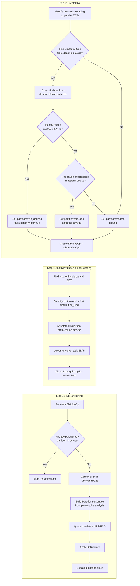
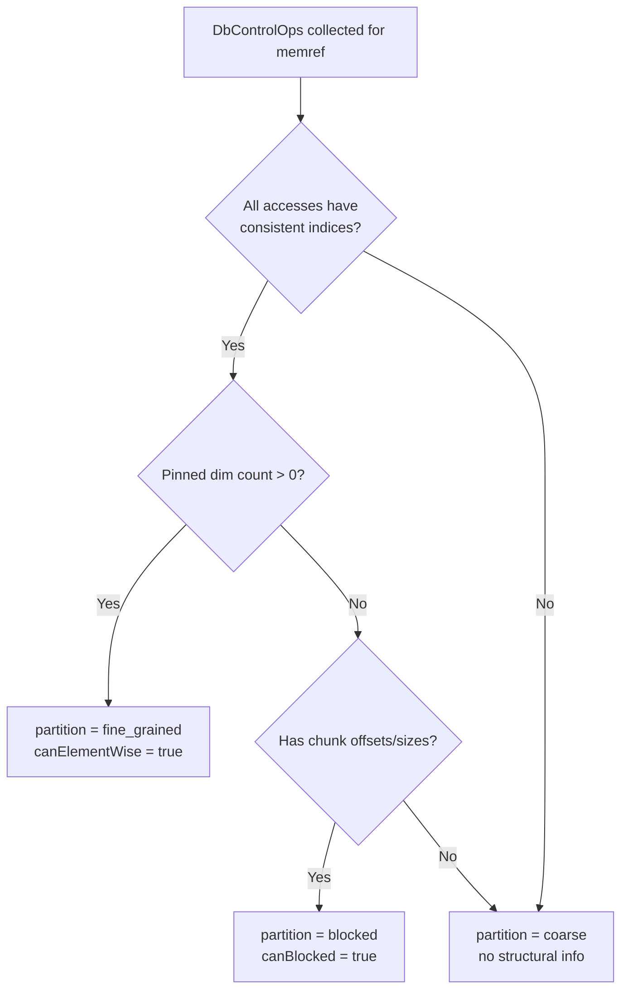
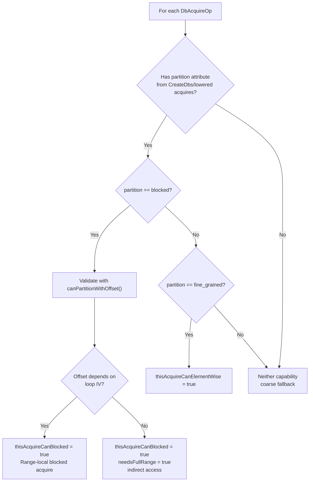
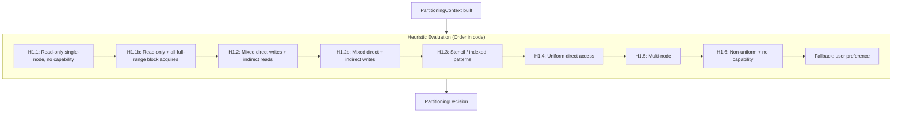
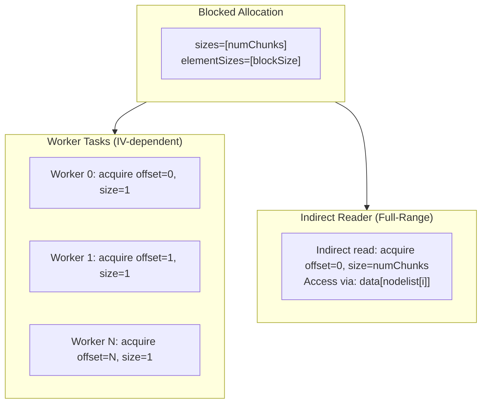

# CARTS Analysis Guide

This guide teaches agents and developers how to understand, run, and debug CARTS optimizations. It covers the complete pipeline from C/C++ source to ARTS runtime executable.

> **Environment note:** The `carts` CLI uses dekk for environment management.
> Configuration is defined in `.dekk.toml` at the repository root. Run
> `carts doctor` to validate that the development environment is correctly
> set up before running any commands below.

## Agent Configuration

### Architecture

```
.agents/                         <-- SOURCE OF TRUTH (committed to git)
  project.md                     Project instructions (one file, all agents)
  agents-reference.md            Detailed reference (this file's source)
  skills/                        Skill definitions (7 skills)
  rules/                         Path-scoped rules (5 rules)

GENERATED (gitignored, run `dekk carts agents generate`):
  CLAUDE.md                      <- Claude Code (from project.md)
  AGENTS.md                      <- All agents (from agents-reference.md)
  .claude/skills/                <- Claude Code skills (from skills/)
  .claude/rules/                 <- Claude Code path rules (from rules/)
  CODEX.md                       <- Codex (from project.md)
  .cursorrules                   <- Cursor (from project.md)
  .github/copilot-instructions.md <- Copilot (from project.md)
  .github/instructions/          <- Copilot per-directory (from rules/)
  .agents.json                   <- Machine-readable manifest
```

### Workflow

```bash
# Edit the source of truth
vim .agents/project.md           # Project instructions
vim .agents/skills/build/SKILL.md # A skill

# Generate all agent configs
dekk carts agents generate       # Produces CLAUDE.md, CODEX.md, .cursorrules, etc.

# Install skills to Codex
dekk carts agents install        # Copies to ~/.codex/skills/

# Check status
dekk carts agents status         # Shows source + all targets
dekk carts agents list           # Lists available skills
```

### Supported Agents

| Agent | Instructions | Skills | Path Rules | Generated From |
|-------|-------------|--------|------------|---------------|
| Claude Code | `CLAUDE.md` | `.claude/skills/` | `.claude/rules/` (paths: frontmatter) | `.agents/` |
| Codex | `CODEX.md` | `~/.codex/skills/` | N/A | `.agents/` |
| Copilot | `.github/copilot-instructions.md` | N/A | `.github/instructions/` (applyTo: frontmatter) | `.agents/` |
| Cursor | `.cursorrules` | `.cursor/rules/` (manual) | N/A | `.agents/` |

### Path-Scoped Rules

Rules in `.agents/rules/*.md` are auto-generated to agent-specific formats:
- **Claude Code**: `.claude/rules/*.md` with `paths:` YAML frontmatter
- **Copilot**: `.github/instructions/*.instructions.md` with `applyTo:` YAML frontmatter
- Rules are loaded automatically when agents read files matching the glob patterns

### Design Rules

- `.agents/` is the single source of truth — edit ONLY there
- Generated files are gitignored — never edit them directly
- `AGENTS.md` is generated from `.agents/agents-reference.md` (edit the source, not the output)
- Skills use YAML frontmatter (`name`, `description`, `user-invocable`)
- Rules use YAML frontmatter (`paths:` list of globs)
- Keep workflow commands in `dekk carts agents`, not in agent-specific wrappers

## Table of Contents

1. [Quick Reference Card](#quick-reference-card)
2. [Pipeline Overview](#pipeline-overview)
3. [Pipeline Steps](#pipeline-steps)
4. [Partition Mode Algorithm](#partition-mode-algorithm)
5. [Pass-Level Debug Reference](#pass-level-debug-reference)
6. [Common Issues & Troubleshooting](#common-issues--troubleshooting)
7. [Example Workflows](#example-workflows)
8. [Distributed Runtime Debug](#distributed-runtime-debug)

---

## Quick Reference Card

### Essential Commands

```bash
# Build CARTS
carts build

# Build ARTS runtime with full debug logging
carts build --arts --debug 3

# Generate MLIR from C/C++
carts cgeist <file>.c -O0 --print-debug-info -S --raise-scf-to-affine           # Sequential
carts cgeist <file>.c -O0 --print-debug-info -S -fopenmp --raise-scf-to-affine  # Parallel

# Run pipeline (stop at specific step)
carts compile <file>.mlir --pipeline=<step>

# Run pipeline (dump all intermediate pipeline steps)
carts compile <file>.mlir --all-pipelines -o ./pipeline_steps/

# Resume from a specific pipeline step (.mlir only)
carts compile <file>.mlir --start-from=post-db-refinement -o <file>.prelower.mlir

# Collect metadata
carts compile <file>_seq.mlir --collect-metadata

# Debug a specific pass
carts compile <file>.mlir --pipeline=<step> --arts-debug=<pass> 2>&1

# Full compilation and execution
carts compile <file>.c -O3

# Full compilation with diagnostics
carts compile <file>.c -O3 --diagnose

# Run focused lit regressions with the bundled toolchain
carts lit tests/contracts/for_dispatch_clamp.mlir
carts lit --suite contracts
```

### Pipeline Steps (CLI Introspection)

Do not hardcode pipeline-step lists in docs. Query the compiler manifest:

```bash
# Human-readable order + pass counts
carts pipeline

# Full machine-readable manifest (pipeline/start_from/passes)
carts pipeline --json

# Pass list for one pipeline step
carts pipeline --pipeline=db-partitioning
```

Use these outputs as the source of truth for valid `--pipeline` and
`--start-from` tokens.

### ARTS Debug Channels (`--arts-debug`)

`--arts-debug` accepts a comma-separated list of compiler debug channels and
forwards them to `carts-compile`.

```bash
carts compile example.mlir --pipeline=create-dbs --arts-debug=create_dbs 2>&1
```

Prefer discovering channels from current compiler output/source instead of
maintaining static docs lists.

---

## Pipeline Overview

```mermaid
flowchart TB
  SRC["C/C++ Source (.c/.cpp)"]
  CG["carts cgeist<br/>Polygeist frontend"]

  subgraph MLIR["MLIR pipeline"]
    direction TB

    subgraph P1["Phase 1: Normalization & Analysis"]
      direction TB
      S1["1) raise-memref-dimensionality<br/>Normalize memrefs + raise layouts"]
      S2["2) collect-metadata<br/>Extract loop/array metadata"]
      S3["3) initial-cleanup<br/>Dead code elimination"]
      S1 --> S2 --> S3
    end

    subgraph P2["Phase 2: OpenMP → ARTS transformation"]
      direction TB
      S4["4) openmp-to-arts<br/>OMP parallel → ARTS EDTs"]
      S5["5) pattern-pipeline<br/>Semantic pattern discovery + kernel transforms"]
      S6["6) edt-transforms<br/>EDT structure optimization"]
      S4 --> S5 --> S6
    end

    subgraph P3["Phase 3: DB management"]
      direction TB
      S7["7) create-dbs<br/>Create DataBlock allocations"]
      S8["8) db-opt<br/>Optimize DB access modes"]
      S9["9) edt-opt<br/>EDT fusion & optimization"]
      S7 --> S8 --> S9
    end

    subgraph P4["Phase 4: Concurrency & synchronization"]
      direction TB
      S10["10) concurrency<br/>Build EDT concurrency graph"]
      S11["11) edt-distribution<br/>Distribution selection + ForLowering"]
      S12["12) post-distribution-cleanup<br/>Cleanup after loop lowering"]
      S13["13) db-partitioning<br/>DB partitioning"]
      S14["14) post-db-refinement<br/>Contract validation + DB refinement"]
      S15["15) late-concurrency-cleanup<br/>Late hoisting/sinking cleanup"]
      S16["16) epochs<br/>Epoch synchronization"]
      S10 --> S11 --> S12 --> S13 --> S14 --> S15 --> S16
    end

    subgraph P5["Phase 5: Lowering to LLVM"]
      direction TB
      S17["17) pre-lowering<br/>EDT/DB/Epoch lowering"]
      S18["18) arts-to-llvm<br/>Final ARTS → LLVM conversion"]
      S17 --> S18
    end

    P1 --> P2 --> P3 --> P4 --> P5
  end

  EMIT["--emit-llvm"]

  subgraph POST["Post-lowering optimizations"]
    direction TB
    O1["AliasScopeGen<br/>LLVM alias metadata for vectorizer"]
    O2["LoopVectorizationHints<br/>LLVM loop hints (!llvm.loop)"]
    O3["PrefetchHints<br/>Software prefetch intrinsics"]
    O1 --> O2 --> O3
  end

  OUT["LLVM IR (.ll) → Executable"]

  SRC --> CG --> MLIR --> EMIT --> POST --> OUT
```



### Key Concepts

**EDT (Event-Driven Task):** ARTS unit of parallel execution. Created from OpenMP parallel regions/tasks.

**DataBlock (DB):** ARTS memory abstraction for inter-task communication. Handles data dependencies automatically.

**Epoch:** Synchronization barrier grouping related EDTs.

**Twin-Diff:** Runtime mechanism to handle overlapping memory writes between parallel workers.

---

## Pipeline Steps

### Step 1: raise-memref-dimensionality

**Purpose:** Normalize memref operations and inline functions to prepare for analysis.

**Run Command:**
```bash
carts compile <file>.mlir --pipeline=raise-memref-dimensionality
```

**Passes Executed:**
- `LowerAffine` - Lower affine dialect operations
- `CSE` - Common subexpression elimination
- `ArtsInliner` - ARTS-specific inlining
- `PolygeistCanonicalize` - Canonicalize polygeist + memref structure
- `RaiseMemRefDimensionality` - Raise nested memref layouts to multi-dimensional forms
- `HandleDeps` - Normalize dependency-carrier structure after raising
- `DeadCodeElimination` - Remove unused code
- `CSE` - Final cleanup after normalization

**What to Look For:**
- Nested pointer arrays (`memref<?xmemref<?xT>>`) converted to multi-dimensional memrefs (`memref<?x?xT>`)
- Functions inlined for better analysis scope
- Simplified control flow

**Common Issues:**
- **Wrapper allocas with circular aliases:** Pointer swap patterns (like in Jacobi double-buffering) may not canonicalize properly
  - *Fix:* Use explicit double-buffering without pointer swap

---

### Step 2: collect-metadata

**Purpose:** Analyze sequential code to extract loop bounds, array dimensions, and access patterns for dual-compilation strategy.

**Run Command:**
```bash
carts compile <file>_seq.mlir --collect-metadata
```

**Debug Command:**
```bash
carts compile <file>_seq.mlir --collect-metadata --arts-debug=collect_metadata 2>&1
```

**Passes Executed:**
- `RaiseSCFToAffine` - Convert SCF loops to affine for analysis
- `CollectMetadata` - Extract and export metadata to JSON

**Output Artifacts:**
- `.carts-metadata.json` - Contains loop IDs, memref IDs, dimensions, access patterns
- `<file>_arts_metadata.mlir` - MLIR with metadata annotations

**What to Look For:**
- Loop trip counts (static vs dynamic)
- Array dimensions inferred from access patterns (e.g., `i*128+j` → `[128,128]`)
- Memory access patterns for partitioning decisions

**Debug Output:**

```text
[DEBUG] [collect_metadata] Collecting loop metadata...
[DEBUG] [collect_metadata] Collecting memref metadata...
```

---

### Step 3: initial-cleanup

**Purpose:** Remove dead code and simplify control flow after metadata collection.

**Run Command:**
```bash
carts compile <file>.mlir --pipeline=initial-cleanup
```

**Passes Executed:**
- `LowerAffine` - Lower remaining affine operations
- `CSE` - Common subexpression elimination
- `CanonicalizeFor` - Canonicalize for loops

---

### Step 4: openmp-to-arts

**Purpose:** Transform OpenMP parallel constructs into ARTS EDT operations.

**Run Command:**
```bash
carts compile <file>.mlir --pipeline=openmp-to-arts
```

**Debug Command:**
```bash
carts compile <file>.mlir --pipeline=openmp-to-arts --arts-debug=convert_openmp_to_arts 2>&1
```

**Passes Executed:**
- `ConvertOpenMPToArts` - Transform OMP parallel regions to ARTS EDTs
- `DeadCodeElimination` - Remove dead OMP dependency proxies
- `CSE` - Common subexpression elimination

**Transformations:**

| OpenMP            | ARTS                          |
|-------------------|-------------------------------|
| `omp.parallel` | `arts.edt<parallel>` |
| `omp.task` | `arts.edt<task>` |
| `omp.wsloop` | `arts.for` |
| `omp.taskwait` | `arts.barrier` |
| `depend(in:x)` | DB acquire with `mode=in` |
| `depend(out:x)` | DB acquire with `mode=out` |
| `depend(inout:x)` | DB acquire with `mode=inout` |

**What to Look For:**
```mlir
// Before (OpenMP)
omp.parallel {
  omp.wsloop for (%i) : i64 = (%lb) to (%ub) step (%step) {
    // loop body
  }
}

// After (ARTS)
arts.edt <parallel> {
  arts.for (%i) = (%lb) to (%ub) step (%step) {
    // loop body
  }
}
```

---

### Step 6: edt-transforms

**Purpose:** Optimize EDT structure through invariant code motion and pointer rematerialization.

**Run Command:**
```bash
carts compile <file>.mlir --pipeline=edt-transforms
```

**Debug Command:**
```bash
carts compile <file>.mlir --pipeline=edt-transforms --arts-debug=edt 2>&1
```

**Passes Executed:**
- `Edt` (initial) - Initial EDT transformation
- `EdtInvariantCodeMotion` - Hoist loop-invariant code from EDT regions
- `DeadCodeElimination` - Remove dead code
- `SymbolDCE` - Dead symbol elimination
- `EdtPtrRematerialization` - Optimize pointer dependencies

---

### Step 5: pattern-pipeline

**Purpose:** Reorder inner loops for cache-optimal memory access patterns based on metadata analysis.

**Run Command:**
```bash
carts compile <file>.mlir --pipeline=pattern-pipeline
```

**Debug Command:**
```bash
carts compile <file>.mlir --pipeline=pattern-pipeline --arts-debug=loop_reordering,kernel_transforms 2>&1
```

**Passes Executed:**
- `LoopReordering` - Apply loop interchange transformations
- `KernelTransforms` - Kernel-form transforms such as matmul reduction
  distribution
- `CSE` - Common subexpression elimination

**Critical Ordering:** **MUST run BEFORE create-dbs** because:
1. CreateDbs uses SSA indices from DbControlOps
2. DbPartitioning analyzes loop IV relationships for chunk computation
3. Reordering after CreateDbs causes SSA changes → chunk computation fails

**Transformations:**
```mlir
// Matrix multiply: i-j-k (row-major C, bad locality for B)
// Reordered to: i-k-j (better cache reuse for B)

// Before
scf.for %i = %c0 to %M {
  scf.for %j = %c0 to %N {
    scf.for %k = %c0 to %K {
      // C[i,j] += A[i,k] * B[k,j]  <- B access has stride N
    }
  }
}

// After
scf.for %i = %c0 to %M {
  scf.for %k = %c0 to %K {
    scf.for %j = %c0 to %N {
      // C[i,j] += A[i,k] * B[k,j]  <- B access is contiguous
    }
  }
}
```

**Debug Output:**
```
[DEBUG] [loop_reordering] Found loop with reorder_nest_to: 3 loops
[INFO] [loop_reordering] Applied loop reordering to arts.for
[DEBUG] [loop_reordering] Auto-detected matmul pattern: 2 init ops, j-k nest
```

---

### Step 7: create-dbs

**Purpose:** Create DataBlock abstractions for memory shared between EDTs.

**Run Command:**
```bash
carts compile <file>.mlir --pipeline=create-dbs
```

**Debug Command:**
```bash
carts compile <file>.mlir --pipeline=create-dbs --arts-debug=create_dbs 2>&1
```

**Passes Executed:**
- `CreateDbs` - Identify external allocations, create DB operations
- `PolygeistCanonicalize` - Canonicalize polygeist operations
- `CSE`, `SymbolDCE`, `Mem2Reg` - Cleanup passes

**Allocation Strategies:**

| Strategy | Outer Dims | Use Case |
|----------|-----------|----------|
| Coarse-grained | `sizes=[1]` | Single DB for entire array |
| Fine-grained | `sizes=[N]` | One DB per element |
| Blocked | `sizes=[numChunks]` | Multiple DBs matching workers |

**What to Look For:**
```mlir
// DataBlock allocation
%db = arts.db_alloc %memref : memref<?x?xf64> -> !arts.db<memref<?x?xf64>>
  { outer_dims = [1], sizes = [1] }  // Coarse-grained

// Acquire before EDT access
%view = arts.db_acquire %db [%idx] { mode = "in" } : !arts.db<...> -> memref<...>

// Release after EDT access
arts.db_release %view : memref<...>

// Free at end of scope
arts.db_free %db : !arts.db<...>
```

---

### Step 8: db-opt

**Purpose:** Optimize DataBlock access modes based on actual load/store operations.

**Run Command:**
```bash
carts compile <file>.mlir --pipeline=db-opt
```

**Debug Command:**
```bash
carts compile <file>.mlir --pipeline=db-opt --arts-debug=db 2>&1
```

**Passes Executed:**
- `Db` - Adjust DB modes based on access patterns
- `PolygeistCanonicalize`, `CSE`, `Mem2Reg` - Cleanup passes

**Mode Optimization:**
- Loads only → `mode = "in"`
- Stores only → `mode = "out"`
- Both → `mode = "inout"`

---

### Step 9: edt-opt

**Purpose:** EDT fusion and further optimization.

**Run Command:**
```bash
carts compile <file>.mlir --pipeline=edt-opt
```

**Debug Command:**
```bash
carts compile <file>.mlir --pipeline=edt-opt --arts-debug=edt,loop_fusion 2>&1
```

**Passes Executed:**
- `PolygeistCanonicalize` - Canonicalize operations
- `Edt` (full analysis) - EDT optimization
- `LoopFusion` - Fuse independent arts.for loops
- `CSE` - Common subexpression elimination

**Loop Fusion:**
```mlir
// Before: Two independent loops with barrier
arts.edt <parallel> {
  arts.for(%i) to(%N) {
    // compute E[i]
  }
  // implicit barrier
  arts.for(%i) to(%N) {
    // compute F[i] (independent of E)
  }
}

// After: Fused loop
arts.edt <parallel> {
  arts.for(%i) to(%N) {
    // compute E[i]
    // compute F[i]
  }
}
```

---

### Step 10: concurrency

**Purpose:** Build EDT concurrency graph and apply pre-lowering `arts.for` hints.

**Run Command:**
```bash
carts compile <file>.mlir --pipeline=concurrency
```

**Debug Command:**
```bash
carts compile <file>.mlir --pipeline=concurrency --arts-debug=concurrency,arts_for_optimization 2>&1
```

**Passes Executed:**
- `Concurrency` - Build EDT concurrency graph
- `ArtsForOptimization` - Add access-pattern + partitioning hints
- `PolygeistCanonicalize` - Cleanup pass

---

### Step 11: edt-distribution

**Purpose:** Select distribution strategy and lower `arts.for` loops.

**Reference Doc:**
- `docs/heuristics/distribution.md`

**Run Command:**
```bash
carts compile <file>.mlir --pipeline=edt-distribution
```

**Debug Command:**
```bash
carts compile <file>.mlir --pipeline=edt-distribution --arts-debug=edt_distribution,for_lowering 2>&1
```

**Passes Executed:**
- `EdtDistribution` - Annotate strategy (`distribution_kind`, `distribution_pattern`)
- `ForLowering` - Lower `arts.for` into task EDT work chunks

---

### Steps 12-15: post-distribution-cleanup, db-partitioning, post-db-refinement, late-concurrency-cleanup

**Purpose:** Replace the old `concurrency-opt` basin with explicit stages for post-lowering cleanup, DB partitioning, contract refinement, and late concurrency cleanup.

**Reference Doc:**
- `docs/heuristics/partitioning.md`

**Run Command:**
```bash
carts compile <file>.mlir --pipeline=db-partitioning
```

**Debug Command:**
```bash
carts compile <file>.mlir --pipeline=db-partitioning --arts-debug=db,db_partitioning 2>&1
```

**Passes Executed:**
- `post-distribution-cleanup` - structural cleanup and `EpochOpt` after `ForLowering`
- `db-partitioning` - `DbPartitioning`, optional `DbDistributedOwnership`, and `DbTransforms`
- `post-db-refinement` - mode tightening, contract validation, scratch cleanup, and canonicalization
- `late-concurrency-cleanup` - strip mining, hoisting, alloca sinking, DCE, and `Mem2Reg`

**Partitioning Decision (Heuristics):**

| Heuristic | Condition | Result |
|-----------|-----------|--------|
| H1.1 | Read-only single-node, no partition capability | **Coarse** |
| H1.1b | Read-only + all block-capable acquires are full-range | **Coarse** |
| H1.2 | Mixed direct writes + indirect reads | **Block** (indirect uses full-range) |
| H1.2b | Mixed direct + indirect writes | **Block** (indirect uses full-range) |
| H1.3 | Stencil or indexed patterns | **Stencil** (if supported) or **Block/ElementWise** |
| H1.4 | Uniform direct access | **Block** |
| H1.5 | Multi-node system | **Block** if supported, else **ElementWise** |
| H1.6 | Non-uniform, no capability | **Coarse** |
| H1.7 | Per-acquire offset mismatch | **Full-range** acquire (per-acquire only) |

**Blocked Access Pattern:**
```mlir
// Global index → chunk index + local index
%chunk_idx = arith.divui %global_idx, %block_size
%local_idx = arith.remui %global_idx, %block_size
%ref = arts.db_ref %ptr[%chunk_idx] : memref<?xmemref<T>> -> memref<T>
memref.load/store %ref[%local_idx]
```

---

## Partition Mode Algorithm

This section provides a comprehensive guide to how CARTS determines the partitioning strategy for DataBlocks. The algorithm spans three pipeline steps and involves capability analysis, heuristic decision-making, and IR transformation.

### Overview

Partition mode determines how a DataBlock's data is distributed:

| Mode | Allocation Structure | Use Case |
|------|---------------------|----------|
| **Coarse** | `sizes=[1], elementSizes=[N]` | Single DB for entire array |
| **Blocked** | `sizes=[numChunks], elementSizes=[blockSize]` | Loop-based parallel access |
| **ElementWise** | `sizes=[N], elementSizes=[1]` | Fine-grained from depend clauses |
| **Stencil** | `sizes=[numChunks], elementSizes=[blockSize+halo]` | Stencil patterns with halos |

### Master Flowchart: Three-Step Partition Mode Assignment



---

### Step 7: CreateDbs - Initial Partition Mode

CreateDbs analyzes OpenMP `depend` clauses (converted to DbControlOps) to determine initial partitioning capability.

#### DbControlOp Analysis

```c
// OpenMP source with depend clause
#pragma omp task depend(inout: A[i])
{
    A[i] = compute(A[i]);
}
```

Becomes:
```mlir
// DbControlOp carries the index pattern
arts.db_control %A_ptr mode(inout) indices(%i)
```

#### CreateDbs Decision Tree



**Key Code Location**: `lib/arts/passes/transforms/CreateDbs.cpp`

```cpp
// Build PartitioningContext from DbControlOp analysis
ctx.canElementWise = !isRankZero && accessPatternInfo.isConsistent &&
                     accessPatternInfo.pinnedDimCount > 0 &&
                     accessPatternInfo.allAccessesHaveIndices;
ctx.canBlocked = !isRankZero && accessPatternInfo.hasChunkDeps &&
                 accessPatternInfo.blockSizesAreConsistent;

// Set partition attribute on DbAllocOp
PromotionMode promotionMode = decision.isBlocked() ? PromotionMode::blocked
                              : decision.isFineGrained() ? PromotionMode::fine_grained
                              : PromotionMode::coarse;
setPartitionMode(dbAllocOp, promotionMode);
```

---

### Step 11 Detail: EdtDistribution + ForLowering

The distribution step is split into two responsibilities:
- `EdtDistributionPass` classifies each `arts.for` pattern and sets typed distribution attributes.
- `ForLowering` consumes those attributes and lowers loops by delegating to strategy-specific task lowerings.

#### Distribution-Lowering Mechanism


#### Attribute Contract

`EdtDistributionPass` annotates each `arts.for` with the distribution plan:
- `distribution_kind` (`block`, `block_cyclic`, `tiling_2d`)
- `distribution_pattern` (e.g., `uniform`, `stencil`, `triangular`, `matmul`)
- `distribution_version` (typed contract/versioning for downstream passes)

#### Lowering Contract

`ForLowering` is orchestration-only:
- resolve worker topology through `DistributionHeuristics`
- select `EdtTaskLoopLowering` implementation from `distribution_kind`
- run local acquire rewrite planning and apply rewrites
- keep strategy-specific bounds and acquire math in strategy classes, not in the pass body

**Fallback behavior**:
- missing/invalid distribution attrs fall back to `block` strategy
- `--partition-fallback` still controls coarse vs element-wise behavior inside DbPartitioning for unsupported/non-affine cases

---

### Step 12: DbPartitioning - Final Decision Algorithm

DbPartitioning is the final decision point. It analyzes all acquires for an allocation and applies heuristics to choose the optimal partitioning.

#### Per-Acquire Analysis Flowchart



#### `canPartitionWithOffset()` - IV Dependence Check

This critical function determines if an acquire's access pattern is derived from the partition offset:

```cpp
// DbAcquireNode.cpp:923-1001
bool DbAcquireNode::canPartitionWithOffset(Value offset) {
    // Zero offset always valid (full array access)
    if (ValueUtils::isZeroConstant(offset))
        return true;

    // Collect all memory access operations
    DenseMap<DbRefOp, SetVector<Operation *>> dbRefToMemOps;
    collectAccessOperations(dbRefToMemOps);

    for (auto &[dbRef, memOps] : dbRefToMemOps) {
        for (Operation *memOp : memOps) {
            Value accessIndex = getFirstAccessIndex(memOp);

            // Check if access index is derived from partition offset
            // e.g., A[chunk_offset + local_idx] → offset appears in access
            if (!isIndexDerivedFromOffset(accessIndex, offset))
                return false;
        }
    }
    return true;
}
```

**What This Validates**:
- If offset = `%chunk_start` and access is `A[%chunk_start + %local]` → **Valid** (IV-dependent)
- If offset = `%chunk_start` but access is `A[nodelist[%i]]` → **Invalid** (indirect, needs full-range)
- If offset appears with a constant stride (`offset * C`) or in a non-leading
  dimension → **Invalid** (unsafe for blocked partitioning)

#### Building PartitioningContext

```cpp
// DbPartitioning.cpp:970-1030
for each DbAcquireNode {
    // Read partition attribute from acquire (set by CreateDbs and lowering rewriters)
    auto acquireMode = getPartitionMode(acquire.getOperation());

    bool thisAcquireCanBlocked =
        acquireMode && *acquireMode == PromotionMode::blocked;
    bool thisAcquireCanElementWise =
        acquireMode && *acquireMode == PromotionMode::fine_grained;

    // Validate blocked capability with IV dependence check
    if (thisAcquireCanBlocked) {
        Value offsetForCheck = getPartitionOffset(acqNode, &acqInfo);
        if (offsetForCheck && !acqNode->canPartitionWithOffset(offsetForCheck)) {
            if (hasIndirectAccess) {
                // Indirect access: still blocked but needs full-range
                thisAcquireCanBlocked = true;  // allocation blocked
                needsFullRange = true;          // this acquire gets all chunks
            } else if (acqNode->hasLoads() && !acqNode->hasStores()) {
                // Read-only direct access with mismatched offset: full-range
                thisAcquireCanBlocked = true;
                needsFullRange = true;
            } else {
                // Direct access but offset not derived from access (writes)
                thisAcquireCanBlocked = false;  // fall back to coarse
            }
        }
    }

    // Build AcquireInfo for heuristic voting
    AcquireInfo info;
    info.canBlocked = thisAcquireCanBlocked;
    info.canElementWise = thisAcquireCanElementWise;
    ctx.acquires.push_back(info);
}

// Aggregate capabilities via voting
ctx.canBlocked = ctx.anyCanBlocked();
ctx.canElementWise = ctx.anyCanElementWise();
```

---

### Heuristics Decision Flow



#### Heuristics Summary Table

| ID | Condition | Result |
|----|-----------|--------|
| H1.1 | Read-only single-node, no partition capability | **Coarse** |
| H1.1b | Read-only + all block-capable acquires are full-range | **Coarse** |
| H1.2 | Mixed direct writes + indirect reads | **Block** (indirect full-range) |
| H1.2b | Mixed direct + indirect writes | **Block** (indirect full-range) |
| H1.3 | Stencil or indexed patterns | **Stencil** (if supported), else **Block/ElementWise** |
| H1.4 | Uniform direct access | **Block** |
| H1.5 | Multi-node | **Block** if supported, else **ElementWise** |
| H1.6 | Non-uniform + no capability | **Coarse** |

**Note:** H1.7 is a per-acquire decision (full-range vs specific block). It is
computed during acquire analysis and does not change the allocation-level mode.

---

### Mixed Mode: Blocked + Full-Range Acquires

When both IV-dependent and indirect accesses exist for the same allocation:



**Example: LULESH-style nodelist pattern**

```c
// Worker writes (IV-dependent) → blocked with index
for (int e = chunk_start; e < chunk_end; e++) {
    elemData[e] = compute(...);  // Direct: A[chunk_start + local]
}

// Indirect reads (not IV-dependent) → full-range acquire
for (int e = 0; e < numElems; e++) {
    for (int n = 0; n < 4; n++) {
        int nodeIdx = nodelist[e*4 + n];  // Indirect index
        nodeData[nodeIdx] += ...;          // Need all of nodeData
    }
}
```

---

### Heuristics Architecture Assessment

#### Current Structure (as of this codebase)

Heuristics live in the analysis heuristics layer:

```
include/arts/analysis/heuristics/PartitioningHeuristics.h
lib/arts/analysis/heuristics/PartitioningHeuristics.cpp
lib/arts/analysis/heuristics/DbHeuristics.cpp
```

Key entry points:

- `evaluatePartitioningHeuristics(...)` returns a `PartitioningDecision`.
- `DbHeuristics` integrates heuristic results into DB-mode and partitioning
  decisions.
- Partitioning logic applies H1.7 (per-acquire
  full-range decisions).

**Assessment**: The current structure keeps policy evaluation centralized in
`PartitioningHeuristics` while keeping pass-facing behavior in `DbHeuristics`.

| Aspect | Current | Notes |
|--------|---------|-------|
| Files | `PartitioningHeuristics.cpp` + `DbHeuristics.cpp` | Clear split: policy vs integration |
| Classes | helper + integration utilities | Keeps pass code lean |
| Context fields | `PartitioningContext` | Rich enough for H1.x decisions |
| Evaluation | linear chain | Very fast |

**Why it is reasonable**:
1. **Extensibility**: Add new branches in `evaluatePartitioningHeuristics(...)`
2. **Separation**: Heuristics decide; DbPartitioning applies
3. **Diagnostics**: DB heuristics can attach rationale in one place

---

### Key Code References

| Step | File | Key Lines | Purpose |
|------|------|-----------|---------|
| CreateDbs | `lib/arts/passes/transforms/CreateDbs.cpp` | see `DbControlOp` handling | Initial partition mode |
| ForLowering | `lib/arts/passes/transforms/ForLowering.cpp` | task-lowering pipeline | Apply distribution strategy via helper contracts |
| DbPartitioning | `lib/arts/passes/opt/db/DbPartitioning.cpp` | per-acquire + context aggregation | Partitioning rewrite and mode decisions |
| IV Check | `lib/arts/analysis/graphs/db/DbAcquireNode.cpp` | `canPartitionWithOffset` | Offset legality checks |
| Heuristics | `lib/arts/analysis/heuristics/PartitioningHeuristics.cpp` | policy entrypoints | H1.x evaluation |

### Step 13: epochs

**Purpose:** Create epoch synchronization for EDT groups.

**Run Command:**
```bash
carts compile <file>.mlir --pipeline=epochs
```

**Passes Executed:**
- `PolygeistCanonicalize` - Canonicalize operations
- `CreateEpochs` - Create ARTS epochs for synchronization

---

### Step 14: pre-lowering

**Purpose:** Final transformations before LLVM conversion.

**Run Command:**
```bash
carts compile <file>.mlir --pipeline=pre-lowering
```

**Debug Command:**
```bash
carts compile <file>.mlir --pipeline=pre-lowering --arts-debug=parallel_edt_lowering,db_lowering,edt_lowering,epoch_lowering,arts_data_ptr_hoisting 2>&1
```

**Passes Executed:**
- `ParallelEdtLowering` - Lower parallel EDTs to task graphs
- `DbLowering` - Lower DataBlocks to opaque pointers
- `EdtLowering` - Lower EDTs to runtime function calls
- `DataPtrHoisting` - Hoist data pointer loads out of loops
- `ScalarReplacement` - Memory to register promotion for reductions
- `EpochLowering` - Lower epochs and propagate GUIDs

**EDT Lowering Steps:**
1. Analyze EDT region for free variables and dependencies
2. Outline EDT region to function with ARTS runtime signature
3. Insert parameter packing before EDT
4. Insert parameter/dependency unpacking in outlined function
5. Replace EDT with `artsEdtCreate` call returning GUID
6. Add dependency management (`artsRecordInDep`, `artsSignalEdtNull`)

---

### Step 15: arts-to-llvm

**Purpose:** Final conversion of ARTS dialect to LLVM dialect.

**Run Command:**
```bash
carts compile <file>.mlir --pipeline=arts-to-llvm
# or for complete pipeline:
carts compile <file>.mlir
```

**Debug Command:**
```bash
carts compile <file>.mlir --arts-debug=convert_arts_to_llvm 2>&1
```

**Passes Executed:**
- `ConvertArtsToLLVM` - Convert ARTS operations to LLVM
- `PolygeistCanonicalize`, `CSE`, `Mem2Reg` - Cleanup passes
- `ControlFlowSink` - Sink control flow operations

---

### Post-Pipeline: emit-llvm

**Purpose:** Generate LLVM IR with performance hints.

**Run Command:**
```bash
carts compile <file>.mlir --emit-llvm
```

**Debug Command:**
```bash
carts compile <file>.mlir --emit-llvm --arts-debug=arts_alias_scope_gen,arts_loop_vectorization_hints,arts_prefetch_hints 2>&1
```

**Passes Executed:**
- `ConvertPolygeistToLLVM` - Final Polygeist lowering
- `AliasScopeGen` - Generate LLVM alias scope metadata
- `LoopVectorizationHints` - Attach vectorization hints
- `PrefetchHints` - Insert software prefetch intrinsics

**AliasScopeGen:**
- Creates unique alias scopes for each data array
- Enables LLVM vectorizer to prove non-aliasing
- Sets alignment=8 on data pointer loads

**LoopVectorizationHints:**
- Auto-detects vector width (8 for f32, 4 for f64)
- Creates `!llvm.loop` metadata for innermost loops
- Adds `llvm.assume` for non-negative loop bounds

**PrefetchHints:**
- Detects strided memory access patterns
- Inserts `llvm.prefetch` for large-stride accesses (>64 bytes)
- Prefetch distance based on stride size:
  - >=4KB: 2 iterations ahead
  - 1-4KB: 4 iterations ahead
  - 128B-1KB: 6-10 iterations ahead

---

## Pass-Level Debug Reference

### Complete Pass Table

| Pass | DEBUG_TYPE | Pipeline Step | Purpose |
|------|-----------|---------------|---------|
| CollectMetadata | `collect_metadata` | 2 | Extract loop/array metadata |
| ConvertOpenMPToArts | `convert_openmp_to_arts` | 4 | OMP → ARTS transformation |
| CanonicalizeMemrefs | `canonicalize_memrefs` | 1 | Normalize memref operations |
| LoopReordering | `loop_reordering` | 6 | Cache-optimal loop order |
| CreateDbs | `create_dbs` | 7 | Create DataBlock allocations |
| Db | `db` | 8,12 | Adjust DB modes |
| DbPartitioning | `db_partitioning` | 12 | Partition for parallelism |
| Edt | `edt` | 5,9,12 | EDT analysis/optimization |
| EdtInvariantCodeMotion | `edt_invariant_code_motion` | 5 | Hoist invariant code |
| EdtPtrRematerialization | `edt_ptr_rematerialization` | 5 | Optimize pointer deps |
| LoopFusion | `loop_fusion` | 9 | Fuse independent loops |
| Concurrency | `concurrency` | 10 | Build concurrency graph |
| ForLowering | `for_lowering` | 11 | Lower arts.for with strategy-selected helpers |
| CreateEpochs | `create_epochs` | 13 | Create epoch sync |
| ParallelEdtLowering | `parallel_edt_lowering` | 14 | Lower parallel EDTs |
| DbLowering | `db_lowering` | 14 | Lower DBs to pointers |
| EdtLowering | `edt_lowering` | 14 | Lower EDTs to runtime |
| EpochLowering | `epoch_lowering` | 14 | Lower epochs |
| DataPtrHoisting | `data_ptr_hoisting` | 14 | Hoist pointer loads |
| ScalarReplacement | `scalar_replacement` | 14 | Mem2reg for reductions |
| ConvertArtsToLLVM | `convert_arts_to_llvm` | 15 | Final ARTS lowering |
| AliasScopeGen | `alias_scope_gen` | emit-llvm | Alias metadata |
| LoopVectorizationHints | `loop_vectorization_hints` | emit-llvm | Loop hints |
| PrefetchHints | `prefetch_hints` | emit-llvm | Prefetch intrinsics |
| DeadCodeElimination | `dead_code_elimination` | various | Remove dead code |

### Debug Output Color Coding

All passes use the ARTS debug infrastructure with color-coded output:

| Color | Level | Meaning |
|-------|-------|---------|
| Blue (bold) | INFO | High-level progress messages |
| Magenta (bold) | DEBUG | Detailed transformation steps |
| Yellow (bold) | WARN | Potential issues |
| Red (bold) | ERROR | Errors (always printed) |

### Example Debug Session

```bash
# Debug loop reordering decisions
carts compile gemm.mlir --pipeline=pattern-pipeline --arts-debug=loop_reordering 2>&1 | tee debug.log

# Debug DB partitioning decisions
carts compile gemm.mlir --pipeline=db-partitioning --arts-debug=db,db_partitioning 2>&1 | tee debug.log

# Debug multiple passes
carts compile gemm.mlir --arts-debug=loop_reordering,create_dbs,db_partitioning 2>&1 | tee debug.log

# Debug post-lowering optimizations
carts compile gemm.mlir --emit-llvm --arts-debug=arts_alias_scope_gen,arts_loop_vectorization_hints,arts_prefetch_hints 2>&1 | tee debug.log
```

---

## Common Issues & Troubleshooting

### 1. Switch Statements Not Supported

**Symptom:** Error during OpenMP-to-ARTS conversion mentioning multiple basic blocks.

**Cause:** Switch statements create multiple basic blocks in loop bodies, violating `scf.for` structure requirements.

**Fix:** Replace switch with separate inline functions or if-else chains.

**Example:** SPECFEM3D stress/velocity kernels

---

### 2. Collapse Clause Not Supported

**Symptom:** Error during OpenMP processing.

**Cause:** `#pragma omp ... collapse(N)` is not yet supported.

**Fix:** Remove `collapse(N)` from pragmas and manually restructure loops if needed.

**Example:** SW4Lite rhs4sg-base, vel4sg-base

---

### 3. Early Returns Not Supported

**Symptom:** Error about control flow in loop body.

**Cause:** Early return statements inside parallel loops violate structured control flow requirements.

**Fix:** Restructure to avoid early returns; use guard variables or restructure conditionals.

---

### 4. SSA Dominance Violations

**Symptom:** `db_free` placed outside loop where `db_alloc` is inside, causing SSA dominance error.

**Cause:** Control flow analysis places free in wrong scope.

**Fix:** Ensure `db_free` is in same block as `db_alloc`.

**Example:** SeisSol volume-integral

---

### 5. Pointer Swap Pattern Bugs

**Symptom:** Double-buffering with pointer swap doesn't work correctly.

**Cause:** Circular alias relationships in wrapper allocas confuse canonicalization.

**Fix:** Use explicit double-buffering without pointer swap:
```c
// Instead of swapping pointers
// Use explicit indexing: buffer[iter % 2] and buffer[(iter + 1) % 2]
```

**Example:** PolyBench jacobi2d

---

### 6. Checksum Verification Failures

**Symptom:** Checksum differs between sequential and ARTS execution.

**Cause:** For normalized data (like in layernorm/batchnorm), `sum(x)` produces near-zero values.

**Fix:** Use `sum(|x|)` instead of `sum(x)` for checksums:
```c
// Instead of: checksum += data[i];
checksum += fabs(data[i]);
```

**Example:** ML-kernels layernorm, batchnorm, activations

---

### 7. Large Dataset Timeouts

**Symptom:** Compilation or execution takes extremely long.

**Cause:** Element-wise allocation creating millions of tiny DBs.

**Fix:** Use blocked allocation with div/mod index transformation:
```mlir
// Fine-grained (slow for large N)
%db = arts.db_alloc ... { outer_dims = [0], sizes = [%N] }

// Blocked (efficient)
%num_chunks = arith.divui %N, %block_size
%db = arts.db_alloc ... { outer_dims = [0], sizes = [%num_chunks] }
```

**Example:** ML-kernels activations (large dataset)

---

### 8. Makefile Naming Mismatch

**Symptom:** Build errors or wrong file compiled.

**Cause:** `EXAMPLE_NAME` doesn't match source file basename.

**Fix:** Ensure `EXAMPLE_NAME` in Makefile matches the `.c` file name exactly.

---

### 9. Loop Reordering Breaks Chunk Computation

**Symptom:** Wrong results after enabling loop reordering.

**Cause:** Loop reordering ran AFTER create-dbs, breaking SSA value relationships.

**Fix:** Ensure pattern-pipeline step runs BEFORE create-dbs (this is the default order).

---

### 10. Missing Debug Output

**Symptom:** `--arts-debug=<pass>` produces no output.

**Cause:** Debug output goes to stderr, not stdout.

**Fix:** Redirect stderr: `carts compile ... 2>&1 | tee debug.log`

---

## Example Workflows

### Workflow 1: Analyze a New Benchmark

```bash
# Navigate to benchmark
cd /path/to/benchmark

# Build CARTS
carts build

# Step 1: Generate sequential MLIR for metadata
carts cgeist example.c -O0 --print-debug-info -S --raise-scf-to-affine -o example_seq.mlir

# Step 2: Collect metadata
carts compile example_seq.mlir --collect-metadata

# Step 3: Generate parallel MLIR
carts cgeist example.c -O0 --print-debug-info -S -fopenmp --raise-scf-to-affine -o example.mlir

# Step 4: Inspect each pipeline step
carts compile example.mlir --pipeline=raise-memref-dimensionality -o pipeline_steps/01_raise_memref_dimensionality.mlir
carts compile example.mlir --pipeline=openmp-to-arts -o pipeline_steps/04_openmp_to_arts.mlir
carts compile example.mlir --pipeline=create-dbs -o pipeline_steps/07_create_dbs.mlir
carts compile example.mlir --pipeline=db-partitioning -o pipeline_steps/13_db_partitioning.mlir

# Or dump all steps at once
carts compile example.mlir --all-pipelines -o pipeline_steps/

# Step 5: Debug specific pass if needed
carts compile example.mlir --pipeline=create-dbs --arts-debug=create_dbs 2>&1 | tee debug_createdb.log

# Step 6: Full execution
carts compile example.c -O3
```

### Workflow 2: Debug DB Partitioning Decision

```bash
# Generate MLIR
carts cgeist example.c -O0 --print-debug-info -S -fopenmp --raise-scf-to-affine -o example.mlir

# Stop at db-partitioning and debug
carts compile example.mlir --pipeline=db-partitioning --arts-debug=db,db_partitioning 2>&1 | tee db_debug.log

# Look for partitioning decisions in output:
# [INFO] [db_partitioning] Analyzing DB partitioning...
# [DEBUG] [db_partitioning] H1 heuristic: read-only, keeping coarse
# [DEBUG] [db_partitioning] H2 heuristic: cost model suggests partition

# Inspect the MLIR to see allocation strategy
grep -A2 "arts.db_alloc" example_db-partitioning.mlir
```

### Workflow 3: Debug Loop Vectorization

```bash
# Generate LLVM IR with hints
carts compile example.mlir --emit-llvm --arts-debug=arts_loop_vectorization_hints,arts_prefetch_hints 2>&1 | tee vec_debug.log

# Look for:
# [DEBUG] [arts_loop_vectorization_hints] Auto-detected vector width: 8
# [DEBUG] [arts_loop_vectorization_hints] Unroll count: 4 (loads=16)
# [DEBUG] [arts_prefetch_hints] Found 3 strided accesses
# [INFO] [arts_prefetch_hints] Inserted 3 prefetches

# Inspect the generated LLVM IR
grep -A5 "llvm.loop" example.ll
grep "llvm.prefetch" example.ll
```

### Workflow 4: Compare Sequential vs ARTS Execution

```bash
# Run sequential version
gcc -O3 example.c -o example_seq
./example_seq > seq_output.txt

# Run ARTS version
carts compile example.c -O3 -o example_arts
./example_arts > arts_output.txt

# Compare outputs
diff seq_output.txt arts_output.txt

# If different, debug with diagnostics
carts compile example.c -O3 --diagnose --diagnose-output=diag.json
```

### Workflow 5: Full Pipeline Inspection

```bash
# Dump all pipeline-step outputs + LLVM IR
carts compile example.mlir --all-pipelines -o pipeline_steps/

# Inspect generated files without hardcoding step names
find pipeline_steps -maxdepth 1 -type f | sort
# Includes one <stem>_<pipeline-step>.mlir per step, plus:
#   <stem>_complete.mlir
#   <stem>.ll

# Compare transformation between pipeline steps
diff pipeline_steps/example_create-dbs.mlir pipeline_steps/example_db-partitioning.mlir
```

## Distributed Runtime Debug

Use this workflow when multi-node runs hang, timeout, or show uneven work distribution.

### 1. Build ARTS with runtime debug enabled

```bash
# Raw ARTS runtime levels:
#   0 = errors only
#   1 = warnings
#   2 = info
#   3 = debug

carts build --arts --debug 3 --profile=profile-workload.cfg
```

### 2. Run a targeted multi-node benchmark with logs retained

```bash
carts benchmarks run polybench/2mm \
  --size small \
  --arts-config docker/arts-docker-2node.cfg \
  --nodes 2 \
  --threads 4 \
  --debug 2
```

Notes:
- `--debug 2` stores full benchmark stdout/stderr in per-run logs (`arts.log`, `omp.log`).
- Correctness verification is enabled by default (ARTS checksum compared to OpenMP).
- For `nodes > 1`, speedup is intentionally hidden as an unfair comparison.

### 3. Inspect artifacts

```bash
# Replace with your run directory
cd external/carts-benchmarks/results/<timestamp>/

# Benchmark/run logs
find . -name 'arts.log' -o -name 'omp.log'

# Counter artifacts
find . -name 'cluster.json' -o -name 'n0.json' -o -name 'n1.json'
```

### 4. Thread-count sanity for multinode runs

If runtime output shows `Number of Threads = 2` followed by `Killed`, increase threads.
Use at least 4 worker threads per node to avoid starving runtime communication/progress threads:

```bash
carts benchmarks run <bench> --nodes 2 --threads 4 --arts-config docker/arts-docker-2node.cfg
```

---

## Reference Files

- **Pipeline Definition:** `tools/compile/Compile.cpp`
- **CLI Interface:** `tools/carts_cli.py`
- **Pass Registry:** `include/arts/passes/Passes.td`
- **Pass Headers:** `include/arts/passes/Passes.h`
- **Debug Macros:** `include/arts/utils/Debug.h`
- **Pass Implementations:** `lib/arts/passes/transforms/`, `lib/arts/passes/opt/`

---

## Version Information

This guide covers CARTS with the following features:
- 15 pipeline steps
- 27+ optimization passes
- New passes: LoopReordering, PrefetchHints, AliasScopeGen, LoopVectorizationHints
- Dual-compilation metadata strategy
- Twin-diff runtime support
