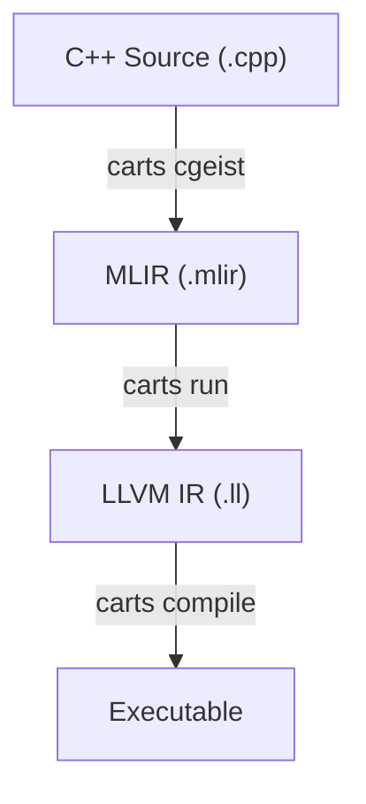

# CARTS - Compiler for Asynchronous Runtime System

CARTS is an LLVM/MLIR-based compiler framework that implements the ARTS (Asynchronous Runtime System) dialect for distributed programming.

## Documentation

For a comprehensive understanding of the project, including its architecture, dependencies, and build process, please refer to the documentation in the `docs/` directory.

*   **[Project Overview](docs/project_overview.md)**
*   **[Dependencies](docs/dependencies.md)**
*   **[Build and Run](docs/build_and_run.md)**
*   **[Project Structure](docs/project_structure.md)**
*   **[Next Steps](docs/next_steps.md)**

## Quick Start

### 1. Automated Setup (Recommended)

```bash
# Install all dependencies and build the project
python3 tools/setup/carts-setup.py

# Set up the environment
source setup_env.sh
```

To make the `carts` command available, you can either source the `setup_env.sh` script in your current session or add it to your shell's configuration file for permanent access.

### 2. Build CARTS Project

```bash
# Build CARTS project (default)
carts build

# Clean build
carts build --clean

# Build only ARTS components
carts build --arts

# Build only Polygeist
carts build --polygeist

# Build only LLVM
carts build --llvm
```

### 3. Use CARTS

#### CARTS Compilation Pipeline

The CARTS compilation process follows this pipeline:



#### Step-by-Step Usage

```bash
# Step 1: Convert C++ to MLIR
carts cgeist simple.cpp -std=c++17 -fopenmp -O0 -S > simple.mlir

# Step 2: Apply ARTS transformations and convert to LLVM IR
carts run simple.mlir --O3 --arts-opt --emit-llvm > simple-arts.ll

# Step 3: Compile to executable with ARTS runtime
carts compile simple-arts.ll -o simple

# Alternative: Run the complete pipeline automatically
carts execute simple.cpp -o simple    # Automatically detects C++ and uses -std=c++17
carts execute simple.c -o simple      # Automatically detects C and uses -std=c17
```

#### Individual Commands

```bash
# Run individual optimization passes
carts opt simple.mlir --lower-affine --cse --polygeist-mem2reg

# Run benchmarks
carts benchmark --target_examples matrixmul

# Generate interactive reports
carts report

# Clean generated files
carts clean
```

> **Important**: Project build uses **system clang**, while ARTS operations use **installed LLVM**

## Core Transformation Passes

The CARTS compilation pipeline includes several key transformation passes. Here are a few of the most important ones:

### `--convert-openmp-to-arts`

This pass converts OpenMP parallel constructs into the ARTS dialect.

**Before:**

```mlir
func.func @example(%arg0: memref<100xf32>) {
  omp.parallel {
    %c0 = arith.constant 0 : index
    %c1 = arith.constant 1 : index
    %c100 = arith.constant 100 : index
    scf.for %i = %c0 to %c100 step %c1 {
      %v = memref.load %arg0[%i] : memref<100xf32>
      %a = arith.addf %v, %v : f32
      memref.store %a, %arg0[%i] : memref<100xf32>
    }
    omp.terminator
  }
  return
}
```

**After:**

```mlir
func.func @example(%arg0: memref<100xf32>) {
  arts.parallel {
    %c0 = arith.constant 0 : index
    %c1 = arith.constant 1 : index
    %c100 = arith.constant 100 : index
    scf.for %i = %c0 to %c100 step %c1 {
      %v = memref.load %arg0[%i] : memref<100xf32>
      %a = arith.addf %v, %v : f32
      memref.store %a, %arg0[%i] : memref<100xf32>
    }
  }
  return
}
```

### `--create-dbs`

This pass identifies data blocks (DBs) that can be managed by the ARTS runtime.

**Before:**

```mlir
func.func @example() -> memref<100xf32> {
  %0 = memref.alloc() : memref<100xf32>
  return %0 : memref<100xf32>
}
```

**After:**

```mlir
func.func @example() -> memref<100xf32> {
  %0 = arts.db_alloc() : memref<100xf32>
  return %0 : memref<100xf32>
}
```

### `--convert-arts-to-llvm`

This pass converts the ARTS dialect to the LLVM IR dialect.

**Before:**

```mlir
func.func @example() {
  arts.parallel {
    // ...
  }
  return
}
```

**After:**

```mlir
func.func @example() {
  // This will be lowered to a series of function calls to the ARTS runtime
  // library, such as artsEdtCreate, artsSignalEdt, etc.
  llvm.call @artsEdtCreate(...) : (...) -> i64
  // ...
  return
}
```

## Project Structure

```
carts/
├── tools/              # All CARTS tools
│   ├── setup.py       # Automated setup
│   ├── carts/         # Main compiler tools
│   ├── benchmark/     # Performance testing
│   └── report/        # Results visualization
├── examples/          # Example programs
├── test/             # Test cases
├── include/          # Header files
├── lib/              # Library source
└── external/         # External dependencies
```

## Manual Setup

If you prefer manual setup, see [tools/README.md](tools/README.md) for detailed instructions.

## Tools

### Unified Wrapper (`carts`)

The main interface for all CARTS operations:

- `carts build` - Build CARTS project (uses system clang)
- `carts cgeist` - Convert C++ to MLIR (uses installed LLVM)
- `carts opt` - Run individual optimization passes (uses installed LLVM)
- `carts run` - Apply ARTS transformations and convert to LLVM IR (uses installed LLVM)
- `carts compile` - Compile LLVM IR to executable with ARTS runtime (uses installed LLVM)
- `carts execute` - Run complete pipeline: C++ → MLIR → LLVM IR → Executable
- `carts clean` - Clean generated files (.ll, .mlir, executables)
- `carts benchmark` - Run performance tests
- `carts report` - Generate reports
- `carts setup` - Automated setup

### Individual Tools

- `tools/setup/carts-setup.py` - Automated dependency installation
- `tools/benchmark/carts-benchmark` - Performance testing
- `tools/report/carts-report` - Results visualization

## Examples

See `examples/` directory for sample programs and `test/` for test cases.

---

**Author**: Rafael Andres Herrera Guaitero  
**Email**: <rafaelhg@udel.edu>