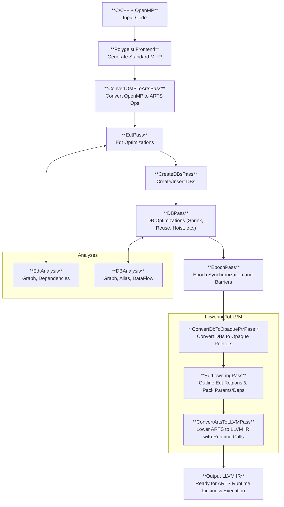

# Building and Running

This document provides instructions for building the CARTS project and running the provided examples.

## Quick Start

The project uses a `Makefile` to simplify the build process. The `carts` wrapper script is the primary interface for all compilation and execution tasks.

1.  **Build the project**:

    ```bash
    make build
    ```

2.  **Set up the environment**:

    ```bash
    source enable
    ```

## The `carts` Wrapper Script

**Always use the `carts` wrapper script for all operations.** This script ensures that all paths, libraries, and environment variables are set up correctly.

### Available Commands

*   `carts build`: Build the CARTS project.
*   `carts cgeist <file> [opts]`: Convert C++ to MLIR.
*   `carts opt <file> [opts]`: Run MLIR optimizations.
*   `carts run [opts]`: Run the main ARTS transformation pipeline.
*   `carts mlir-translate <file>`: Convert MLIR to LLVM IR.
*   `carts compile <file> [opts]`: Compile LLVM IR to an executable.
*   `carts execute <file> [opts]`: A full compilation pipeline from C++ to an executable.
*   `carts benchmark [opts]`: Run benchmarks.
*   `carts report [opts]`: Generate reports.
*   `carts setup [opts]`: Set up the environment.
*   `carts clean`: Clean generated files.

## Compilation Pipeline Example

This example demonstrates the step-by-step compilation of a C++ file (`simple.cpp`) into an executable.



1.  **C++ to MLIR (using Polygeist)**:

    ```bash
    carts cgeist simple.cpp -std=c++17 -fopenmp -O0 -S > simple.mlir
    ```

2.  **MLIR Optimization and ARTS Conversion**:

    ```bash
    carts opt simple.mlir --lower-affine --cse --polygeist-mem2reg \
      --canonicalize --loop-invariant-code-motion --arts-inliner \
      --convert-openmp-to-arts --symbol-dce > simple-arts.mlir
    ```

3.  **EDT and DataBlock Processing**:

    ```bash
    carts opt simple-arts.mlir --edt --edt-invariant-code-motion \
      --create-dbs --canonicalize --db --canonicalize --cse \
      --edt-pointer-rematerialization --create-epochs \
      --convert-arts-to-llvm --canonicalize --cse \
      --convert-polygeist-to-llvm --cse > simple-final.mlir
    ```

4.  **LLVM IR Generation**:

    ```bash
    carts mlir-translate --mlir-to-llvmir simple-final.mlir > simple-arts.ll
    ```

5.  **Final Compilation**:

    ```bash
    carts compile simple-arts.ll -o simple
    ```

## Simplified Pipeline

The `carts execute` command can perform the entire compilation pipeline in a single step:

```bash
carts execute simple.cpp -o simple
```

## Running Examples

Examples can be found in the `examples/` directory. Each example has its own `Makefile` and can be run from its directory.

For example, to run the `matrixmul` example:

```bash
cd examples/tasking/matrixmul
make
./matrixmul
```

[Go back to README.md](../README.md)

