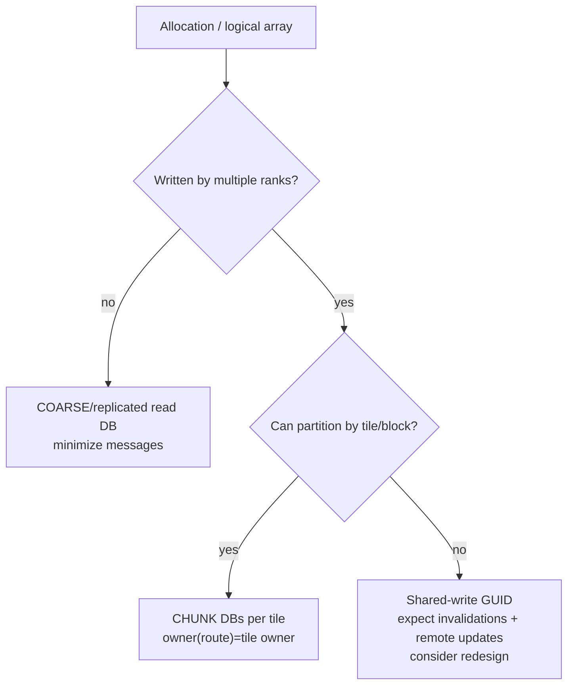
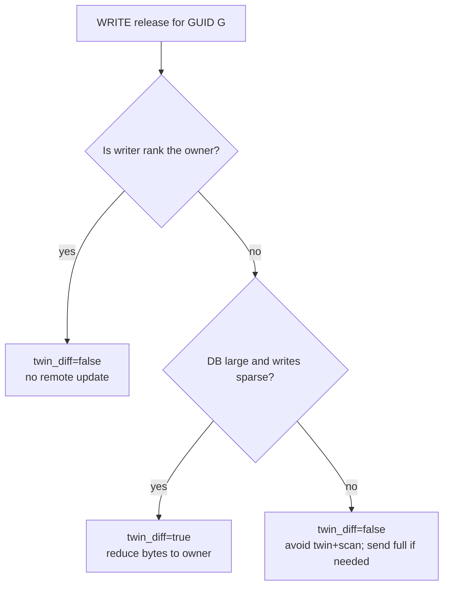
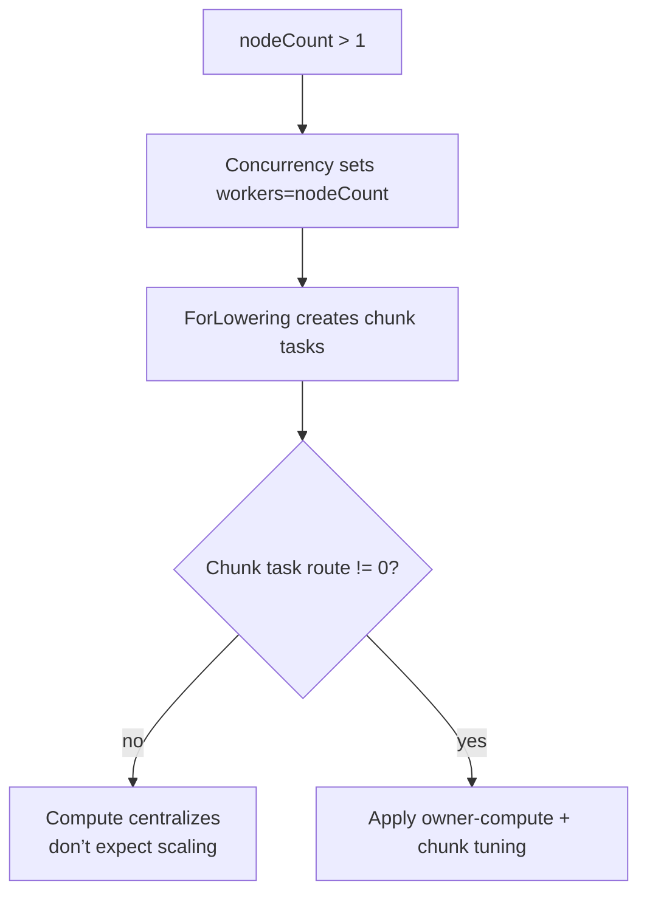

# Multi-rank heuristics: DB granularity, ownership, and `twin_diff`

This document is the multi-rank companion to `docs/heuristics/single_rank/db_granularity_and_twin_diff.md`.

Scope:
- `artsGlobalRankCount > 1` (multiple ranks)
- Works for both:
  - **intra-node multi-rank** (multiple ranks on one host)
  - **multi-node multi-rank** (ranks on different hosts)

Key idea: in multi-rank, performance depends as much on **where data is owned and where tasks run** as it does on “fine vs coarse” DBs.

---

## 1) Runtime model: what matters in multi-rank

### 1.1 Owner rank (fixed) vs valid rank (moves)

For a DB GUID `G`:
- **Owner rank** is encoded in the GUID: `owner = artsGuidGetRank(G)` (`external/arts/core/src/gas/Guid.c:138`).
- Owner is chosen when reserving GUIDs: `artsReserveGuidRoute(type, route)` (route is modulo rankCount) (`external/arts/core/src/gas/Guid.c:153`).
- The **current valid copy** location is tracked separately in the route table:
  - `artsRouteTableLookupDb(G, &validRank, touch)` returns `validRank` (`external/arts/core/src/gas/RouteTable.c:617`).

Performance implication:
- If EDTs execute far from the owner/validRank, ARTS must move DBs or updates across ranks.

### 1.2 WRITE coordination: invalidations + updates

WRITE is expensive in multi-rank because it triggers global coordination:

- On WRITE acquire preparation, ARTS calls `artsRemoteUpdateRouteTable(G, -1)` (`external/arts/core/src/runtime/memory/DbFunctions.c:673`).
  - If caller is the owner, it iterates duplicates and sends invalidations (`external/arts/core/src/runtime/network/RemoteFunctions.c:121`).
  - If caller is not the owner, it notifies the owner to update/invalidate.

- On WRITE release:
  - If `owner == myRank`, ARTS progresses the DB frontier locally (`artsProgressFrontier`) (`external/arts/core/src/runtime/memory/DbFunctions.c:816`).
  - If `owner != myRank`, ARTS sends an update to the owner:
    - full DB: `artsRemoteUpdateDb(G, true)` (same file, non-owner path), or
    - partial update: `artsRemotePartialUpdateDb(...)` when `twin_diff` is enabled and dirty ratio is low (`external/arts/core/src/runtime/memory/DbFunctions.c:739`).

### 1.3 Per-GUID write serialization still exists (frontiers)

Even in multi-rank, each DB GUID has the same frontier rules as single-rank:
- only one writer can join a frontier (`frontierAddWriteLock` rejects if `writeSet` is set; `external/arts/core/src/runtime/memory/DbList.c:87`)
- additional writers for the same GUID are queued in later frontiers and run later (`external/arts/core/src/runtime/memory/DbList.c:268`)

So **coarse-grained DBs can serialize writers per GUID**, while fine/blocked DBs can increase concurrency by reducing “writers per GUID”.

---

## 2) What `twin_diff` is for (and how to decide)

### 2.1 What it does

When `useTwinDiff=true` for a WRITE acquire:
- `prepDbs()` allocates a twin snapshot (`artsDbAllocateTwin`) (`external/arts/core/src/runtime/memory/DbFunctions.c:681`)
- on release, ARTS estimates dirty ratio and either:
  - sends full DB if dirty ratio is high (> `ARTS_DIFF_DIRTY_THRESHOLD`) and we are non-owner (`external/arts/core/src/runtime/memory/DbFunctions.c:728`)
  - or computes diffs and sends only dirty regions (`external/arts/core/src/runtime/memory/DbFunctions.c:739`)

Key thresholds:
- `ARTS_DIFF_DIRTY_THRESHOLD = 0.75` (`external/arts/core/inc/arts/runtime/memory/TwinDiff.h:56`)
- `ARTS_DIFF_MERGE_THRESHOLD = 128` bytes (`external/arts/core/inc/arts/runtime/memory/TwinDiff.h:53`)

### 2.2 When `twin_diff` helps (multi-rank)

`twin_diff` tends to help when all are true:
- DBs are large enough that full updates are expensive
- writes are sparse (low dirty ratio)
- remote writers are present (cannot always run tasks on the owner)

It tends to hurt when any are true:
- DBs are small (copy+scan dominates)
- writes are dense (dirty ratio high → fallback after still paying overhead)
- ownership/task routing makes most writes local anyway

### 2.3 Treat `twin_diff` as ROI-based, not “always on”

Enable counters and compute:
- `twin_diff_roi = twinDiffBytesSaved / twinDiffComputeTime`

Counter profile:
- `external/arts/counter.profile-overhead.cfg`

---

## 3) Why DB granularity matters more in multi-rank than single-rank

Multi-rank adds two new forces that single-rank doesn’t have:

1. **Message count / latency costs**
   - too-fine DBs can explode the number of acquires/requests/updates

2. **Invalidation fanout**
   - if many ranks hold duplicates of a DB and a writer appears, the owner may invalidate many ranks

So the multi-rank “sweet spot” is often **blocked DBs aligned to partitions**, not per-element DBs.

---

## 4) Heuristics (multi-rank)

### H1: distribute DB ownership (avoid single-owner hotspots)

If `DbAllocOp.route` is constant (often 0), then many DBs are owned by one rank, which becomes a bottleneck.

Ownership is set by `artsReserveGuidRoute(type, route)` in lowering (`lib/arts/Passes/ConvertArtsToLLVM.cpp:837`).

Heuristic:
- Choose DB owner rank based on the partition index of the DB (tile/block), not a constant.

### H2: route EDTs to the owner of their primary WRITE DB (“owner-compute”)

Goal:
- reduce remote WRITE releases (and invalidation storms)
- keep valid copies stable (avoid ping-pong)

Heuristic:
- For each EDT, pick its dominant write DB (largest bytes/frequency) and route the EDT to that DB’s owner rank.

### H3: read-mostly DBs should be coarse/replicated

If a DB is read-only (or read-mostly) across ranks:
- coarse DB reduces dependency/messaging overhead
- replication/caching reduces repeated remote acquires

### H4: write-heavy shared DBs should be partitioned (blocked DBs)

If many ranks write disjoint regions of a logical array:
- representing the whole array as one DB GUID forces:
  - per-GUID writer serialization (frontiers)
  - high remote update pressure

Prefer:
- blocked DBs per tile/block, so each rank mainly writes “its” GUIDs.

### H5: minimize “writers per GUID per phase”

The goal is to avoid “many ranks writing the same GUID” patterns (the worst case):
- it creates remote updates for non-owner writers
- it increases invalidation fanout
- it increases write-serialization pressure per GUID

If you can structure the DAG so each GUID has one writer per phase:
- you can often disable `twin_diff` safely and reduce traffic.

### H6: `twin_diff` defaults should differ intra-node vs multi-node

- Intra-node multi-rank: transport is cheaper → `twin_diff` needs higher ROI to win.
- Multi-node: bandwidth/latency are dominant → `twin_diff` can be valuable for large sparse updates.

---

## 5) Special case: `parallel_for` internode today (why tasks can centralize)

There is a current pipeline interaction where `parallel_for` uses “nodes as workers” for partitioning, but the actual chunk tasks can still be routed to a single rank.

### What happens (verified)

1. `Concurrency` sets `arts.edt <parallel>` to `internode` and sets `workers = nodeCount` when `nodeCount > 1`:
   - `lib/arts/Passes/Concurrency.cpp:206`
   - `lib/arts/Passes/Concurrency.cpp:230`

2. The default pipeline runs:
   - `createConcurrencyPass()` then `createForLoweringPass()` then later `createParallelEdtLoweringPass()`
   - `tools/run/carts-run.cpp:289`, `tools/run/carts-run.cpp:293`, `tools/run/carts-run.cpp:321`

3. `ForLowering` creates the per-chunk task EDT with `route = 0`:
   - `lib/arts/Passes/ForLowering.cpp:1503`

4. Later, `ParallelEdtLowering` distributes the *outer* worker EDTs across ranks by setting `route = workerId` for `internode`:
   - `lib/arts/Passes/ParallelEdtLowering.cpp:191`

Net effect:
- Outer control EDTs are distributed
- Inner chunk tasks remain routed to rank 0 unless runtime remote stealing moves them

### Practical heuristics if you observe centralization

- Don’t expect internode `parallel_for` to scale compute if chunk tasks centralize.
- Avoid distributing DB ownership away from the rank that runs the chunk tasks (otherwise every chunk does remote acquires/releases).
- Prefer coarser distributed parallelism (one task per node) or an SPMD “owner-compute” design if you want real multi-node speedups.

---

## 6) Decision flowcharts

### 6.1 Granularity + ownership decision (multi-rank)

### 6.2 `twin_diff` decision (multi-rank)

### 6.3 `parallel_for` internode sanity check

---

## 7) What to measure (closed-loop tuning)

Enable `external/arts/counter.profile-overhead.cfg` and track:
- `remoteBytesSent`, `remoteBytesReceived`
- `ownerUpdatesPerformed`, `ownerUpdatesSaved`
- `acquireReadMode`, `acquireWriteMode`
- `twinDiffUsed`, `twinDiffSkipped`, `twinDiffBytesSaved`, `twinDiffComputeTime`

Then iterate:
1. Fix ownership hotspots (H1)
2. Fix EDT placement vs write owners (H2)
3. Sweep block size (H4) and watch message count vs serialization
4. Tune `twin_diff` using ROI (H6)

