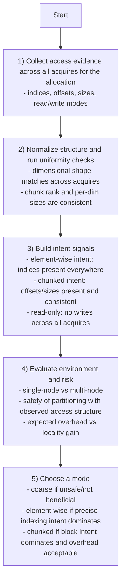
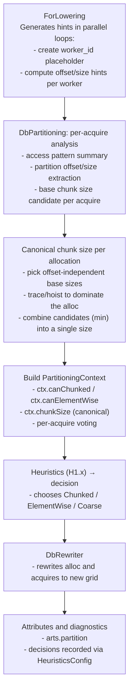

# Partitioning Decision Guide

This document describes how CARTS decides the datablock partitioning mode for each allocation. The decision is made once per DbAlloc and applies to all acquires of that allocation.

For rank-aware and multi-node specifics, see:

- /Users/randreshg/Documents/carts/docs/heuristics/single_rank
- /Users/randreshg/Documents/carts/docs/heuristics/multi_rank/db_granularity_and_twin_diff.md

## Modes at a Glance

| Mode         | What It Means                | Best Fit                  | Tradeoffs                        |
|--------------|------------------------------|---------------------------|----------------------------------|
| Coarse       | One datablock for full array | Irregular or mixed access | Lowest overhead, least locality  |
| Element-wise | One datablock per element    | Precise indexed access    | Highest overhead                 |
| Chunked      | One datablock per block      | Blocked/tiling patterns   | Good locality, moderate overhead |

## IR Labels (Coarse vs Fine-Grained)

The IR uses `arts.partition` with `promotion_mode` values:

| IR Attribute                              | Meaning        |
|-------------------------------------------|----------------|
| `#arts.promotion_mode<coarse>`            | Coarse         |
| `#arts.promotion_mode<fine_grained>`      | Fine-grained   |
| `#arts.promotion_mode<chunked>`           | Chunked        |

Internally, "coarse" is represented as element-wise with `outerRank=0`
(`PartitioningDecision::isCoarse()`), so both labels appear in logs.

All `arts.db_alloc` operations carry an explicit `arts.partition` attribute
(default `promotion_mode<coarse>`). This keeps allocation layout explicit for
copy/sync decisions and diagnostics.

## Terminology Mapping

This table maps user-facing CLI options to internal implementation details:

| User/CLI Term | PartitionGranularity | RewriterMode | outerRank | IR Attribute    |
|---------------|----------------------|--------------|-----------|-----------------|
| coarse        | Coarse               | ElementWise  | 0         | coarse          |
| fine          | FineGrained          | ElementWise  | >0        | fine_grained    |
| chunked       | Chunked              | Chunked      | 1         | chunked         |
| stencil       | Stencil              | Stencil      | 1         | chunked         |

**Key insight**: `RewriterMode::ElementWise` handles both coarse and fine-grained.
The difference is `outerRank`: coarse has `outerRank=0` (single DB for entire array),
fine-grained has `outerRank>0` (multiple DBs, one per element/row).

**CLI option**: `--partition-fallback=coarse|fine` controls the fallback behavior
for non-affine (indirect) accesses. See "Non-Affine Fallback" section for details.

## Decision Flow (High-Level)

A compact reasoning flow that captures how the system decides without naming specific heuristics.



## Partitioning Pipeline (End-to-End)

**CRITICAL**: The partitioning decision spans THREE key passes in the compiler pipeline.
Understanding when hints are generated vs. consumed is essential.

### Pipeline Stage Overview

| Pipeline Stage | Pass               | What Happens                                       |
|----------------|--------------------|----------------------------------------------------|
| Stage 7        | CreateDbsPass      | Creates DbAllocs (no hints yet)                    |
| Stage 8-9      | DbOpt + EdtOpt     | Initial optimization passes                        |
| Stage 10       | ForLoweringPass    | Generates `chunk_hint(index, size)` and `indices`  |
| Stage 11       | DbPartitioningPass | Uses hints to partition (coarse → fine)            |
| Stage 11       | DbPass             | Re-run to adjust modes after partitioning          |

### Three-Stage Flow Diagram

```mermaid
flowchart TB
  subgraph S7["Stage 7: CreateDbs pass"]
    direction TB
    S7A["For each memref used in EDTs:<br/>- create DbAllocOp + DbAcquireOps based on memref usage<br/>- no partition hints exist yet (ForLowering has not run)<br/>- DbAcquireOps have offsets/sizes but no chunk_hint yet"]
    S7O["Output: DbAllocOps with basic structure (no hints)"]
    S7A --> S7O
  end

  subgraph S10["Stage 10: ForLowering pass (in Concurrency)"]
    direction TB
    S10A["Analyze loop IVs and depend structure:<br/>- indices[] from indexed access patterns (A[i])<br/>- chunk_index = which chunk (workerIdx, not element offset)<br/>- chunk_size = elements per chunk (must be consistent)"]
    S10B["Add hints to existing DbAcquireOps as chunk_hint"]
    S10O["Output: DbAcquireOps now have chunk_hint(index, size) and indices"]
    S10A --> S10B --> S10O
  end

  subgraph S11["Stage 11: DbPartitioning pass (in ConcurrencyOpt)"]
    direction TB
    S11A["1) canBePartitioned(useFineGrainedFallback)?<br/>- if hasNonAffineAccesses and fallback not enabled → false<br/>- safety checks on hints/structure<br/>- false → skip (keep coarse)"]
    S11B["2) Per-acquire analysis (using hints from ForLowering):<br/>- chunk_index: which chunk this worker handles<br/>- chunk_size: elements per chunk<br/>- indices: canElementWise = true"]
    S11C["3) Build PartitioningContext:<br/>- ctx.canChunked / ctx.canElementWise<br/>- ctx.chunkSize (canonical)<br/>- per-acquire voting"]
    S11D["4) Heuristics evaluation (H1.x):<br/>- H1.1 read-only single node → coarse<br/>- H1.2 mixed access → chunked + versioning<br/>- H1.3 stencil pattern → stencil/fine-grained<br/>- H1.4 multi-node → fine-grained preferred<br/>- H1.5 access uniformity → coarse fallback"]
    S11E["5) Apply decision via DbRewriter:<br/>- coarse: keep original<br/>- else: rewrite alloc and acquires to new grid<br/>- set partition attribute (coarse/fine_grained/chunked)"]
    S11A --> S11B --> S11C --> S11D --> S11E
  end

  S7 --> S10 --> S11
```



### Coarse → Fine Conversion Example

When DbPartitioning converts an allocation from coarse to fine-grained:

```text
BEFORE (coarse, after CreateDbs):
  %alloc = arts.db_alloc sizes[1] elementSizes[N]
      {arts.partition = #arts.promotion_mode<coarse>}
  %acq = arts.db_acquire %alloc offsets[0] sizes[1]
      chunk_hint(%idx, 1) indices[%idx]  ← hints from ForLowering

AFTER (fine-grained, after DbPartitioning):
  %alloc = arts.db_alloc sizes[N] elementSizes[1]
      {arts.partition = #arts.promotion_mode<fine_grained>}
  %acq = arts.db_acquire %alloc offsets[%idx] sizes[1]
```

### Verification Commands

```bash
# Stage 7: After CreateDbs - DBs exist but NO hints yet
carts run input.mlir --create-dbs > after_createdb.mlir
grep "chunk_hint" after_createdb.mlir | wc -l  # Should be 0!

# Stage 10: After ForLowering - Hints NOW exist
carts run input.mlir --concurrency > after_forlowering.mlir
grep "chunk_hint" after_forlowering.mlir | wc -l  # Should be > 0!

# Stage 11: After DbPartitioning - Partitioning applied
carts run input.mlir --concurrency-opt > final.mlir
grep "promotion_mode" final.mlir | sort | uniq -c
```

### Detailed Per-Stage Flow



Mixed access patterns (chunked writes + indirect reads) are handled via H1.2
heuristic using **full-range acquires** instead of DbCopy/DbSync. When H1.2
detects this pattern, indirect read-only acquires are marked as `needsFullRange`,
allowing them to access all chunks while direct writes use chunked partitioning.

## What Signals Are Used

| Signal                     | How It Is Derived                       | Why It Matters              |
|---------------------------|-----------------------------------------|-----------------------------|
| Uniform access structure   | Uniformity checks pass for all acquires | Enables safe partitioning   |
| Element-wise intent        | Indices present for all acquires        | Enables element-wise mode   |
| Chunked intent             | `chunk_hint` present and sizes consistent | Enables chunked mode      |
| Read-only allocation       | No write acquires across the allocation | Reduces need to split DBs   |
| Environment (single/multi) | Execution context                       | Changes transfer tradeoff   |

### ChunkHintInfo Semantics

The `chunk_hint(chunk_index, chunk_size)` operands have specific semantics:

| Operand | Meaning | Example |
|---------|---------|---------|
| `chunk_index` | Which chunk this worker handles (0, 1, 2, ...) | Worker 0 → chunk 0 |
| `chunk_size` | Elements per chunk (must be consistent across acquires) | 250 elements |

**Critical Distinction: Chunk Index vs Element Offset**

```
Given: 1000 elements split across 4 workers with chunk_size=250

chunk_index=0 → elements [0, 250)      (NOT element offset 0!)
chunk_index=1 → elements [250, 500)    (NOT element offset 1!)
chunk_index=2 → elements [500, 750)
chunk_index=3 → elements [750, 1000)

The chunk_index is a CHUNK number, not an element offset.
Element offset = chunk_index * chunk_size
```

**Chunk Size Consistency Check:**
DbPartitioning validates that all acquires for the same allocation have consistent
`chunk_size` (same SSA value or equal constants). If sizes don't agree, partitioning
falls back to `--partition-fallback` (coarse or fine, NOT chunked).

## Canonical Chunk Size Per Allocation

Chunked partitioning needs a single chunk size per allocation, even when
individual acquires have remainder-aware sizes (e.g., the last worker gets a
smaller slice). The canonicalization step derives a stable base size and makes
it available to the heuristics interface.

Algorithm (per allocation):

1) Collect chunk_size from all acquires with chunk_hint.
2) For each acquire, try to strip remainder-aware sizes:
   - If size depends on chunk_index, peel min/select to pick the non-offset branch.
   - If size does not depend on chunk_index, use it directly.
3) Trace/hoist candidates to dominate the alloc site.
4) Canonicalize:
   - If candidates match, use that.
   - If candidates differ, use min(candidate_i) to stay safe.
5) Set ctx.chunkSize to the smallest static candidate (if any) and use the
   canonical dynamic size for rewriting.

This ensures all acquires are rewritten against the same allocation grid while
keeping per-worker offsets/sizes intact.

## Offset Validation (Chunked Safety)

Offset validation ensures that the partition offset is tied to the memref
indices used by the task. The current rule is:

- Prefer memref indices (load/store) for validation.
- If no memref indices exist, fall back to db_ref indices.
- The first dynamic index in that chain must depend on the partition offset.

Pseudocode:

```
for each memref access:
  chain = memref.indices if present else db_ref.indices
  first_dyn = first non-constant index in chain
  if first_dyn exists and !dependsOn(first_dyn, offset):
    fail
```

When twin_diff is unavailable, partitioning proceeds only if this rule holds
for all acquires, ensuring disjoint chunk ownership for writers.

## Non-Affine Fallback (Partition Fallback)

Some arrays are accessed through indirect indices (e.g., `x[nodelist[i]]`).
These are classified as non-affine and are unsafe to chunk by default.

Policy is controlled by `--partition-fallback`:

- `coarse` (default): reject non-affine allocations unless explicit
  offset/size hints override; allocation stays coarse.
- `fine`: allow non-affine allocations to proceed and mark them as indexed so
  H1.3 selects element-wise partitioning.
- `versioned`: legacy alias for `fine` (versioning is no longer automatic).

**Why only coarse and fine?** Only these two modes are direct partitioning
fallbacks because they work for ANY access pattern:

| Fallback | Works For | Requirements |
|----------|-----------|--------------|
| coarse   | All patterns | None (single DB) |
| fine     | All patterns | None (one DB per element) |
| chunked  | **Not a fallback** | Requires chunk_hint from ForLowering |
| stencil  | **Not a fallback** | Requires stencil pattern detection |

Chunked and Stencil modes require specific structural information (chunk_hint
with chunk_index/chunk_size) that may not be available for arbitrary access patterns.
They are selected by heuristics when the patterns are detected, not as fallbacks.

**Note:** Mixed access patterns (chunked writes + indirect reads) are handled
via full-range acquires in chunked mode. The indirect read-only acquires get
`needsFullRange=true` and access all chunks, while direct writes use standard
chunked partitioning. This avoids the memory duplication and sync overhead of
the versioning approach (DbCopy/DbSync).

This keeps correctness while enabling exploration of finer-grained
parallelism. The element-wise path can be expensive; use it for targeted
experiments or when indirect access dominates the kernel.

## LULESH Case Study: Coarse vs Fine vs Versioned (DB Copy)

This case study compares three partitioning strategies for LULESH, demonstrating
the performance implications of each approach.

### The LULESH Challenge

LULESH uses a hexahedral mesh where each element accesses 8 corner nodes through
an indirection array (`nodelist[elem][0..7]`). This indirect/gather access pattern
is classified as **non-affine** because the compiler cannot statically determine
which nodes each element accesses.

```
Element e accesses: x[nodelist[e][0]], x[nodelist[e][1]], ..., x[nodelist[e][7]]
                    ↑ indirect index - cannot be analyzed statically
```

By default, `canBePartitioned()` returns false for non-affine accesses, forcing
coarse-grained partitioning and serializing all parallel work.

### Mode 1: Coarse-Grained (Default)

**What happens:**

- Non-affine accesses → `canBePartitioned()` returns false
- Allocation stays coarse: `sizes=[1], elementSizes=[numNodes]`
- All EDTs serialize on coarse acquires

**Commands:**

```bash
# Compile with default (coarse) partitioning
carts run lulesh.mlir --concurrency-opt > lulesh_coarse.mlir

# Run benchmark
carts benchmarks run lulesh --size small

# Verify IR - should show promotion_mode<none> for node arrays
grep "promotion_mode" lulesh_coarse.mlir | sort | uniq -c
```

**Expected metrics:**

| Metric | Value | Notes |
|--------|-------|-------|
| E2E Time | ~11.28s | Measured on small problem size |
| Slowdown vs OMP | ~250x | Due to serialization |
| DBs Created | ~30 | One per array |
| Acquires/Element | ~15 | All compete for same DBs |
| Parallelism | None | Serialized on coarse acquires |

### Mode 2: Fine-Grained (Element-wise Fallback)

**What happens:**

- `--partition-fallback=fine` enables non-affine conversion
- `canBePartitioned(useFineGrainedFallback=true)` returns true
- H1.3 selects element-wise for indexed access patterns
- Allocation becomes: `sizes=[numNodes], elementSizes=[1]`

**Commands:**

```bash
# Compile with fine-grained fallback
carts run lulesh.mlir --concurrency-opt --partition-fallback=fine > lulesh_fine.mlir

# Run benchmark
carts benchmarks run lulesh --size small -- --partition-fallback=fine

# Verify IR - should show promotion_mode<fine_grained> for node arrays
grep "promotion_mode" lulesh_fine.mlir | sort | uniq -c

# Compare allocation structure
diff <(grep "arts.db_alloc" lulesh_coarse.mlir | head -3) \
     <(grep "arts.db_alloc" lulesh_fine.mlir | head -3)
# Should show: sizes=[1] → sizes=[numNodes]
```

**Expected metrics:**

| Metric | Value | Notes |
|--------|-------|-------|
| E2E Time | TBD | Measure with benchmark |
| Speedup vs Coarse | TBD | Expected significant improvement |
| DBs Created | numNodes | e.g., 729 for s=8 |
| Acquires/Element | 24 | 8 corners × 3 (x,y,z) |
| Parallelism | Full | Independent element access |

### Mode 3: Versioned DB Copy

**What happens:**

- **Write-optimized DB**: Chunked partitioning for direct writes
- **Read-optimized DB**: Element-wise copy for indirect reads
- **Explicit sync**: Between write and read phases

**Conceptual IR:**

```mlir
// Write phase: chunked for locality
%x_write = arts.db_alloc sizes[numChunks] elementSizes[chunkSize]
    {arts.partition = #arts.promotion_mode<chunked>}

// Read phase: fine-grained copy for indirect access
%x_read = arts.db_copy(%x_write)
    {arts.partition = #arts.promotion_mode<fine_grained>}

// Sync before indirect reads
arts.db_sync(%x_read, %x_write)
```

**Commands:**

```bash
carts run lulesh.mlir --concurrency-opt --partition-fallback=versioned > lulesh_versioned.mlir
carts benchmarks run lulesh --size small -- --partition-fallback=versioned
```

This aims to balance write locality (chunked) with read flexibility (element-wise).

### Performance Comparison Table

| Metric | Coarse | Fine | Versioned | OMP |
|--------|--------|------|-----------|-----|
| E2E Time (s) | 11.28 | TBD | TBD | 0.045 |
| Speedup vs OMP | 0.004x | TBD | TBD | 1.0x |
| DBs Created | ~30 | numNodes | 2×numNodes | N/A |
| Acquires/Iter | ~15 | ~24K | ~512+8K | N/A |
| Memory | 1x | 1x+meta | 2x | 1x |
| Parallelism | None | Full | Moderate | Full |
| Correctness | Yes | Yes | Yes | Yes |

### Verification

All modes must produce identical numerical results:

```bash
# Verify correctness for each mode
carts benchmarks run lulesh --size small --verify
carts benchmarks run lulesh --size small --verify -- --partition-fallback=fine

# Compare checksums (should match)
carts benchmarks run lulesh --size small 2>&1 | grep checksum
carts benchmarks run lulesh --size small -- --partition-fallback=fine 2>&1 | grep checksum
```

### Which Heuristics Fire

```bash
# Check which heuristics apply in each mode
carts run lulesh.mlir --concurrency-opt 2>&1 | grep -E "H1\.[0-9]"
carts run lulesh.mlir --concurrency-opt --partition-fallback=fine 2>&1 | grep -E "H1\.[0-9]"

# Verify H1.3 triggers for indexed patterns with fine fallback
carts run lulesh.mlir --concurrency-opt --partition-fallback=fine 2>&1 | grep "H1.3"
```

### When to Use Each Mode

| Scenario | Mode | Rationale |
|----------|------|-----------|
| Development/debugging | Coarse | Simple, guaranteed correct |
| Small problem sizes | Fine | Acquire overhead < parallelism benefit |
| Large problem sizes | Versioned | Sync cost amortized |
| Memory-constrained | Fine | No 2x memory for copies |
| Highest correctness confidence | Coarse | Minimal transformation |

## Why Uniformity Is Critical

Uniformity ensures that each EDT observes the same partitioning contract.

| Pattern Consistency         | Partition Safety | Expected Outcome       |
|----------------------------|------------------|------------------------|
| Same dimensional structure  | Safe             | Fine-grain can be used |
| Mixed dimensional structure | Unsafe           | Coarse required        |
| Inconsistent chunk sizes    | Unsafe           | Coarse required        |

## Per-Acquire Voting

A single allocation may have multiple acquires with different characteristics. The system collects per-acquire information and aggregates it to make allocation-level decisions.

### Why Per-Acquire Voting

Consider an allocation with two acquires:

- Acquire #1: READ mode (in) - could use coarse
- Acquire #2: WRITE mode (out) - benefits from fine-grained

Without per-acquire voting, the system might choose coarse based on the first acquire alone. With voting, the write acquire's need for fine-grained partitioning takes priority.

### AcquireInfo Structure

Each acquire contributes:

| Field          | Type         | Description                       |
|---------------|--------------|-----------------------------------|
| accessMode     | in/out/inout | Read, write, or read-write access |
| canElementWise | bool         | Has indexed dependencies          |
| canChunked     | bool         | Has chunk/offset dependencies     |
| pinnedDimCount | unsigned     | Dimensions with indexed access    |

### Aggregation Helpers

| Helper              | Logic                                  | Used By                       |
|--------------------|----------------------------------------|-------------------------------|
| hasWriteAccess()    | Any acquire is out or inout            | Removed (was H1.6 optimistic) |
| allReadOnly()       | All acquires are in mode               | H1.1 (read-only check)        |
| anyCanElementWise() | Any acquire can use element-wise       | H1.4 (multi-node)             |
| anyCanChunked()     | Any acquire can use chunked            | H1.4 (multi-node)             |
| maxPinnedDimCount() | Maximum pinnedDimCount across acquires | Removed (was H1.6 decision)   |

### Write-Priority Rule

Write modes have priority over read modes because:

- Concurrent writes benefit from fine-grained partitioning
- Read-only access can safely share coarse datablocks
- If ANY acquire is write, fine-grained is preferred

## Heuristic Per-Acquire Behavior

| Heuristic | Per-Acquire Check          | Behavior                                   |
|----------|-----------------------------|--------------------------------------------|
| H1.1      | allReadOnly()              | Only applies if all acquires are read-only |
| H1.2      | anyCanChunked() + patterns | Mixed chunked+indirect uses full-range     |
| H1.3      | accessPatterns summary     | Handles indexed/stencil/mixed patterns     |
| H1.4      | anyCanChunked/ElementWise  | Uses any-acquire capability for multi-node |

## Heuristic Evaluation Flowchart

Heuristics are evaluated in priority order (highest first). The first heuristic
that returns a decision wins.

```mermaid
flowchart TD
    START[Build PartitioningContext] --> H1_1

    H1_1{H1.1 priority=100<br/>Read-Only Single-Node?}
    H1_1 -->|applies| COARSE1[COARSE]
    H1_1 -->|skip| H1_2

    H1_2{H1.2 priority=98<br/>Mixed Access Pattern?<br/>canChunked && hasIndirectRead}
    H1_2 -->|applies| CHUNKED_FR[CHUNKED + full-range indirect reads]
    H1_2 -->|skip| H1_3

    H1_3{H1.3 priority=95<br/>Stencil Pattern?}
    H1_3 -->|applies| STENCIL[STENCIL or ELEMENTWISE]
    H1_3 -->|skip| H1_4

    H1_4{H1.4 priority=90<br/>Multi-Node?}
    H1_4 -->|applies| FINE1[CHUNKED or ELEMENTWISE]
    H1_4 -->|skip| H1_5

    H1_5{H1.5 priority=80<br/>Non-Uniform Access?}
    H1_5 -->|applies| COARSE2[COARSE]
    H1_5 -->|skip| DECISION[COARSE (fallback)]
```

## Decision Equation

  Decision =
    if !canBePartitioned              -> Coarse
    else if H1.1 (read-only + single) -> Coarse
    else if H1.2 (mixed chunked+idx)  -> Chunked (with full-range indirect reads)
    else if H1.3 (stencil/mixed)      -> Stencil or ElementWise
    else if H1.4 (multi-node)         -> Chunked or ElementWise
    else if H1.5 (!uniform)           -> Coarse
    else                              -> Coarse (fallback)

## When Chunked Beats Element-wise

Chunked mode is favored when the access pattern is contiguous and block-shaped, and the system expects locality benefits to outweigh overhead.

| Observation               | Favor                  | Reason                     |
|--------------------------|------------------------|----------------------------|
| Offsets/sizes present     | Chunked                | Explicit block structure   |
| Only indices present      | Element-wise            | Fine-grain intent          |
| Dynamic chunk size        | Chunked (optimistic)   | Intent is clear            |
| Very small chunk capacity | Element-wise or Coarse | Overhead outweighs benefit |

## Mixed Mode Partitioning

Mixed mode enables chunked partitioning when an allocation has both chunked acquires
(in parallel regions) and coarse acquires (in non-parallel regions). Without mixed
mode, the presence of any coarse acquire would force the entire allocation to use
coarse-grained partitioning, serializing all parallel work.

### The Problem: Serialization Due to Mixed Acquires

Consider an array used in both initialization (sequential) and computation (parallel):

```
Allocation: sizes=[1], elementSizes=[N]  (COARSE - single block)

                    ┌─────────────────────────────────────────┐
                    │        Single Coarse Datablock          │
                    │   A[0] A[1] A[2] ... A[N-1]              │
                    └─────────────────────────────────────────┘
                                      │
        ┌─────────────────────────────┼─────────────────────────────┐
        │                             │                             │
   ┌────▼────┐                   ┌────▼────┐                   ┌────▼────┐
   │ Init    │ ───────────────▶  │ Worker0 │ ───────────────▶  │ Worker1 │ ...
   │ (full)  │    SERIALIZED!    │ (full)  │    SERIALIZED!    │ (full)  │
   └─────────┘                   └─────────┘                   └─────────┘

Problem: All workers must wait for exclusive access to the single coarse block.
```

### The Solution: Mixed Mode with Full-Range Acquires

Mixed mode uses chunked partitioning but allows coarse acquires to access all chunks:

```
Allocation: sizes=[numChunks], elementSizes=[chunkSize]  (CHUNKED)

        ┌──────────┐  ┌──────────┐  ┌──────────┐  ┌──────────┐
        │ Chunk 0  │  │ Chunk 1  │  │ Chunk 2  │  │ Chunk 3  │ ...
        │ A[0..C]  │  │ A[C..2C] │  │ A[2C..3C]│  │ A[3C..4C]│
        └──────────┘  └──────────┘  └──────────┘  └──────────┘
              │             │             │             │
              ▼             ▼             ▼             ▼
   ┌─────────────────────────────────────────────────────────────┐
   │ Init EDT (FULL-RANGE: offset=0, size=numChunks)             │
   │ - Acquires ALL chunks                                        │
   │ - Uses div/mod indexing: dbRef[i/C], memref[i%C]            │
   └─────────────────────────────────────────────────────────────┘
              │
              ▼ (workers run in PARALLEL after init completes)
        ┌─────┴─────┬─────┴─────┬─────┴─────┐
        │           │           │           │
   ┌────▼────┐ ┌────▼────┐ ┌────▼────┐ ┌────▼────┐
   │ Worker0 │ │ Worker1 │ │ Worker2 │ │ Worker3 │
   │ off=[0] │ │ off=[1] │ │ off=[2] │ │ off=[3] │
   │ size=1  │ │ size=1  │ │ size=1  │ │ size=1  │
   └─────────┘ └─────────┘ └─────────┘ └─────────┘

Benefit: Workers own disjoint chunks and can execute concurrently.
```

### How Index Localization Works

The DbChunkedRewriter uses div/mod localization for both single-chunk and full-range
acquires. The same arithmetic handles both cases correctly.

**Localization Formula:**

```
dbRefIdx  = (globalRow / chunkSize) - startChunk
memrefIdx = globalRow % chunkSize
```

**Single-Chunk Acquire (Parallel Worker):**

Worker owns chunk 2, accessing element at globalIdx=55 with chunkSize=25:

```
startChunk = 2
physChunk  = 55 / 25 = 2        (worker accesses its owned chunk)
dbRefIdx   = 2 - 2 = 0          (local view: chunk appears at index 0)
memrefIdx  = 55 % 25 = 5        (offset within chunk)

Result: dbRef[0], memref[5]  ← worker sees single chunk at index 0
```

**Full-Range Acquire (Non-Parallel Code):**

Init code accessing element at globalIdx=55 with chunkSize=25:

```
startChunk = 0
physChunk  = 55 / 25 = 2        (absolute chunk index)
dbRefIdx   = 2 - 0 = 2          (global view: chunk at absolute index)
memrefIdx  = 55 % 25 = 5        (offset within chunk)

Result: dbRef[2], memref[5]  ← init sees all chunks at their absolute indices
```

### Detection and Decision Rule

Mixed mode is detected when:

- `anyCanChunked()` returns true (at least one acquire has offset/size hints)
- Some acquires have `mode == PartitionMode::Coarse` (no hints)

Decision:

- Use chunked partitioning for the allocation
- Mark coarse acquires as `needsFullRange = true`
- Rewrite full-range acquires with `offset=0, size=numChunks`

### IR Transformation Example

**Before (Coarse - Serialized):**

```mlir
// Single coarse block - all acquires compete for exclusive access
%alloc = arts.db_alloc sizes[%c1] elementSizes[%N]
    {arts.partition = #arts.promotion_mode<none>}

%acq_init = arts.db_acquire %alloc offsets[%c0] sizes[%c1]
%acq_worker = arts.db_acquire %alloc offsets[%c0] sizes[%c1]
    chunk_hint(%worker_off, %chunk)  // Hints ignored!
```

**After (Mixed Mode - Parallel):**

```mlir
// Chunked allocation - workers can run in parallel
%alloc = arts.db_alloc sizes[%numChunks] elementSizes[%chunkSize]
    {arts.partition = #arts.promotion_mode<chunked>}

// Init: full-range access (all chunks)
%acq_init = arts.db_acquire %alloc offsets[%c0] sizes[%numChunks]

// Worker: single-chunk access (disjoint)
%acq_worker = arts.db_acquire %alloc offsets[%workerIdx] sizes[%c1]
```

### When Mixed Mode Applies

| Acquire Pattern               | Mixed Mode? | Resulting Behavior             |
|------------------------------|------------|--------------------------------|
| All chunked                   | No         | Standard chunked partitioning  |
| All coarse                    | No         | Coarse (no partitioning)       |
| Chunked + coarse (same alloc) | Yes        | Chunked with full-range coarse |
| Chunked + element-wise        | No         | Falls back based on heuristics |

### Implementation Notes

1. **No New Rewriter Needed:** The existing DbChunkedRewriter handles full-range
   correctly because `startChunk=0` makes the subtraction a no-op.

2. **Allocation Grid:** Determined by chunked acquires (chunk count and size).
   Coarse acquires adapt to this grid by requesting all chunks.

3. **Dataflow Safety:** The ARTS runtime still enforces proper dependencies.
   Init completes before workers start because of the acquire ordering.

4. **Validation Relaxed:** Full-range acquires bypass offset validation since
   they access the entire allocation (no partition offset to validate).

## Stencil Mode (ESD - Ephemeral Slice Dependencies)

Stencil mode is a specialized form of chunked partitioning designed for stencil
access patterns where each element accesses its neighbors (e.g., `A[i-1]`, `A[i]`,
`A[i+1]`).

### When Stencil Mode is Selected

H1.3 (StencilPatternHeuristic) detects stencil patterns by analyzing access bounds:

```
Access pattern detected:
  A[i-1]  → offset = -1 (left neighbor)
  A[i]    → offset = 0  (center)
  A[i+1]  → offset = +1 (right neighbor)

Result: hasStencil = true, haloLeft = 1, haloRight = 1
```

### How Stencil Differs from Standard Chunked

| Aspect | Chunked | Stencil |
|--------|---------|---------|
| Chunk structure | `[start, end)` | `[start-halo, end+halo)` |
| Inner size | `chunkSize` | `chunkSize + haloLeft + haloRight` |
| Data delivery | Local chunk only | Local chunk + neighbor halos |
| Runtime support | Standard ARTS | ESD (Ephemeral Slice Dependencies) |

### Stencil Partitioning Example

For a 1D stencil with `haloLeft=1, haloRight=1, chunkSize=100`:

```
Worker 0: chunk [0, 100)    → acquires [-1, 101) = 102 elements
Worker 1: chunk [100, 200)  → acquires [99, 201) = 102 elements
Worker 2: chunk [200, 300)  → acquires [199, 301) = 102 elements
                                        ↑     ↑
                                    haloLeft  haloRight
```

### IR Representation

Both Chunked and Stencil use `promotion_mode<chunked>` in the IR. The difference
is tracked internally through `StencilInfo` with halo sizes:

```mlir
// Chunked (no halo)
%alloc = arts.db_alloc sizes[%numChunks] elementSizes[%chunkSize]
    {arts.partition = #arts.promotion_mode<chunked>}

// Stencil (with halo) - same IR attribute, different internal metadata
%alloc = arts.db_alloc sizes[%numChunks] elementSizes[%extendedChunkSize]
    {arts.partition = #arts.promotion_mode<chunked>}
// where extendedChunkSize = chunkSize + haloLeft + haloRight
```

### Detection Conditions

Stencil mode is triggered when:

1. `hasStencil` is true (neighbor accesses detected)
2. Access bounds show non-zero offsets relative to the base index
3. Pattern is consistent across all acquires

### ESD Runtime Behavior

When stencil mode is active, the ARTS runtime:

1. Allocates extended chunks with halo regions
2. Delivers neighbor data to halo regions before EDT execution
3. Ensures data consistency across chunk boundaries

### Verification

```bash
# Check if stencil pattern is detected
carts run jacobi.mlir --concurrency-opt 2>&1 | grep -i stencil

# Verify extended chunk sizes in IR
carts run jacobi.mlir --concurrency-opt | grep "elementSizes"
```

## Summary

- The decision is per allocation, not per acquire.
- Partitioning is only enabled when it is safe and consistent across all acquires.
- Canonical chunk size is derived per allocation from acquire hints before heuristics run.
- Explicit intent signals (indices or chunk bounds) are honored when possible.
- Environment constraints (single vs multi-node) affect whether fine-grain is worth it.
- Per-acquire voting enables fine-grained decisions when acquires have different access modes.
- Write modes get priority: if any acquire writes, fine-grained partitioning is preferred.
- Mixed mode allows chunked partitioning even when some acquires are coarse, enabling
  parallel execution while preserving correctness for sequential initialization code.
- Stencil mode extends chunked partitioning with halo regions for neighbor accesses,
  using ESD (Ephemeral Slice Dependencies) for efficient data delivery.
- The three-stage pipeline (CreateDbs → ForLowering → DbPartitioning) separates
  DB creation from hint generation and partitioning decisions.
