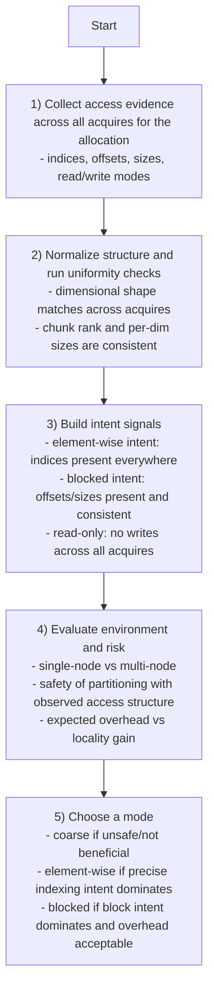
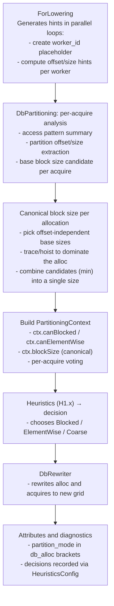
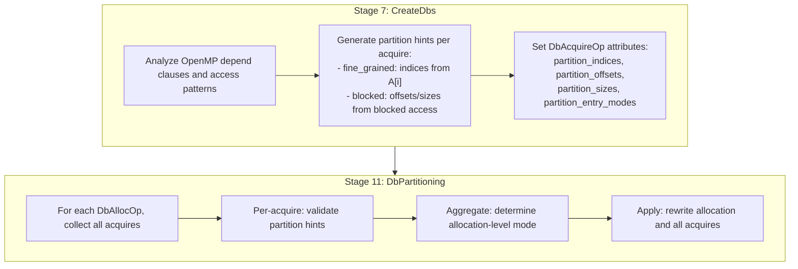
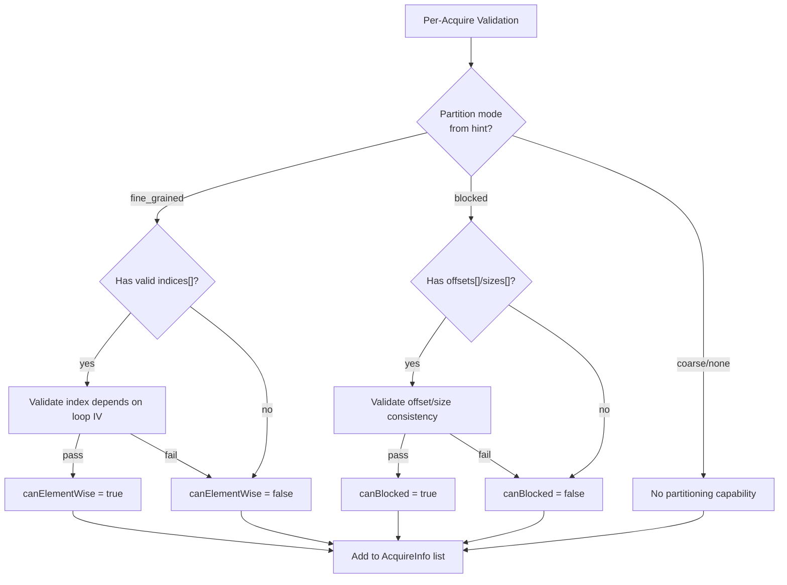
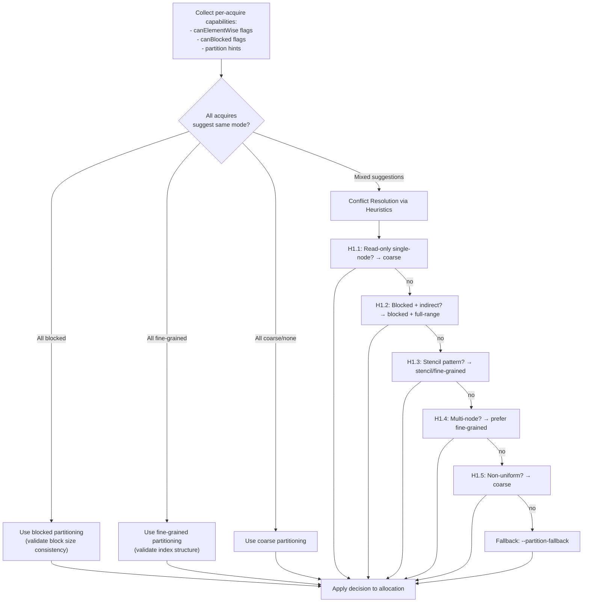
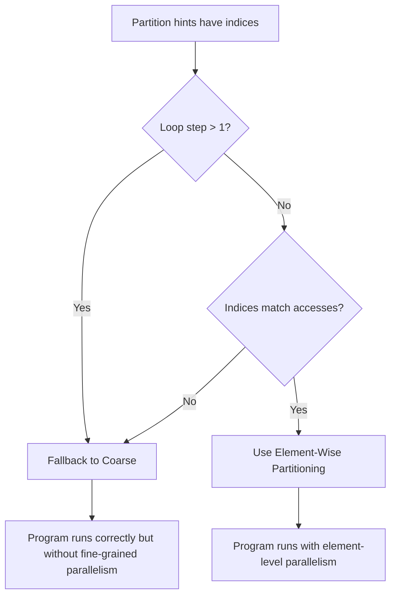

# Partitioning Decision Guide

This document describes how CARTS decides the datablock partitioning mode for each allocation. The decision is made once per DbAlloc and applies to all acquires of that allocation.

For rank-aware and multi-node specifics, see:

- /Users/randreshg/Documents/carts/docs/heuristics/single_rank
- /Users/randreshg/Documents/carts/docs/heuristics/multi_rank/db_granularity_and_twin_diff.md

## Modes at a Glance

| Mode         | What It Means                | Best Fit                  | Tradeoffs                        |
|--------------|------------------------------|---------------------------|----------------------------------|
| Coarse       | One datablock for full array | Irregular or mixed access | Lowest overhead, least locality  |
| Element-wise | One datablock per element    | Precise indexed access    | Highest overhead                 |
| Block (blocked) | One datablock per block   | Blocked/tiling patterns   | Good locality, moderate overhead |

## IR Labels and Partitioning Clause

The IR uses `partition_mode` in `db_alloc` brackets and a unified `partitioning(...)` clause for `db_acquire`:

| Partition Mode     | Meaning        |
|--------------------|----------------|
| `<coarse>`         | Coarse         |
| `<fine_grained>`   | Fine-grained   |
| `<block>`          | Block (blocked) |

### Unified Partitioning Clause

The `partitioning(...)` clause on `db_acquire` operations specifies access semantics:

| Mode | `indices[]` | `offsets[]` | `sizes[]` |
|------|-------------|-------------|-----------|
| **fine_grained** | element index (single) or empty (range) | optional range start (element coords) | optional range length (element count) |
| **block (blocked)** | (empty) | chunk start (block coord) | block size |
| **coarse** | (empty) | 0 | total size |
| **stencil** | (empty) | chunk start (block coord) | block size + halo |

Example:

```mlir
// Fine-grained: access single element at index %i
arts.db_acquire[<out>] (%guid, %ptr)
    partitioning(<fine_grained>, indices[%i], offsets[%c0], sizes[%c1])

// Fine-grained range: access a contiguous span starting at %start for %len
arts.db_acquire[<inout>] (%guid, %ptr)
    partitioning(<fine_grained>, offsets[%start], sizes[%len])

// Block (blocked): access chunk starting at %workerStart with %blockSize elements
arts.db_acquire[<inout>] (%guid, %ptr)
    partitioning(<block>, offsets[%workerStart], sizes[%blockSize])
```

All `arts.db_alloc` operations carry an explicit `partition_mode` in brackets
(e.g., `db_alloc[<inout>, <heap>, <write>, <coarse>]`). This keeps allocation
layout explicit for copy/sync decisions and diagnostics.

**Note on DB-space vs partition hints:** CreateDbs always emits **coarse
DB-space** offsets/sizes (`offsets=[0]`, `sizes=[allocSizes]`) regardless of
fine-grained intent. Fine-grained intent is carried **only** in the
`partition_*` hint fields (`partition_indices/offsets/sizes`). DbPartitioning
consumes those hints and rewrites the DB-space fields later.

## Terminology Mapping

This table maps user-facing CLI options to internal implementation details:

| User/CLI Term | PartitionGranularity | RewriterMode | outerRank | IR Attribute    |
|---------------|----------------------|--------------|-----------|-----------------|
| coarse        | Coarse               | ElementWise  | 0         | coarse          |
| fine          | FineGrained          | ElementWise  | >0        | fine_grained    |
| blocked       | Blocked              | Blocked      | 1         | block           |
| stencil       | Stencil              | Stencil      | 1         | stencil         |

**Key insight**: `RewriterMode::ElementWise` handles both coarse and fine-grained.
The difference is `outerRank`: coarse has `outerRank=0` (single DB for entire array),
fine-grained has `outerRank>0` (multiple DBs, one per element/row).

**CLI option**: `--partition-fallback=coarse|fine` controls the fallback behavior
for non-affine (indirect) accesses. See "Non-Affine Fallback" section for details.

## PartitionInfo: The Canonical Terminology Source

All indexers and rewriters use `PartitionInfo` (defined in ArtsDialect.h) as the
single source of truth for partition semantics. This struct flows through the
entire partitioning pipeline, ensuring consistent terminology.

### The PartitionInfo Struct

```cpp
struct PartitionInfo {
  PartitionMode mode;                    // coarse, fine_grained, block, stencil
  SmallVector<Value, 4> indices;         // For fine_grained: element COORDINATES
  SmallVector<Value, 4> offsets;         // For block/stencil and fine-grained range: START
  SmallVector<Value, 4> sizes;           // For block/stencil and fine-grained range: SIZE
};
```

### Inheritance Architecture

```
DbIndexerBase (holds PartitionInfo)
    |-- partitionInfo.mode          // Determines which fields to use
    |-- partitionInfo.indices       // Element coordinates (fine-grained)
    |-- partitionInfo.offsets       // Range start (block/stencil or fine-grained range)
    |-- partitionInfo.sizes         // Range size (block/stencil or fine-grained range)
    |
    |-- DbElementWiseIndexer (uses partitionInfo.indices)
    |-- DbBlockIndexer (uses partitionInfo.offsets/sizes)
    +-- DbStencilIndexer (uses partitionInfo.offsets/sizes + stencilInfo)
```

### Field Semantics by Mode

| Mode | `indices` | `offsets` | `sizes` | Indexer |
|------|-----------|-----------|---------|---------|
| **fine_grained** | Element COORDINATES (single) | Optional range START (element coords) | Optional range SIZE (element count) | DbElementWiseIndexer |
| **block** | (unused) | Range START | Range SIZE | DbBlockIndexer |
| **stencil** | (unused) | Range START | Range SIZE + halo | DbStencilIndexer |

### Index Localization Formulas

**Fine-Grained (DbElementWiseIndexer):**
```
dbRefIndex  = partitionInfo.indices    // Direct use - these ARE the element coordinates
memrefIndex = accessIndices[outerRank:]
```

**Fine-Grained Range (DbElementWiseIndexer):**
```
dbRefIndex  = globalOuter - rangeStart   // rangeStart = partitionInfo.offsets[0]
memrefIndex = globalInner
```
Range acquires still use element-wise indexing (no division/modulo). The
offsets/sizes describe a contiguous span of element coordinates.

**Block (DbBlockIndexer):**
```
blockSize   = partitionInfo.sizes[d]
startBlock  = partitionInfo.offsets[d] / blockSize  // Computed by rewriter
dbRefIndex  = (accessIndex / blockSize) - startBlock
memrefIndex = accessIndex % blockSize
```

**Stencil (DbStencilIndexer):**
```
// Same as block, but with 3-buffer selection for halo regions
blockSize   = partitionInfo.sizes[d]
localRow    = globalRow - elemOffset
// Then select: leftHalo, owned, or rightHalo buffer based on localRow
```

---

## Visual Guide to Index Localization

This section provides visual ASCII diagrams showing how each partitioning type transforms memory layout and indices. Use this as a quick reference before diving into the detailed formulas above.

### 1. Memory Layout Fundamentals (Common to All)

```
C Declaration: double A[4][8]  (4 rows, 8 columns)

Logical View (2D):
┌───┬───┬───┬───┬───┬───┬───┬───┐
│0,0│0,1│0,2│0,3│0,4│0,5│0,6│0,7│  Row 0    addr 0-7
├───┼───┼───┼───┼───┼───┼───┼───┤
│1,0│1,1│1,2│1,3│1,4│1,5│1,6│1,7│  Row 1    addr 8-15
├───┼───┼───┼───┼───┼───┼───┼───┤
│2,0│2,1│2,2│2,3│2,4│2,5│2,6│2,7│  Row 2    addr 16-23
├───┼───┼───┼───┼───┼───┼───┼───┤
│3,0│3,1│3,2│3,3│3,4│3,5│3,6│3,7│  Row 3    addr 24-31
└───┴───┴───┴───┴───┴───┴───┴───┘

Linearized vs Multi-index access:
  A[2][5]      → row=2, col=5              (2 indices)
  A[2*8 + 5]   → linear_idx=21             (1 index)
```

### 2. Element-Wise (Fine-Grained) Partitioning

#### 2.1 What It Does

Creates one datablock per element (or per row for 2D arrays).

```
Original: memref<4x8xf64>  (4 rows, 8 columns)

BEFORE:                          AFTER (element-wise on dim 0):
┌─────────────────────────┐      ┌─────────┐ ┌─────────┐ ┌─────────┐ ┌─────────┐
│ [0,0]..[0,7]            │      │ Row 0   │ │ Row 1   │ │ Row 2   │ │ Row 3   │
│ [1,0]..[1,7]            │  →   │ 8 elems │ │ 8 elems │ │ 8 elems │ │ 8 elems │
│ [2,0]..[2,7]            │      └─────────┘ └─────────┘ └─────────┘ └─────────┘
│ [3,0]..[3,7]            │       db_ref[0]   db_ref[1]   db_ref[2]   db_ref[3]
└─────────────────────────┘

Allocation: sizes=[4], elementSizes=[8]
            (4 datablocks, each holding 8 elements)
```

#### 2.2 Index Transformation Formula

```
Access A[row][col]:
  db_ref_idx  = row          (direct - row IS the db index)
  memref_idx  = [col]        (remaining indices passed through)
```

#### 2.3 Example: Jacobi Copy Loop

```c
// Source code
for (i = 0; i < 4; i++) {
    for (j = 0; j < 8; j++) {
        u[i][j] = unew[i][j];
    }
}
```

```
Access u[2][5]:
  Step 1: db_ref_idx = 2     → select db_ref[2]
  Step 2: memref_idx = [5]   → load from memref[5]

Result:  db_ref[2] → memref.load[5]

Visual:
  ┌─────────┐ ┌─────────┐ ┌─────────┐ ┌─────────┐
  │ Row 0   │ │ Row 1   │ │ Row 2 ← │ │ Row 3   │
  └─────────┘ └─────────┘ └────┬────┘ └─────────┘
                               │
                          memref[5] = element at col 5
```

### 3. Block Partitioning

#### 3.1 What It Does

Groups multiple rows/elements into blocks. Each block is one datablock.

```
Original: memref<4x8xf64>  (4 rows)
Block partitioning on dim 0, blockSize=2

BEFORE:                          AFTER:
┌─────────────────────────┐      ┌─────────────────┐  ┌─────────────────┐
│ [0,0]..[0,7]            │      │  Block 0        │  │  Block 1        │
│ [1,0]..[1,7]            │  →   │  rows 0-1       │  │  rows 2-3       │
│ [2,0]..[2,7]            │      │  16 elements    │  │  16 elements    │
│ [3,0]..[3,7]            │      └─────────────────┘  └─────────────────┘
└─────────────────────────┘           db_ref[0]            db_ref[1]

Allocation: sizes=[2], elementSizes=[2, 8]
            (2 datablocks, each holding 2 rows × 8 cols)
```

#### 3.2 Index Transformation Formula

```
Access A[row][col] with blockSize=B:
  db_ref_idx  = row / B              (which block)
  memref_idx  = [row % B, col]       (position within block)
```

#### 3.3 Example: Standard 2D Access

```c
// Access A[2][5] with blockSize=2
```

```
Step 1: Compute block index
  db_ref_idx = 2 / 2 = 1        → block 1

Step 2: Compute local indices
  local_row = 2 % 2 = 0         → row 0 within block
  local_col = 5                 → col 5 (unchanged)
  memref_idx = [0, 5]

Result: db_ref[1] → memref.load[0, 5]

Visual:
  ┌─────────────────┐  ┌─────────────────┐
  │  Block 0        │  │  Block 1    ←   │
  │  row 0: [0..7]  │  │  row 0: [0..7]──┼─→ memref[0,5]
  │  row 1: [0..7]  │  │  row 1: [0..7]  │    (local row 0, col 5)
  └─────────────────┘  └─────────────────┘
       db_ref[0]            db_ref[1]
```

#### 3.4 Linearized Access in Block Mode

**What is linearized access?**

C code can access 2D arrays with a single computed index:

```c
Real_t (*A)[8];         // 2D array, 8 columns
A[elem / 8][elem % 8];  // mathematically equals A[elem] (linearized)
```

The compiler may optimize this to `memref.load %A[%elem]` (1 index instead of 2).

**The Problem:**

```
Array type: memref<?x8xf64>  (2D, stride=8)
Access:     load[21]          (1 index)

After block partitioning:
  Element type: memref<?x8xf64>  (still 2D!)

But we only have 1 index (21) and need 2 indices for 2D element!
```

**The Solution: De-linearize first**

```
Input: linear_idx=21, stride=8, blockSize=2

Step 1: DE-LINEARIZE
  ┌─────────────────────────────┐
  │ globalRow = 21 / 8 = 2      │
  │ globalCol = 21 % 8 = 5      │
  │                             │
  │ Linear 21 → row 2, col 5    │
  └─────────────────────────────┘

Step 2: BLOCK INDEX
  ┌─────────────────────────────┐
  │ db_ref_idx = 2 / 2 = 1      │
  │ (row 2 is in block 1)       │
  └─────────────────────────────┘

Step 3: LOCAL INDICES
  ┌─────────────────────────────┐
  │ local_row = 2 % 2 = 0       │
  │ local_col = 5               │
  │ memref_idx = [0, 5]         │
  └─────────────────────────────┘

Result: db_ref[1] → memref.load[0, 5]
```

**Visual Flow:**

```
  load[21]  ──de-linearize──▶  (row=2, col=5)
                                    │
                              ┌─────▼─────┐
                              │ row / bs  │ = db_ref[1]
                              │ row % bs  │ = local_row 0
                              │ col       │ = local_col 5
                              └───────────┘
                                    │
                              memref.load[0, 5]
```

### 4. Stencil Partitioning

#### 4.1 What It Does

Block partitioning + halo regions for neighbor access patterns.

```
5-point stencil: A[i-1], A[i], A[i+1]

Standard block:       Stencil block (with halo):
┌───────────────┐     ┌─┬─────────────┬─┐
│ owned rows    │  →  │H│ owned rows  │H│
│ [0..bs-1]     │     │a│ [0..bs-1]   │a│
└───────────────┘     │l│             │l│
                      │o│             │o│
                      └─┴─────────────┴─┘
                       ↑               ↑
                    left halo      right halo
```

#### 4.2 Index Transformation Formula

```
Access A[i] with halo:
  db_ref_idx  = (i - halo_left) / blockSize
  memref_idx  = (i - halo_left) % blockSize + halo_offset
```

#### 4.3 Example: Jacobi Stencil

```c
// 5-point stencil access
unew[i][j] = 0.25 * (u[i-1][j] + u[i][j+1] +
                     u[i][j-1] + u[i+1][j] + f[i][j]);
```

```
Worker 1 owns rows 2-3 (blockSize=2)
Stencil needs: u[i-1], u[i], u[i+1]

Block with halo:
  ┌─────────────────────────────┐
  │ halo_left:  row 1 (copy)    │  ← neighbor data
  │ owned:      rows 2-3        │  ← worker's data
  │ halo_right: row 4 (copy)    │  ← neighbor data
  └─────────────────────────────┘

Access u[2-1][j] = u[1][j]:
  → Found in halo_left region
```

### 5. Comparison Summary

```
| Type         | DBs Created | Index Transform | Best For         |
|--------------|-------------|-----------------|------------------|
| Element-wise | O(N)        | direct          | precise deps     |
| Block        | O(N/bs)     | div/mod         | locality         |
| Stencil      | O(N/bs)     | div/mod + halo  | neighbor access  |

Example: 4-row array, blockSize=2

Element-wise: 4 DBs     Block: 2 DBs        Stencil: 2 DBs + halos
┌──┐┌──┐┌──┐┌──┐        ┌────┐┌────┐        ┌─┬────┬─┐┌─┬────┬─┐
│r0││r1││r2││r3│        │r0-1││r2-3│        │H│r0-1│H││H│r2-3│H│
└──┘└──┘└──┘└──┘        └────┘└────┘        └─┴────┴─┘└─┴────┴─┘
```

---

### Linearized Access in Block Mode

When C code uses linearized indexing to access multi-dimensional arrays, the compiler
detects this pattern and handles it specially in `DbBlockIndexer`.

**What is linearized access?**

C arrays can be accessed either with multi-dimensional indices or with a single
linearized index:

```c
// Multi-dimensional access (2 indices)
double A[N][8];
value = A[row][col];  // MLIR: memref.load A[%row, %col]

// Linearized access (1 index)
double *A_linear = (double*)A;
value = A_linear[row * 8 + col];  // MLIR: memref.load A[%linear_idx]
```

**Detection in DbBlockIndexer:**

Linearized access is detected when:
1. The load/store has **1 index** (`indices.size() == 1`)
2. The element type has **rank >= 2** (e.g., `memref<?x8xf64>`)
3. There's a **static stride > 1** (e.g., stride=8 for the inner dimension)

```cpp
// From DbBlockIndexer::transformDbRefUsers (lines 335-350)
bool isLinearized = false;
if (elementIndices.size() == 1) {
  if (auto memrefType = newElementType.dyn_cast<MemRefType>()) {
    if (memrefType.getRank() >= 2) {
      if (auto staticStride = DatablockUtils::getStaticStride(memrefType)) {
        if (*staticStride > 1) {
          isLinearized = true;
          stride = staticStride;
        }
      }
    }
  }
}
```

**Localization Formula (localizeLinearized):**

```
Input:  globalLinearIndex (single index), stride (from element type)

Step 1: De-linearize global index
  globalRow = globalLinearIndex / stride
  globalCol = globalLinearIndex % stride

Step 2: Compute block index (same as regular block mode)
  physBlock = globalRow / blockSize
  dbRefIdx  = physBlock - startBlock

Step 3: Compute local indices within block
  localRow = globalRow % blockSize
  localCol = globalCol % colBlockSize  // colBlockSize defaults to stride if not specified

Step 4: Output depends on innerRank
  if innerRank >= 2:
    memrefIndices = [localRow, localCol]    // Separate indices for 2D element type
  else:
    localLinear = localRow * colBlockSize + localCol
    memrefIndices = [localLinear]           // Re-linearized for 1D element type
```

**Why innerRank matters:**

The element type after partitioning determines how many indices the load/store needs:

| Element Type | innerRank | memrefIndices Format |
|--------------|-----------|---------------------|
| `memref<?xf64>` | 1 | `[localLinear]` (re-linearized) |
| `memref<?x?xf64>` | 2 | `[localRow, localCol]` (separate) |
| `memref<?x?x?xf64>` | 3 | `[localRow, localCol, ...]` (separate) |

**Example: LULESH 2D Array Access**

```c
// Source: lulesh.c line 957
Real_t (*fx_elem)[8] = AllocReal2D(numElem, 8);
fx_tmp += fx_elem[elem / 8][elem % 8];
```

This gets compiled to a linearized single-index access. With block partitioning:

```
Original: memref<?x8xf64> partitioned on dim 0
Element type: memref<?x8xf64> (innerRank=2)

Access: load[linear_idx] where linear_idx = (elem/8)*8 + (elem%8) = elem

De-linearize:
  globalRow = elem / 8
  globalCol = elem % 8

Block localization (blockSize=B):
  dbRefIdx = (elem / 8) / B - startBlock
  localRow = (elem / 8) % B
  localCol = elem % 8

Output (innerRank=2):
  db_ref[dbRefIdx]
  memref.load[localRow, localCol]  // 2 indices for rank-2 element type
```

### Data Flow Through Pipeline

```
DbAcquireOp.getPartitionInfos() --> PartitionInfo
                                          |
                          DbPartitioning populates DbRewriteAcquire.partitionInfo
                                          |
                          Rewriter checks partitionInfo.mode, passes to Indexer
                                          |
                          DbIndexerBase.partitionInfo (inherited by all indexers)
                                          |
                          Specialized indexer accesses .indices OR .offsets/.sizes
```

This unified flow eliminates the previous semantic confusion where `elemOffsets`
could mean either element coordinates (fine-grained) or range starts (block mode).

## Index Localization by Mode

### Terminology: partition_indices vs partition_offsets

| CreateDbs Source | Semantic Meaning | When Used | Indexer |
|------------------|------------------|-----------|---------|
| `partition_indices` | Element COORDINATES `[%i, %j]` | Fine-grained: `depend(inout: A[i][j])` | DbElementWiseIndexer |
| `partition_offsets` | Range START (element coords) | Fine-grained range: batch deps like `depend(in: A[i : len])` | DbElementWiseIndexer |
| `partition_offsets` | Block START (block coords) | Block mode: `depend(in: A[off:sz])` | DbBlockIndexer |

Both flow to `DbRewriteAcquire.elemOffsets` but have different semantics!

### DbElementWiseIndexer (Fine-Grained Mode)
- **elemOffsets**: Element COORDINATES from `partition_indices` (or range start from `partition_offsets`)
- **globalIndices**: Inner indices from load/store operations
- **Behavior**: Single-element uses elemOffsets directly; range uses `globalOuter - rangeStart` (no div/mod)
- **Example**:
  ```
  partition_indices = [%i] from depend(inout: A[i])
  Access: A[%i][%j]
  elemOffsets = [%i], globalIndices = [%j]
  Result: db_ref[%i], memref[%j]
  ```

### DbBlockIndexer (Block Mode)
- **blockSizes, startBlocks**: Block configuration
- **Behavior**: Div/mod localization: `dbRefIdx = global / blockSize - startBlock`
- **Example**:
  ```
  partition_offsets = [25], partition_sizes = [25]
  Access: A[27][10]
  dbRefIdx = 27 / 25 - 1 = 0
  memrefIdx = [27 % 25, 10] = [2, 10]
  ```

### DbStencilIndexer (Stencil Mode)
- Extends block mode with halo regions for neighbor access

## Decision Flow (High-Level)

A compact reasoning flow that captures how the system decides without naming specific heuristics.



## Partitioning Pipeline (End-to-End)

**CRITICAL**: The partitioning decision spans THREE key passes in the compiler pipeline.
Understanding when hints are generated vs. consumed is essential.

### Pipeline Stage Overview

| Pipeline Stage | Pass               | What Happens                                       |
|----------------|--------------------|----------------------------------------------------|
| Stage 7        | CreateDbsPass      | Creates DbAllocs with initial partitioning hints   |
| Stage 8-9      | DbOpt + EdtOpt     | Initial optimization passes                        |
| Stage 10       | ForLoweringPass    | Sets PartitioningHint on parallel loops            |
| Stage 11       | DbPartitioningPass | Uses hints to partition (coarse → fine/blocked)    |
| Stage 11       | DbPass             | Re-run to adjust modes after partitioning          |

### Three-Stage Flow Diagram

```mermaid
flowchart TB
  subgraph S7["Stage 7: CreateDbs pass"]
    direction TB
    S7A["For each memref used in EDTs:<br/>- create DbAllocOp + DbAcquireOps<br/>- ALWAYS coarse db_alloc (sizes=[1])<br/>- attach partition hints on DbAcquire: partition_indices/offsets/sizes<br/>- capture multi-entry depend hints via segment attrs"]
    S7O["Output: coarse DbAllocOps + DbAcquireOps carrying partition hints"]
    S7A --> S7O
  end

  subgraph S10["Stage 10: ForLowering pass (in Concurrency)"]
    direction TB
    S10A["Analyze loop IVs and depend structure:<br/>- indices[] from indexed access patterns (A[i])<br/>- offsets/sizes for blocked patterns<br/>- set PartitioningHint attribute on loops"]
    S10B["Update DbAcquireOps with partition info"]
    S10O["Output: DbAcquireOps with partitioning(mode, indices, offsets, sizes)"]
    S10A --> S10B --> S10O
  end

  subgraph S11["Stage 11: DbPartitioning pass (in ConcurrencyOpt)"]
    direction TB
    S11A["1) canBePartitioned(useFineGrainedFallback)?<br/>- if hasNonAffineAccesses and fallback not enabled → false<br/>- safety checks on hints/structure<br/>- false → skip (keep coarse)"]
    S11B["2) Per-acquire analysis:<br/>- indices present → canElementWise = true<br/>- offsets/sizes present → canBlocked = true<br/>- extract partition offset/size"]
    S11C["3) Build PartitioningContext:<br/>- ctx.canBlocked / ctx.canElementWise<br/>- ctx.blockSize (canonical)<br/>- per-acquire voting"]
    S11D["4) Heuristics evaluation (H1.x):<br/>- H1.1 read-only single node → coarse<br/>- H1.2 mixed access → blocked + full-range<br/>- H1.3 stencil pattern → stencil/fine-grained<br/>- H1.4 multi-node → fine-grained preferred<br/>- H1.5 access uniformity → coarse fallback"]
    S11E["5) Apply decision via DbRewriter:<br/>- coarse: keep original<br/>- else: rewrite alloc and acquires to new grid<br/>- set partition attribute (coarse/fine_grained/blocked)"]
    S11A --> S11B --> S11C --> S11D --> S11E
  end

  S7 --> S10 --> S11
```



### Coarse → Fine Conversion Example

When DbPartitioning converts an allocation from coarse to fine-grained:

```text
BEFORE (coarse, after CreateDbs):
  %alloc = arts.db_alloc[<inout>, <heap>, <write>, <coarse>]
      sizes[1] elementSizes[N]
  %acq = arts.db_acquire %alloc
      partitioning(<coarse>, offsets[0], sizes[1])

AFTER (fine-grained, after DbPartitioning):
  %alloc = arts.db_alloc[<inout>, <heap>, <write>, <fine_grained>]
      sizes[N] elementSizes[1]
  %acq = arts.db_acquire %alloc
      partitioning(<fine_grained>, indices[%idx], offsets[%c0], sizes[%c1])
```

### Invariants (Keep in Mind)

- CreateDbs always emits coarse `db_alloc` (`sizes=[1]`) and never changes allocation layout.
- Partition hints live only in `partition_*` fields on `db_acquire` and are consumed later.
- Multi-entry depend clauses are encoded with segment arrays; if segment attrs are missing, treat the hints as a single entry.
- DbPartitioning is the only place where allocation mode changes (coarse → fine/blocked/stencil).

### Verification Commands

```bash
# Stage 7: After CreateDbs - DBs exist with initial partitioning
carts run input.mlir --create-dbs > after_createdb.mlir
grep "partitioning" after_createdb.mlir | head -5

# Stage 10: After ForLowering - Partition hints refined
carts run input.mlir --concurrency > after_forlowering.mlir
grep "partitioning" after_forlowering.mlir | head -5

# Stage 11: After DbPartitioning - Final partitioning applied
carts run input.mlir --concurrency-opt > final.mlir
grep "partition_mode" final.mlir | sort | uniq -c
```

### Detailed Per-Stage Flow



Mixed access patterns (blocked writes + indirect reads) are handled via H1.2
heuristic using **full-range acquires** instead of DbCopy/DbSync. When H1.2
detects this pattern, indirect read-only acquires are marked as `needsFullRange`,
allowing them to access all chunks while direct writes use blocked partitioning.

## Partition Hint Validation and Allocation-Level Decisions

**CRITICAL**: Partitioning decisions are made at the **allocation level**, but the
appropriate mode depends on what the **acquires** suggest. This section documents
how partition hints from CreateDbs are validated and how conflicts between acquires
are resolved.

### Key Constraint: No Mixed-Mode Acquires

All acquires for the same DbAllocOp **MUST** have the same partitioning mode.
This is because the allocation's structure (`sizes`/`elementSizes`) is determined
at the allocation level. You cannot have blocked and fine-grained acquires for
the same allocation.

```
INVALID:
  %alloc = arts.db_alloc sizes[N] elementSizes[1]  // Fine-grained structure
  %acq1 = arts.db_acquire partitioning(<fine_grained>, indices[%i])
  %acq2 = arts.db_acquire partitioning(<block>, offsets[%o], sizes[%s])
                                       ↑ CONFLICT! Different mode

VALID:
  %alloc = arts.db_alloc sizes[N] elementSizes[1]  // Fine-grained structure
  %acq1 = arts.db_acquire partitioning(<fine_grained>, indices[%i])
  %acq2 = arts.db_acquire partitioning(<fine_grained>, indices[%j])
                                       ↑ SAME mode
```

### Hint Flow: CreateDbs → DbPartitioning



### Per-Acquire Hint Validation

For each acquire, DbPartitioning validates the partition hints from CreateDbs:



### Allocation-Level Mode Resolution

When acquires suggest different modes, heuristics determine the final allocation mode:



### Conflict Resolution Rules

| Conflict Scenario | Resolution | Rationale |
|-------------------|------------|-----------|
| Blocked + Coarse | Blocked (coarse → full-range) | Enables parallelism; coarse uses full-range acquire |
| Fine-grained + Coarse | Heuristics decide | May use fine-grained with full-range, or fall back to coarse |
| Blocked + Fine-grained | **NOT ALLOWED** | Incompatible allocation structures; fall back to coarse |
| All modes agree | Use that mode | No conflict to resolve |

### Example 1: All Acquires Suggest Blocked

**Source pattern:**

```c
#pragma omp parallel for
for (int i = 0; i < N; i += BLOCK_SIZE) {
    for (int j = 0; j < BLOCK_SIZE; j++) {
        B[i+j] = A[i+j] * 2.0;  // Blocked access
    }
}
```

**CreateDbs output:**

```mlir
%acq_A = arts.db_acquire partitioning(<block>, offsets[%arg2], sizes[%c4])
%acq_B = arts.db_acquire partitioning(<block>, offsets[%arg2], sizes[%c4])
```

**DbPartitioning analysis:**

- Acquire A: canBlocked=true, offset=%arg2, size=%c4
- Acquire B: canBlocked=true, offset=%arg2, size=%c4
- All suggest blocked → Use blocked partitioning

**Result:** Both allocations use `sizes[numChunks] elementSizes[blockSize]`

### Example 2: All Acquires Suggest Fine-Grained

**Source pattern:**

```c
#pragma omp parallel for
for (int i = 0; i < N; i++) {
    #pragma omp depend(inout: C[i])
    #pragma omp depend(in: A[i], B[i])
    C[i] = A[i] + B[i];  // Element-wise access
}
```

**CreateDbs output:**

```mlir
%acq_A = arts.db_acquire partitioning(<fine_grained>, indices[%i])
%acq_B = arts.db_acquire partitioning(<fine_grained>, indices[%i])
%acq_C = arts.db_acquire partitioning(<fine_grained>, indices[%i])
```

**DbPartitioning analysis:**

- All acquires: canElementWise=true, indices=[%i]
- All suggest fine-grained → Use fine-grained partitioning

**Result:** All allocations use `sizes[N] elementSizes[1]`

### Example 3: Blocked + Coarse (Mixed Mode)

**Source pattern:**

```c
// Sequential initialization
for (int i = 0; i < N; i++) {
    A[i] = (double)i;  // Coarse access (no parallel, no hints)
}

// Parallel computation
#pragma omp parallel for
for (int i = 0; i < N; i += BLOCK_SIZE) {
    #pragma omp depend(inout: A[i:BLOCK_SIZE])
    for (int j = 0; j < BLOCK_SIZE; j++) {
        A[i+j] *= 2.0;  // Blocked access
    }
}
```

**CreateDbs output:**

```mlir
// Init acquire (no hints)
%acq_init = arts.db_acquire partitioning(<coarse>, offsets[%c0], sizes[%total])

// Parallel acquire (with hints)
%acq_parallel = arts.db_acquire partitioning(<block>, offsets[%arg2], sizes[%c4])
```

**DbPartitioning analysis:**

- Init acquire: canBlocked=false, canElementWise=false
- Parallel acquire: canBlocked=true, offset=%arg2, size=%c4
- Conflict: blocked vs coarse
- Resolution: Use blocked, init acquire becomes full-range

**Result:**

```mlir
%alloc = arts.db_alloc sizes[%numChunks] elementSizes[%blockSize]

// Init: full-range (accesses all chunks)
%acq_init = arts.db_acquire offsets[%c0], sizes[%numChunks]

// Parallel: single chunk per worker
%acq_parallel = arts.db_acquire offsets[%chunkIdx], sizes[%c1]
```

### Example 4: Incompatible Suggestions (Fallback to Coarse)

**Source pattern:**

```c
#pragma omp parallel for
for (int i = 0; i < N; i++) {
    // One task uses element-wise
    #pragma omp depend(inout: A[i])
    process_element(A, i);

    // Another uses blocked (different granularity!)
    #pragma omp depend(in: A[chunk_start:BLOCK_SIZE])
    summarize_chunk(A, chunk_start);
}
```

**CreateDbs output:**

```mlir
%acq1 = arts.db_acquire partitioning(<fine_grained>, indices[%i])
%acq2 = arts.db_acquire partitioning(<block>, offsets[%chunk_start], sizes[%BLOCK_SIZE])
```

**DbPartitioning analysis:**

- Acquire 1: canElementWise=true, indices=[%i]
- Acquire 2: canBlocked=true, offset=%chunk_start
- Conflict: fine-grained vs blocked (incompatible structures!)
- Resolution: Fall back to coarse (cannot satisfy both)

**Result:**

```mlir
%alloc = arts.db_alloc sizes[%c1] elementSizes[%N]  // Coarse
// All acquires rewritten to coarse mode
```

### Trusting vs Validating Partition Hints

DbPartitioning does **not** blindly trust hints from CreateDbs. Instead:

1. **Trust the intent**: If CreateDbs set `<block>` mode, the intent is blocked
2. **Validate the structure**: Check that offsets/sizes are consistent across acquires
3. **Verify safety**: Ensure partition offset ties to access indices

**Why validation is needed:**

CreateDbs analyzes access patterns from the **outer scope** (parallel loop IV),
but DbPartitioning must verify that accesses **inside the EDT** are correctly
structured for the suggested partitioning.

```
CreateDbs sees:        scf.for %arg2 = ... step %c4
                              ↓
                       DbAcquire with offsets[%arg2]

DbPartitioning must verify:
  - EDT body uses %arg2 consistently for indexing
  - All memref accesses can be localized to the chunk
  - No cross-chunk access patterns that would cause errors
```

**Current validation approach:**

```cpp
// In computeAcquirePartitionInfo():
case PartitionMode::block:
  // FIRST: Try to use partition hints from CreateDbs
  if (!acquire.getPartitionOffsets().empty()) {
    info.partitionOffset = acquire.getPartitionOffsets().front();
    info.partitionSize = acquire.getPartitionSizes().front();
    info.isValid = true;  // Trust the hint
  }
  // FALLBACK: computeBlockInfo for cases without hints
  else if (acqNode && succeeded(acqNode->computeBlockInfo(offset, size))) {
    info.partitionOffset = offset;
    info.partitionSize = size;
    info.isValid = true;
  }
  else {
    info.mode = PartitionMode::coarse;  // Cannot validate
  }
```

## What Signals Are Used

| Signal                     | How It Is Derived                       | Why It Matters              |
|---------------------------|-----------------------------------------|-----------------------------|
| Uniform access structure   | Uniformity checks pass for all acquires | Enables safe partitioning   |
| Element-wise intent        | Indices present for all acquires        | Enables element-wise mode   |
| Blocked intent             | `offsets/sizes` present and consistent  | Enables blocked mode        |
| Read-only allocation       | No write acquires across the allocation | Reduces need to split DBs   |
| Environment (single/multi) | Execution context                       | Changes transfer tradeoff   |

### Partitioning Clause Semantics

The `partitioning(<mode>, indices[...], offsets[...], sizes[...])` clause operands:

| Operand | Meaning | Example |
|---------|---------|---------|
| `indices[]` | Element index for fine-grained (element-wise) access | `indices[%i]` → access element `A[i]` |
| `offsets[]` | Chunk start index for blocked/coarse access | `offsets[%workerStart]` → chunk starts at element `workerStart` |
| `sizes[]` | Number of elements in the chunk | `sizes[%blockSize]` → chunk has `blockSize` elements |

**Semantic Mapping by Mode:**

```
fine_grained:  indices[%i], offsets[0], sizes[1]
               → Access single element at index %i
               → %i identifies WHICH element in the fine-grained DB grid

blocked:       offsets[%start], sizes[%count]
               → Access chunk starting at element %start
               → Chunk contains %count elements

coarse:        offsets[0], sizes[%total]
               → Access entire array as one chunk
               → Single DB for all elements
```

**Size Consistency Check:**
DbPartitioning validates that all acquires for the same allocation have consistent
`sizes` (same SSA value or equal constants). If sizes don't agree, partitioning
falls back to `--partition-fallback` (coarse or fine, NOT blocked).

## Canonical Block Size Per Allocation

Blocked partitioning needs a single block size per allocation, even when
individual acquires have remainder-aware sizes (e.g., the last worker gets a
smaller slice). The canonicalization step derives a stable base size and makes
it available to the heuristics interface.

Algorithm (per allocation):

1) Collect `sizes[]` from all acquires with partitioning clause.
2) For each acquire, try to strip remainder-aware sizes:
   - If size depends on offset, peel min/select to pick the non-offset branch.
   - If size does not depend on offset, use it directly.
3) Trace/hoist candidates to dominate the alloc site.
4) Canonicalize:
   - If candidates match, use that.
   - If candidates differ, use min(candidate_i) to stay safe.
5) Set ctx.blockSize to the smallest static candidate (if any) and use the
   canonical dynamic size for rewriting.

This ensures all acquires are rewritten against the same allocation grid while
keeping per-worker offsets/sizes intact.

## Offset Validation (Blocked Safety)

Offset validation ensures that the partition offset is tied to the memref
indices used by the task. The current rule is:

- Prefer memref indices (load/store) for validation.
- If no memref indices exist, fall back to db_ref indices.
- The first dynamic index in that chain must depend on the partition offset.

Pseudocode:

```
for each memref access:
  chain = memref.indices if present else db_ref.indices
  first_dyn = first non-constant index in chain
  if first_dyn exists and !dependsOn(first_dyn, offset):
    fail
```

When twin_diff is unavailable, partitioning proceeds only if this rule holds
for all acquires, ensuring disjoint chunk ownership for writers.

## Non-Affine Fallback (Partition Fallback)

Some arrays are accessed through indirect indices (e.g., `x[nodelist[i]]`).
These are classified as non-affine and are unsafe to chunk by default.

Policy is controlled by `--partition-fallback`:

- `coarse` (default): reject non-affine allocations unless explicit
  offset/size hints override; allocation stays coarse.
- `fine`: allow non-affine allocations to proceed and mark them as indexed so
  H1.3 selects element-wise partitioning.
- `versioned`: legacy alias for `fine` (versioning is no longer automatic).

**Why only coarse and fine?** Only these two modes are direct partitioning
fallbacks because they work for ANY access pattern:

| Fallback | Works For | Requirements |
|----------|-----------|--------------|
| coarse   | All patterns | None (single DB) |
| fine     | All patterns | None (one DB per element) |
| blocked  | **Not a fallback** | Requires offsets/sizes from ForLowering |
| stencil  | **Not a fallback** | Requires stencil pattern detection |

Blocked and Stencil modes require specific structural information (offsets/sizes)
that may not be available for arbitrary access patterns. They are selected by
heuristics when the patterns are detected, not as fallbacks.

**Note:** Mixed access patterns (blocked writes + indirect reads) are handled
via full-range acquires in blocked mode. The indirect read-only acquires get
`needsFullRange=true` and access all chunks, while direct writes use standard
blocked partitioning. This avoids the memory duplication and sync overhead of
the versioning approach (DbCopy/DbSync).

This keeps correctness while enabling exploration of finer-grained
parallelism. The element-wise path can be expensive; use it for targeted
experiments or when indirect access dominates the kernel.

## Element-Wise to Coarse Fallback (Block-Wise Pattern Detection)

When partition hints suggest element-wise (`indices[]` present) but the indices
don't match actual accesses, the system detects a **block-wise pattern** and
falls back to coarse partitioning for correctness.

### Detection Criteria

A **block-wise pattern** is detected when:

1. Partition hints have `indices[]` (looks like element-wise)
2. BUT the enclosing loop steps by > 1 (BLOCK_SIZE)
3. OR partition indices don't appear in EDT body accesses
4. OR accesses span a range beyond the hinted element

### Why This Matters

The Cholesky benchmark uses block-wise OpenMP dependencies:

```c
#pragma omp task depend(inout: L[k_block][k_block])  // Block corner (representative)
{
    // But accesses ENTIRE block: L[i][j] where i,j ∈ [k_block, k_block+BLOCK_SIZE)
    for (int i = k_block; i < k_block + BLOCK_SIZE; i++) {
        for (int j = k_block; j < i; j++) {
            L[i][i] -= L[i][j] * L[i][j];  // Accesses many elements!
        }
    }
}
```

**Key Insight**: The partition hint `indices[k_block, k_block]` is a **BLOCK IDENTIFIER**,
not an element index. The depend clause specifies the block corner, but the task
accesses the entire block region.

### Comparison: Element-Wise vs Block-Wise

| Aspect | Element-Wise | Block-Wise |
|--------|--------------|------------|
| Depend pattern | `depend(inout: A[i])` | `depend(inout: L[k][k])` |
| Loop step | 1 | BLOCK_SIZE (e.g., 16) |
| Actual access | Single element `A[i]` | Entire block `L[k..k+bs][k..k+bs]` |
| Hint matches access? | YES | NO |
| Partition mode | `<fine_grained>` | Falls back to `<coarse>` |

### Fallback Flow



### Validation Logic

The `validateElementWisePartitioning()` function checks if element-wise indices
are valid before applying element-wise partitioning:

```cpp
bool DbAcquireNode::validateElementWisePartitioning() {
    // Check 1: Loop step > 1 means block-wise pattern
    for (Value idx : partitionIndices) {
        if (enclosingLoop.step > 1)
            return false;  // Block-wise, not element-wise
    }

    // Check 2: Partition indices must appear in access chain
    for (Value idx : partitionIndices) {
        if (!accessIndexDependsOn(idx))
            return false;  // Index mismatch
    }
    return true;  // Valid element-wise
}
```

### Heuristic Integration

The fallback integrates with existing heuristics (H1.x):

```mermaid
flowchart TD
    START[Analyze Partition Hints] --> HAS_IDX{Has indices[]?}

    HAS_IDX -->|No| CHECK_OFFSETS{Has offsets/sizes?}
    CHECK_OFFSETS -->|Yes| H14[H1.4: Block Mode]
    CHECK_OFFSETS -->|No| H11[H1.1: Coarse]

    HAS_IDX -->|Yes| VALIDATE[Validate Element-Wise]
    VALIDATE --> VALID{Indices valid?}
    VALID -->|Yes| H13_ELEM[H1.3: Element-Wise]
    VALID -->|No| FALLBACK[Fallback to Coarse]
    FALLBACK --> H11
```

### Future: 2D Block Partitioning

Currently, block-wise patterns fall back to coarse for correctness. A future
enhancement would implement 2D block partitioning:

```
Allocation: sizes[N/bs, N/bs] elementSizes[bs, bs]
            (N/16 × N/16 blocks, each 16×16 elements)

Acquire for block (k_block, k_block):
  - Block index: (k_block/bs, k_block/bs)
  - offsets: [k_block/bs, k_block/bs], sizes: [1, 1]

Access localization for L[i][j]:
  - db_ref index: [i/bs - startRow, j/bs - startCol]
  - memref index: [i%bs, j%bs]
```

This would enable block-level parallelism for Cholesky-style patterns while
maintaining correctness.

### Verification

```bash
# Check if block-wise pattern is detected
carts-run cholesky.mlir --concurrency-opt --debug-only=db_partitioning 2>&1 | grep "block-wise"

# Should show: "Element-wise indices don't match accesses; falling back to coarse"
```

## LULESH Case Study: Coarse vs Fine vs Versioned (DB Copy)

This case study compares three partitioning strategies for LULESH, demonstrating
the performance implications of each approach.

### The LULESH Challenge

LULESH uses a hexahedral mesh where each element accesses 8 corner nodes through
an indirection array (`nodelist[elem][0..7]`). This indirect/gather access pattern
is classified as **non-affine** because the compiler cannot statically determine
which nodes each element accesses.

```
Element e accesses: x[nodelist[e][0]], x[nodelist[e][1]], ..., x[nodelist[e][7]]
                    ↑ indirect index - cannot be analyzed statically
```

By default, `canBePartitioned()` returns false for non-affine accesses, forcing
coarse-grained partitioning and serializing all parallel work.

### Mode 1: Coarse-Grained (Default)

**What happens:**

- Non-affine accesses → `canBePartitioned()` returns false
- Allocation stays coarse: `sizes=[1], elementSizes=[numNodes]`
- All EDTs serialize on coarse acquires

**Commands:**

```bash
# Compile with default (coarse) partitioning
carts run lulesh.mlir --concurrency-opt > lulesh_coarse.mlir

# Run benchmark
carts benchmarks run lulesh --size small

# Verify IR - should show partition_mode<coarse> for node arrays
grep "partition_mode" lulesh_coarse.mlir | sort | uniq -c
```

**Expected metrics:**

| Metric | Value | Notes |
|--------|-------|-------|
| E2E Time | ~11.28s | Measured on small problem size |
| Slowdown vs OMP | ~250x | Due to serialization |
| DBs Created | ~30 | One per array |
| Acquires/Element | ~15 | All compete for same DBs |
| Parallelism | None | Serialized on coarse acquires |

### Mode 2: Fine-Grained (Element-wise Fallback)

**What happens:**

- `--partition-fallback=fine` enables non-affine conversion
- `canBePartitioned(useFineGrainedFallback=true)` returns true
- H1.3 selects element-wise for indexed access patterns
- Allocation becomes: `sizes=[numNodes], elementSizes=[1]`

**Commands:**

```bash
# Compile with fine-grained fallback
carts run lulesh.mlir --concurrency-opt --partition-fallback=fine > lulesh_fine.mlir

# Run benchmark
carts benchmarks run lulesh --size small -- --partition-fallback=fine

# Verify IR - should show partition_mode<fine_grained> for node arrays
grep "partition_mode" lulesh_fine.mlir | sort | uniq -c

# Compare allocation structure
diff <(grep "arts.db_alloc" lulesh_coarse.mlir | head -3) \
     <(grep "arts.db_alloc" lulesh_fine.mlir | head -3)
# Should show: sizes=[1] → sizes=[numNodes]
```

**Expected metrics:**

| Metric | Value | Notes |
|--------|-------|-------|
| E2E Time | TBD | Measure with benchmark |
| Speedup vs Coarse | TBD | Expected significant improvement |
| DBs Created | numNodes | e.g., 729 for s=8 |
| Acquires/Element | 24 | 8 corners × 3 (x,y,z) |
| Parallelism | Full | Independent element access |

### Mode 3: Versioned DB Copy

**What happens:**

- **Write-optimized DB**: Blocked partitioning for direct writes
- **Read-optimized DB**: Element-wise copy for indirect reads
- **Explicit sync**: Between write and read phases

**Conceptual IR:**

```mlir
// Write phase: blocked for locality
%x_write = arts.db_alloc[<inout>, <heap>, <write>, <block>]
    sizes[numChunks] elementSizes[blockSize]

// Read phase: fine-grained copy for indirect access
%x_read = arts.db_copy(%x_write) dest_partition = <fine_grained>

// Sync before indirect reads
arts.db_sync(%x_read, %x_write)
```

**Commands:**

```bash
carts run lulesh.mlir --concurrency-opt --partition-fallback=versioned > lulesh_versioned.mlir
carts benchmarks run lulesh --size small -- --partition-fallback=versioned
```

This aims to balance write locality (blocked) with read flexibility (element-wise).

### Performance Comparison Table

| Metric | Coarse | Fine | Versioned | OMP |
|--------|--------|------|-----------|-----|
| E2E Time (s) | 11.28 | TBD | TBD | 0.045 |
| Speedup vs OMP | 0.004x | TBD | TBD | 1.0x |
| DBs Created | ~30 | numNodes | 2×numNodes | N/A |
| Acquires/Iter | ~15 | ~24K | ~512+8K | N/A |
| Memory | 1x | 1x+meta | 2x | 1x |
| Parallelism | None | Full | Moderate | Full |
| Correctness | Yes | Yes | Yes | Yes |

### Verification

All modes must produce identical numerical results:

```bash
# Verify correctness for each mode
carts benchmarks run lulesh --size small --verify
carts benchmarks run lulesh --size small --verify -- --partition-fallback=fine

# Compare checksums (should match)
carts benchmarks run lulesh --size small 2>&1 | grep checksum
carts benchmarks run lulesh --size small -- --partition-fallback=fine 2>&1 | grep checksum
```

### Which Heuristics Fire

```bash
# Check which heuristics apply in each mode
carts run lulesh.mlir --concurrency-opt 2>&1 | grep -E "H1\.[0-9]"
carts run lulesh.mlir --concurrency-opt --partition-fallback=fine 2>&1 | grep -E "H1\.[0-9]"

# Verify H1.3 triggers for indexed patterns with fine fallback
carts run lulesh.mlir --concurrency-opt --partition-fallback=fine 2>&1 | grep "H1.3"
```

### When to Use Each Mode

| Scenario | Mode | Rationale |
|----------|------|-----------|
| Development/debugging | Coarse | Simple, guaranteed correct |
| Small problem sizes | Fine | Acquire overhead < parallelism benefit |
| Large problem sizes | Versioned | Sync cost amortized |
| Memory-constrained | Fine | No 2x memory for copies |
| Highest correctness confidence | Coarse | Minimal transformation |

## Why Uniformity Is Critical

Uniformity ensures that each EDT observes the same partitioning contract.

| Pattern Consistency         | Partition Safety | Expected Outcome       |
|----------------------------|------------------|------------------------|
| Same dimensional structure  | Safe             | Fine-grain can be used |
| Mixed dimensional structure | Unsafe           | Coarse required        |
| Inconsistent block sizes    | Unsafe           | Coarse required        |

## Per-Acquire Voting

A single allocation may have multiple acquires with different characteristics. The system collects per-acquire information and aggregates it to make allocation-level decisions.

### Why Per-Acquire Voting

Consider an allocation with two acquires:

- Acquire #1: READ mode (in) - could use coarse
- Acquire #2: WRITE mode (out) - benefits from fine-grained

Without per-acquire voting, the system might choose coarse based on the first acquire alone. With voting, the write acquire's need for fine-grained partitioning takes priority.

### AcquireInfo Structure

Each acquire contributes:

| Field          | Type         | Description                       |
|---------------|--------------|-----------------------------------|
| accessMode     | in/out/inout | Read, write, or read-write access |
| canElementWise | bool         | Has indexed dependencies          |
| canBlocked     | bool         | Has chunk/offset dependencies     |
| pinnedDimCount | unsigned     | Dimensions with indexed access    |

### Aggregation Helpers

| Helper              | Logic                                  | Used By                       |
|--------------------|----------------------------------------|-------------------------------|
| hasWriteAccess()    | Any acquire is out or inout            | Removed (was H1.6 optimistic) |
| allReadOnly()       | All acquires are in mode               | H1.1 (read-only check)        |
| anyCanElementWise() | Any acquire can use element-wise       | H1.4 (multi-node)             |
| anyCanBlocked()     | Any acquire can use blocked            | H1.4 (multi-node)             |
| maxPinnedDimCount() | Maximum pinnedDimCount across acquires | Removed (was H1.6 decision)   |

### Write-Priority Rule

Write modes have priority over read modes because:

- Concurrent writes benefit from fine-grained partitioning
- Read-only access can safely share coarse datablocks
- If ANY acquire is write, fine-grained is preferred

## Heuristic Per-Acquire Behavior

| Heuristic | Per-Acquire Check          | Behavior                                   |
|----------|-----------------------------|--------------------------------------------|
| H1.1      | allReadOnly()              | Only applies if all acquires are read-only |
| H1.2      | anyCanBlocked() + patterns | Mixed blocked+indirect uses full-range     |
| H1.3      | accessPatterns summary     | Handles indexed/stencil/mixed patterns     |
| H1.4      | anyCanBlocked/ElementWise  | Uses any-acquire capability for multi-node |

## Heuristic Evaluation Flowchart

Heuristics are evaluated in priority order (highest first). The first heuristic
that returns a decision wins.

```mermaid
flowchart TD
    START[Build PartitioningContext] --> H1_1

    H1_1{H1.1 priority=100<br/>Read-Only Single-Node?}
    H1_1 -->|applies| COARSE1[COARSE]
    H1_1 -->|skip| H1_2

    H1_2{H1.2 priority=98<br/>Mixed Access Pattern?<br/>canBlocked && hasIndirectRead}
    H1_2 -->|applies| CHUNKED_FR[CHUNKED + full-range indirect reads]
    H1_2 -->|skip| H1_3

    H1_3{H1.3 priority=95<br/>Stencil Pattern?}
    H1_3 -->|applies| STENCIL[STENCIL or ELEMENTWISE]
    H1_3 -->|skip| H1_4

    H1_4{H1.4 priority=90<br/>Multi-Node?}
    H1_4 -->|applies| FINE1[CHUNKED or ELEMENTWISE]
    H1_4 -->|skip| H1_5

    H1_5{H1.5 priority=80<br/>Non-Uniform Access?}
    H1_5 -->|applies| COARSE2[COARSE]
    H1_5 -->|skip| DECISION[COARSE (fallback)]
```

## Decision Equation

  Decision =
    if !canBePartitioned              -> Coarse
    else if H1.1 (read-only + single) -> Coarse
    else if H1.2 (mixed blocked+idx)  -> Blocked (with full-range indirect reads)
    else if H1.3 (stencil/mixed)      -> Stencil or ElementWise
    else if H1.4 (multi-node)         -> Blocked or ElementWise
    else if H1.5 (!uniform)           -> Coarse
    else                              -> Coarse (fallback)

## When Blocked Beats Element-wise

Blocked mode is favored when the access pattern is contiguous and block-shaped, and the system expects locality benefits to outweigh overhead.

| Observation               | Favor                  | Reason                     |
|--------------------------|------------------------|----------------------------|
| Offsets/sizes present     | Blocked                | Explicit block structure   |
| Only indices present      | Element-wise            | Fine-grain intent          |
| Dynamic block size        | Blocked (optimistic)   | Intent is clear            |
| Very small chunk capacity | Element-wise or Coarse | Overhead outweighs benefit |

## Mixed Mode Partitioning

Mixed mode enables blocked partitioning when an allocation has both blocked acquires
(in parallel regions) and coarse acquires (in non-parallel regions). Without mixed
mode, the presence of any coarse acquire would force the entire allocation to use
coarse-grained partitioning, serializing all parallel work.

### The Problem: Serialization Due to Mixed Acquires

Consider an array used in both initialization (sequential) and computation (parallel):

```
Allocation: sizes=[1], elementSizes=[N]  (COARSE - single block)

                    ┌─────────────────────────────────────────┐
                    │        Single Coarse Datablock          │
                    │   A[0] A[1] A[2] ... A[N-1]              │
                    └─────────────────────────────────────────┘
                                      │
        ┌─────────────────────────────┼─────────────────────────────┐
        │                             │                             │
   ┌────▼────┐                   ┌────▼────┐                   ┌────▼────┐
   │ Init    │ ───────────────▶  │ Worker0 │ ───────────────▶  │ Worker1 │ ...
   │ (full)  │    SERIALIZED!    │ (full)  │    SERIALIZED!    │ (full)  │
   └─────────┘                   └─────────┘                   └─────────┘

Problem: All workers must wait for exclusive access to the single coarse block.
```

### The Solution: Mixed Mode with Full-Range Acquires

Mixed mode uses blocked partitioning but allows coarse acquires to access all chunks:

```
Allocation: sizes=[numChunks], elementSizes=[blockSize]  (CHUNKED)

        ┌──────────┐  ┌──────────┐  ┌──────────┐  ┌──────────┐
        │ Chunk 0  │  │ Chunk 1  │  │ Chunk 2  │  │ Chunk 3  │ ...
        │ A[0..C]  │  │ A[C..2C] │  │ A[2C..3C]│  │ A[3C..4C]│
        └──────────┘  └──────────┘  └──────────┘  └──────────┘
              │             │             │             │
              ▼             ▼             ▼             ▼
   ┌─────────────────────────────────────────────────────────────┐
   │ Init EDT (FULL-RANGE: offset=0, size=numChunks)             │
   │ - Acquires ALL chunks                                        │
   │ - Uses div/mod indexing: dbRef[i/C], memref[i%C]            │
   └─────────────────────────────────────────────────────────────┘
              │
              ▼ (workers run in PARALLEL after init completes)
        ┌─────┴─────┬─────┴─────┬─────┴─────┐
        │           │           │           │
   ┌────▼────┐ ┌────▼────┐ ┌────▼────┐ ┌────▼────┐
   │ Worker0 │ │ Worker1 │ │ Worker2 │ │ Worker3 │
   │ off=[0] │ │ off=[1] │ │ off=[2] │ │ off=[3] │
   │ size=1  │ │ size=1  │ │ size=1  │ │ size=1  │
   └─────────┘ └─────────┘ └─────────┘ └─────────┘

Benefit: Workers own disjoint chunks and can execute concurrently.
```

### How Index Localization Works

The DbBlockedRewriter uses div/mod localization for both single-chunk and full-range
acquires. The same arithmetic handles both cases correctly.

**Localization Formula:**

```
dbRefIdx  = (globalRow / blockSize) - startChunk
memrefIdx = globalRow % blockSize
```

**Single-Chunk Acquire (Parallel Worker):**

Worker owns chunk 2, accessing element at globalIdx=55 with blockSize=25:

```
startChunk = 2
physChunk  = 55 / 25 = 2        (worker accesses its owned chunk)
dbRefIdx   = 2 - 2 = 0          (local view: chunk appears at index 0)
memrefIdx  = 55 % 25 = 5        (offset within chunk)

Result: dbRef[0], memref[5]  ← worker sees single chunk at index 0
```

**Full-Range Acquire (Non-Parallel Code):**

Init code accessing element at globalIdx=55 with blockSize=25:

```
startChunk = 0
physChunk  = 55 / 25 = 2        (absolute chunk index)
dbRefIdx   = 2 - 0 = 2          (global view: chunk at absolute index)
memrefIdx  = 55 % 25 = 5        (offset within chunk)

Result: dbRef[2], memref[5]  ← init sees all chunks at their absolute indices
```

### Detection and Decision Rule

Mixed mode is detected when:

- `anyCanBlocked()` returns true (at least one acquire has offset/size hints)
- Some acquires have `mode == PartitionMode::Coarse` (no hints)

Decision:

- Use blocked partitioning for the allocation
- Mark coarse acquires as `needsFullRange = true`
- Rewrite full-range acquires with `offset=0, size=numChunks`

### IR Transformation Example

**Before (Coarse - Serialized):**

```mlir
// Single coarse block - all acquires compete for exclusive access
%alloc = arts.db_alloc[<inout>, <heap>, <write>, <coarse>]
    sizes[%c1] elementSizes[%N]

%acq_init = arts.db_acquire %alloc
    partitioning(<coarse>, offsets[%c0], sizes[%c1])
%acq_worker = arts.db_acquire %alloc
    partitioning(<coarse>, offsets[%c0], sizes[%c1])
    // No partition hints - worker competes for exclusive access!
```

**After (Mixed Mode - Parallel):**

```mlir
// Blocked allocation - workers can run in parallel
%alloc = arts.db_alloc[<inout>, <heap>, <write>, <block>]
    sizes[%numChunks] elementSizes[%blockSize]

// Init: full-range access (all chunks)
%acq_init = arts.db_acquire %alloc
    partitioning(<block>, offsets[%c0], sizes[%numChunks])

// Worker: single-chunk access (disjoint)
%acq_worker = arts.db_acquire %alloc
    partitioning(<block>, offsets[%workerIdx], sizes[%c1])
```

### When Mixed Mode Applies

| Acquire Pattern               | Mixed Mode? | Resulting Behavior             |
|------------------------------|------------|--------------------------------|
| All blocked                   | No         | Standard blocked partitioning  |
| All coarse                    | No         | Coarse (no partitioning)       |
| Blocked + coarse (same alloc) | Yes        | Blocked with full-range coarse |
| Blocked + element-wise        | No         | Falls back based on heuristics |

### Implementation Notes

1. **No New Rewriter Needed:** The existing DbBlockedRewriter handles full-range
   correctly because `startChunk=0` makes the subtraction a no-op.

2. **Allocation Grid:** Determined by blocked acquires (chunk count and size).
   Coarse acquires adapt to this grid by requesting all chunks.

3. **Dataflow Safety:** The ARTS runtime still enforces proper dependencies.
   Init completes before workers start because of the acquire ordering.

4. **Validation Relaxed:** Full-range acquires bypass offset validation since
   they access the entire allocation (no partition offset to validate).

## Stencil Mode (ESD - Ephemeral Slice Dependencies)

Stencil mode is a specialized form of blocked partitioning designed for stencil
access patterns where each element accesses its neighbors (e.g., `A[i-1]`, `A[i]`,
`A[i+1]`). This section provides a comprehensive guide including the Jacobi case
study, partitioning strategy comparisons, and ESD implementation details.

### Motivating Example: The Jacobi Case Study

The Jacobi iterative solver presents a challenging compilation scenario: a single
array (`u`) is accessed with **two fundamentally different patterns** within the
same iteration:

```c
// jacobi-for.c - The problematic code structure
for (it = 0; it < maxit; it++) {
    // LOOP 1: Copy operation - UNIFORM access pattern
    #pragma omp parallel for private(j)
    for (i = 0; i < nx; i++) {
        for (j = 0; j < ny; j++) {
            u[i][j] = unew[i][j];  // Each worker writes ONLY its assigned rows
        }
    }

    // LOOP 2: Stencil computation - NEIGHBOR access pattern
    #pragma omp parallel for private(j)
    for (i = 0; i < nx; i++) {
        for (j = 0; j < ny; j++) {
            if (i == 0 || j == 0 || i == nx-1 || j == ny-1) {
                unew[i][j] = f[i][j];  // Boundary condition
            } else {
                // 5-point stencil: reads u[i-1], u[i], u[i+1]
                unew[i][j] = 0.25 * (u[i-1][j] + u[i][j+1] +
                                     u[i][j-1] + u[i+1][j] +
                                     f[i][j] * dx * dy);
            }
        }
    }
}
```

**The Challenge**: How should we partition array `u` when:
- Loop 1 needs simple block distribution (rows 0-24 to Worker 0, 25-49 to Worker 1, etc.)
- Loop 2 needs each worker to access its rows PLUS neighboring rows (Worker 1 needs rows 24-50)

### Understanding ESD: Block Partitioning + Halo Exchanges

**Key concept**: ESD (Ephemeral Slice Dependencies) is **block partitioning** with **halo exchanges**.

- **Block partitioning**: ForLowering distributes iterations into blocks (e.g., Worker 0 gets rows 0-15)
- **Halo exchanges**: For stencil pattern [i-1, i, i+1], send just the boundary elements needed

Without ESD: accessing neighbor block (i-1) requires sending the COMPLETE neighbor block (expensive).
With ESD: send just the halo elements (e.g., row -1 and row 16 for a block of rows 0-15).

### When Stencil Mode is Selected

H1.3 (StencilPatternHeuristic) detects stencil patterns by analyzing access bounds:

```
Access pattern detected:
  A[i-1]  → offset = -1 (left neighbor)
  A[i]    → offset = 0  (center)
  A[i+1]  → offset = +1 (right neighbor)

Result: hasStencil = true, haloLeft = 1, haloRight = 1
```

#### Multi-Entry Stencil Detection

For OpenMP tasks with multi-entry depend clauses like `depend(in: A[i-1], A[i], A[i+1])`,
the compiler detects stencil patterns using `DatablockUtils::hasMultiEntryStencilPattern()`:

1. Get partition indices for all entries
2. All entries must have same dimensionality
3. For each dimension, check if indices differ by small constant offsets (|offset| <= 2)
4. A dimension is stencil if indices are `base +/- constant` with different offsets
5. Return true with halo bounds if any dimension has stencil pattern

### How Stencil Differs from Standard Blocked

| Aspect | Blocked | Stencil |
|--------|---------|---------|
| Chunk structure | `[start, end)` | `[start-halo, end+halo)` |
| Inner size | `blockSize` | `blockSize + haloLeft + haloRight` |
| Data delivery | Local chunk only | Local chunk + neighbor halos |
| Runtime support | Standard ARTS | ESD (Ephemeral Slice Dependencies) |

### Four Partitioning Strategies Comparison

#### 1. Element-Wise (Fine-Grained) Partitioning

Each row of the array becomes its own datablock.

```
Array u[100][50] with 4 workers:

ALLOCATION:
  arts.db.alloc sizes=[100] element_sizes=[50]
                      ↑ 100 datablocks, each containing 1 row (50 elements)

Stencil: Worker 1 acquires DB[24], DB[25..49], DB[50]
Data moved: 2 rows (optimal)
Overhead: Many DBs, many dependencies
```

**Advantages**: Precise data acquisition, minimal network transfer
**Disadvantages**: Many datablocks, higher metadata overhead

#### 2. Chunk-Wise (Coarse-Grained) Partitioning

Multiple rows are grouped into chunks; each chunk is one datablock.

```
Array u[100][50] with 4 workers, blockSize=25:

ALLOCATION:
  arts.db.alloc sizes=[4] element_sizes=[25, 50]
                      ↑ 4 chunks, each containing 25 rows

Stencil: Worker 1 acquires Chunk[0], Chunk[1], Chunk[2]
Data moved: 50 rows (wasteful!)
```

**Advantages**: Fewer datablocks, lower metadata overhead
**Disadvantages**: Wastes network bandwidth for stencil patterns

#### 3. Hybrid: Blocked + Halo Strips

Keep blocked datablocks for ownership, represent stencil boundaries as separate small DBs.

```
OWNERSHIP DBs (blocked):
  Chunk[0..3] = 25 rows each

HALO STRIP DBs (small):
  HaloRight[k] = last row of chunk k
  HaloLeft[k]  = first row of chunk k

Stencil: Worker 1 reads Chunk[1] + HaloRight[0] + HaloLeft[2]
Data moved: 2 rows (optimal)
```

#### 4. ESD (Ephemeral Slice Dependencies) - Recommended

Keep blocked ownership DBs, fetch only needed halo bytes as ephemeral pointer dependencies.

```
Worker 1, Loop 2:
  Interior EDT: depends only on Chunk[1]
  Boundary EDT: depends on Chunk[1] + left halo ptr + right halo ptr

Halo delivery via artsGetFromDbAt():
  slot1: GetFromDbAt(Chunk[0], row24_offset, row_bytes)
  slot2: GetFromDbAt(Chunk[2], row50_offset, row_bytes)

Data moved: 2 rows (optimal)
No extra halo DBs created!
```

### Trade-off Summary

| Aspect | Element-Wise | Chunk-Wise | Hybrid | ESD |
|--------|--------------|------------|--------|-----|
| # of Datablocks | O(Nrows) | O(Nchunks) | O(Nchunks + halos) | O(Nchunks) |
| Stencil transfer | Optimal | Worst-case | Optimal | Optimal |
| Deps per worker | High | Low | Medium | Medium |
| Runtime overhead | High | Low | Medium | Medium |
| Best when | Small N, irregular | No halo | Regular stencil | Narrow halo + barrier |

### Stencil Partitioning Example

For a 1D stencil with `haloLeft=1, haloRight=1, blockSize=100`:

```
Worker 0: chunk [0, 100)    → acquires [-1, 101) = 102 elements
Worker 1: chunk [100, 200)  → acquires [99, 201) = 102 elements
Worker 2: chunk [200, 300)  → acquires [199, 301) = 102 elements
                                        ↑     ↑
                                    haloLeft  haloRight
```

### IR Representation

Blocked uses `partition_mode<block>` while stencil uses `partition_mode<stencil>`
in the IR. The difference is tracked internally through `StencilInfo` with halo sizes:

```mlir
// Blocked (no halo)
%alloc = arts.db_alloc[<inout>, <heap>, <write>, <block>]
    sizes[%numChunks] elementSizes[%blockSize]

// Stencil (with halo)
%alloc = arts.db_alloc[<inout>, <heap>, <write>, <stencil>]
    sizes[%numChunks] elementSizes[%extendedBlockSize]
// where extendedBlockSize = blockSize + haloLeft + haloRight
```

### Detection Conditions

Stencil mode is triggered when:

1. `hasStencil` is true (neighbor accesses detected)
2. Access bounds show non-zero offsets relative to the base index
3. Pattern is consistent across all acquires
4. Multi-entry acquires have indices differing by small constants

### ESD Implementation Details

#### Runtime Functions

The ESD implementation adds key runtime functions in ARTS:

1. **`artsRecordDepAt`**: Record dependency at byte offset
   - Extends `artsRecordDep` to store byte offset and size in the dependency
   - Enables slice-based signaling

2. **`artsSignalEdtPtrWithGuid`**: Signal EDT with pointer while preserving DB GUID
   - Signals with `ARTS_PTR` mode but preserves original DB GUID
   - EDT knows which DB the slice came from

3. **`artsAddDependenceToPersistentEventWithByteOffset`**: Extended event registration
   - Stores byteOffset and size in artsDependent struct

#### MLIR Lowering Path

1. `DbAcquireOp` carries `halo_left`, `halo_right`, `element_bytes` attributes
2. `EdtLowering` extracts halo info, computes `byte_offset = halo_left * element_bytes`
3. `RecordDepOp` created with `byte_offsets` and `byte_sizes`
4. `ConvertArtsToLLVM` lowers to `artsRecordDepAt(...)` runtime call

#### Signaling Flow

When a persistent event fires:
1. Check for ESD dependencies (byteOffset != 0 || size != 0)
2. Compute slicePtr = dbData + byteOffset
3. Call `artsSignalEdtPtrWithGuid(edt, slot, dbGuid, slicePtr, size)`
4. EDT receives: `depv[slot].guid` = dbGuid, `depv[slot].ptr` = slicePtr

### ESD Runtime Behavior

When stencil mode is active, the ARTS runtime:

1. Allocates extended chunks with halo regions
2. Delivers neighbor data to halo regions before EDT execution
3. Ensures data consistency across chunk boundaries

### When Halo Exchange Makes Sense

Halo exchange is attractive when:
- `haloWidth << blockSize` (narrow stencil)
- Stencil reads are **read-only** (no write-sharing)
- Network costs dominate

Halo exchange is less attractive when:
- Halo is wide (comparable to block size)
- Access patterns are irregular or data-dependent
- Pack/unpack cost exceeds savings (very small arrays)

### Verification

```bash
# Check if stencil pattern is detected
carts run jacobi.mlir --concurrency-opt --debug-only=db_partitioning 2>&1 | grep -i stencil

# Verify extended block sizes in IR
carts run jacobi.mlir --concurrency-opt | grep "elementSizes"

# Run benchmark to verify correctness
carts benchmarks run kastors-jacobi/poisson-task
```

## Summary

- The decision is per allocation, not per acquire.
- Partitioning is only enabled when it is safe and consistent across all acquires.
- Canonical block size is derived per allocation from acquire hints before heuristics run.
- Explicit intent signals (indices or chunk bounds) are honored when possible.
- Environment constraints (single vs multi-node) affect whether fine-grain is worth it.
- Per-acquire voting enables fine-grained decisions when acquires have different access modes.
- Write modes get priority: if any acquire writes, fine-grained partitioning is preferred.
- Mixed mode allows blocked partitioning even when some acquires are coarse, enabling
  parallel execution while preserving correctness for sequential initialization code.
- Stencil mode extends blocked partitioning with halo regions for neighbor accesses,
  using ESD (Ephemeral Slice Dependencies) for efficient data delivery.
- The three-stage pipeline (CreateDbs → ForLowering → DbPartitioning) separates
  DB creation from hint generation and partitioning decisions.
