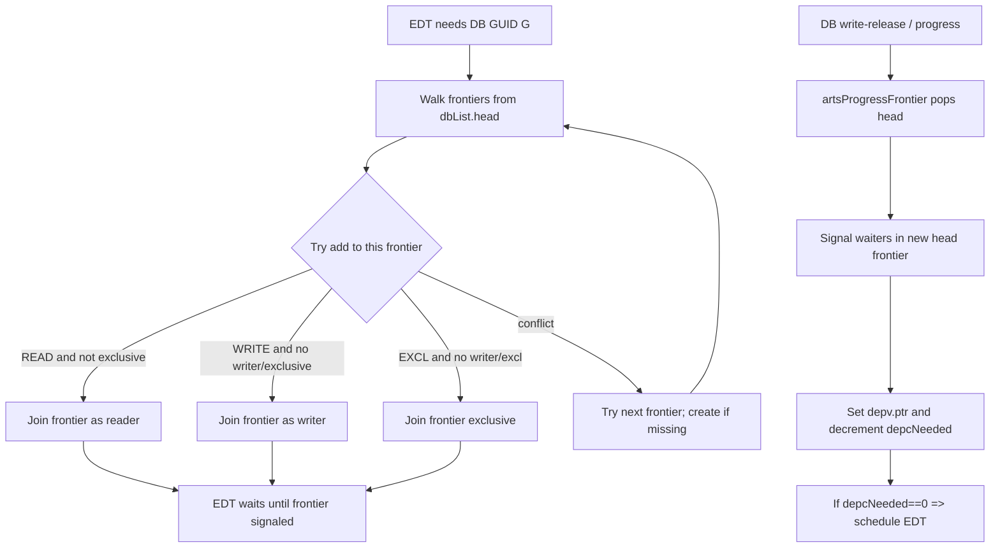
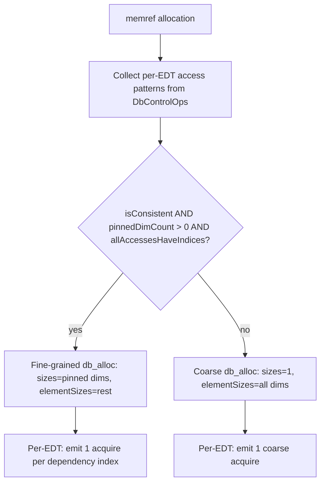
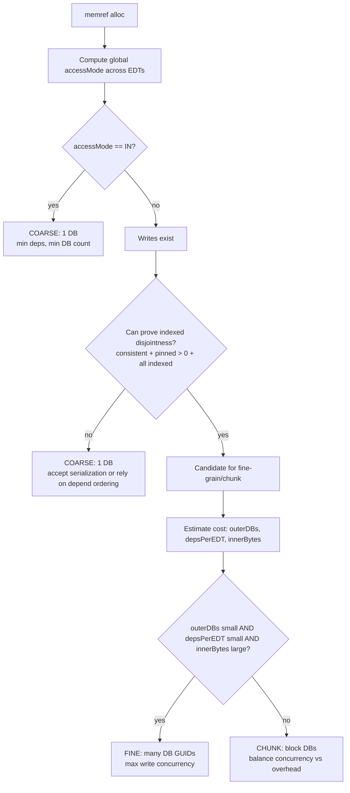
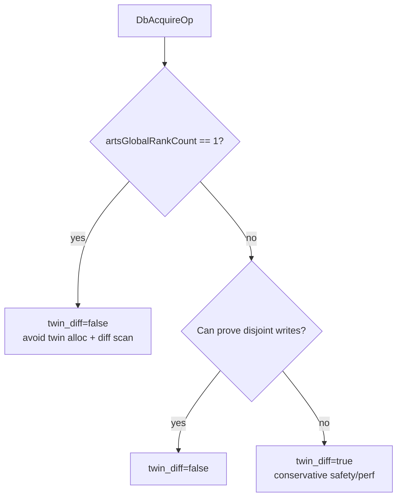
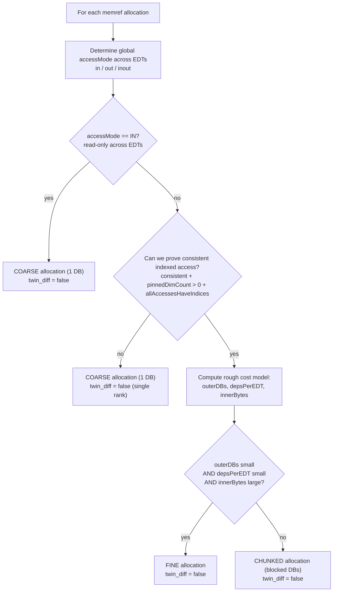

# Single-rank heuristics: DB granularity + `twin_diff`

This note is scoped to **single-rank / single-node** runs (i.e., `artsGlobalRankCount == 1`).
It explains the **runtime mechanics** that cause (or prevent) EDT concurrency (especially around WRITE acquisitions),
and turns that into **compiler/runtime heuristics** for DB granularity and `twin_diff`.

Primary audiences:
- CARTS/ARTS compiler-pass authors (MLIR passes)
- ARTS runtime authors (DB memory model / CDAG)
- performance engineers tuning single-node runs

## Key costs and where they come from

### Cost A: per-EDT acquire/release scales with number of dependencies

At runtime, each EDT acquires its dependencies by iterating its `depv` array:
- `external/arts/core/src/runtime/memory/DbFunctions.c`: `acquireDbs(struct artsEdt *edt)` is a `for (i < depc)` loop.

So if we make DBs *too fine-grained*, we often increase:
- number of `db_acquire` ops per EDT
- `depc` per EDT
- total `acquireDbs()` work per EDT

### Cost B: per-DB metadata/event overhead scales with number of DB objects

Each DB carries persistent tracking structures:
- `external/arts/core/src/runtime/memory/DbFunctions.c`: DB creation initializes `dbList` (`artsNewDbList()`).
- Under `USE_SMART_DB`, each DB also gets a **persistent event** (`artsPersistentEventCreate(...)`).

So if we split an array into many DBs, we also pay for many DB objects’ metadata.

### Cost C: `twin_diff=true` allocates a “twin” and computes diffs on release

If an acquired dependency has `useTwinDiff=true`:
- on WRITE acquire preparation, the runtime may allocate a twin copy (`artsDbAllocateTwin()`), which includes a copy of DB data.
- on WRITE release, it computes diffs and may send partial updates (in multi-rank).

Entry points:
- `external/arts/core/src/runtime/memory/DbFunctions.c`: `prepDbs(...)` allocates twins; `artsTryReleaseTwinDiff(...)` computes/sends diffs.
- `external/arts/core/src/runtime/memory/TwinDiff.c`: twin allocation and diff scanning.

On **single rank**, there is no inter-rank bandwidth to save, so this often becomes pure overhead.

## ARTS DB frontiers: the mechanism behind serialization

### Terminology

In the ARTS runtime, each DB maintains a `dbList` (a linked list) of **frontiers**:
- `external/arts/core/src/runtime/memory/DbFunctions.c`: DB init sets `dbRes->dbList = artsNewDbList()`.
- `external/arts/core/src/runtime/memory/DbList.c`: `artsDbList` is initialized with `head = tail = artsNewDbFrontier()` and can grow via `frontier->next`.

A **frontier** is a “phase” (queue node) that groups a set of compatible consumers of a DB version:
- many readers can share a frontier
- at most one writer can join a frontier
- an “exclusive” acquisition blocks both reads and writes

When a DB completes a phase, the runtime advances to the next frontier and signals its waiters.

### Admission rules (what can join a frontier)

When an EDT wants a DB, the runtime tries to insert that requesting node (rank/EDT+slot) into the earliest frontier where it is compatible.

Implementation points:
- `artsPushDbToList(...)` walks the frontier list and calls `artsPushDbToFrontier(...)` (`external/arts/core/src/runtime/memory/DbList.c:268`).
- `artsPushDbToFrontier(...)` uses per-frontier lock bits to admit:
  - reads: `frontierAddReadLock(...)` rejects if `exclusiveSet` is set (`external/arts/core/src/runtime/memory/DbList.c:70`).
  - writes: `frontierAddWriteLock(...)` rejects if `writeSet` or `exclusiveSet` is set (`external/arts/core/src/runtime/memory/DbList.c:87`).
  - exclusive: `frontierAddExclusiveLock(...)` rejects if `writeSet` or `exclusiveSet` is set (`external/arts/core/src/runtime/memory/DbList.c:108`).

This creates the key behavior:
- **multiple READs of the same DB GUID can share the same frontier**
- **multiple WRITEs of the same DB GUID cannot share the same frontier**

### What “second frontier” means

If a request cannot enter the current frontier (because it conflicts), ARTS does not spin forever; it tries the next frontier:
- `artsPushDbToList()` moves `frontier = frontier->next` and if needed, allocates a new frontier (`external/arts/core/src/runtime/memory/DbList.c:287`).

So a “second frontier” is simply the *next queue node* for that DB. Requests in later frontiers are **logically queued behind** earlier frontiers.

### When later-frontier requests become runnable

Frontier advancement happens via `artsProgressFrontier(...)`:
- it pops `dbList->head = dbList->head->next`
- it signals the (new) head frontier’s waiters (`artsSignalFrontierLocal/Remote`)
- it frees the old head frontier (`external/arts/core/src/runtime/memory/DbList.c:466`)

In the local case, `artsSignalFrontierLocal(...)` updates waiting EDT slots:
- it writes `depv[slot].ptr = db + 1`
- it decrements `edt->depcNeeded`; if it reaches 0, the EDT becomes ready (`external/arts/core/src/runtime/memory/DbList.c:418`)

### Frontier flowchart (runtime DB queueing)



## What “fine-grained DBs” buy you: avoiding *write* serialization

The serialization question is about **multiple EDTs that want to write the same DB GUID** (or the same coarse-grained representation of a larger structure).

### Important distinction

- **Multiple WRITE DBs can be acquired concurrently** *if they are different DB GUIDs*.
  - An EDT can have many dependencies; some can be WRITE.
  - Different EDTs can run concurrently if they write to different DBs.

-- **Two WRITE acquires for the same DB GUID do not execute concurrently on the same frontier**.
  - The second writer is pushed to a later frontier and only becomes runnable after `artsProgressFrontier()` advances past earlier frontier(s).
  - That is the concrete meaning of “writes get serialized (per GUID)”.

### Why coarse-grained WRITE DBs can serialize EDT execution

If the compiler maps a whole array `A` to **one DB**, then any OpenMP-style “element” dependences like:

```c
// conceptual
#pragma omp task depend(inout: A[i])  // disjoint i per task
work(A[i]);
```

can collapse to “all tasks depend on the same DB GUID in WRITE mode”.

That creates an *artificial* bottleneck:
- EDTs become serialized through a single DB’s dependence/event mechanism (even if they are logically disjoint at the element level).
- The runtime cannot see “A[i] disjointness” if everything is represented by one DB.

Conversely, if the compiler allocates **fine-grained DBs** so that each `A[i]` maps to a different DB GUID, then:
- tasks that write different `A[i]` become independent at the DB level
- the runtime can schedule them concurrently

### “Prove me wrong” (proof sketch)

Assume we have `N` EDTs, each writes a disjoint element `A[i]`.

**Case 1: coarse DB (one GUID for all of A)**
- Every EDT has a WRITE dependence on the same DB GUID.
- The DB has one tracking structure (and possibly one persistent event if `USE_SMART_DB`).
- Frontier admission forbids more than one writer per frontier, so writers queue into later frontiers → EDTs get ordered/serialized around that single DB, regardless of disjointness.

**Case 2: fine-grained DB (GUID per element or per block)**
- EDT `i` has a WRITE dependence on GUID `G_i`.
- Different EDTs depend on different GUIDs → no forced ordering through a single DB.
- Therefore, EDTs can be concurrent (limited only by other resources and unrelated dependences).

So yes: **fine-grained DBs increase concurrency specifically for writes** by avoiding coarse “all writers share one DB” serialization.
The key is not “WRITE mode forbids multiple write DBs”; it’s that **WRITE mode is exclusive per DB object**, and a coarse DB makes too many things share that object.

## What the compiler currently does (relevant to heuristics)

### Allocation granularity decision (fine vs coarse)

In `lib/arts/Passes/CreateDbs.cpp`, an allocation becomes fine-grained if:
- access patterns are consistent, and
- there are pinned indexed dimensions, and
- all accesses have indices

Otherwise it falls back to coarse-grained.

### Flowchart: current compiler granularity selection (CreateDbs)



### Acquire emission cost: fine-grained can multiply acquires per EDT

If allocation is fine-grained and an EDT has multiple dependency indices (stencils), the pass emits one acquire per dependency.
This increases `depc`, and therefore increases `acquireDbs()` loop work.

## Single-rank heuristics (initial set)

These are intended as knobs to start experimenting with.

### Heuristic 1: read-only memrefs → prefer coarse allocation

If a memref is **globally read-only** across all EDTs (access mode `in`):
- pick coarse (one DB), even if indexing is consistent

Rationale: there is no write contention to relieve, so fine-graining mostly adds per-DB/per-dep overhead.

### Heuristic 2: write/inout/out memrefs → fine-grain only when it amortizes

If writes exist, fine-graining can help, but we should cap it:

Define:
- `outerDBs = Π size[d]` over pinned dimensions (number of DB objects)
- `depsPerEDT = average number of db_acquire ops` for that allocation per EDT
- `innerBytes = bytes in the “inner” element DB` (remaining dimensions × element size)

Use fine-grain only if:
- `outerDBs` is not too large
- `depsPerEDT` is not too large (stencil width not huge)
- `innerBytes` is large enough to amortize metadata/event overhead

Otherwise, prefer blocked/blocking (see Heuristic 3).

### Heuristic 3: blocked DBs as the middle ground

When per-element DBs are too expensive but coarse is too serializing:
- allocate DBs per **block** of elements (chunk)
- map `A[i]` to `A[block(i)]`

This reduces `outerDBs` and `depc` while preserving most write concurrency.

There is already compiler infrastructure that reasons about chunking/partitioning and sets `twin_diff` conservatively:
- `lib/arts/Passes/Db.cpp`: `partitionDb()` and related chunk rewrite helpers.

### Flowchart: single-rank DB granularity decision (recommended)



### How frontier mechanics map to these heuristics

For a given DB GUID:
- if many EDTs WRITE that GUID, they queue into later frontiers and serialize.

Therefore, the granularity decision is fundamentally:
- **reduce the number of independent writers per GUID** by splitting the data into more GUIDs (fine/chunk),
while
- **not exploding** DB object count and per-EDT dependency count (overhead).

## `twin_diff` policy on single rank

### Recommendation

If `artsGlobalRankCount == 1`:
- set `twin_diff=false` everywhere (or ignore it in runtime) unless you have a *specific* local-only correctness use (rare).

Rationale:
- twin allocation/copy + diff scanning are real costs
- the “send diffs vs full DB” benefit does not exist without inter-rank movement

### Is `twin_diff` necessary on a single node?

It depends on what “single node” means:

- **Single node, single rank (`artsGlobalRankCount == 1`)**: `twin_diff` is not necessary for correctness and is usually net-negative for performance.
  - What it does in this configuration (for WRITE acquires) is: allocate/copy a twin in `prepDbs()`, then scan/compute diffs on release (`artsTryReleaseTwinDiff()`).
  - But the only “consumer” of those diffs is the inter-rank update path; on one rank there is no remote owner to update, and DB frontiers already serialize multiple writers per GUID.
  - Result: extra memory traffic (copy + compare) without enabling additional concurrency or reducing communication.

- **Single physical node, multiple ranks (e.g., MPI ranks on one node)**: `twin_diff` can still be necessary/beneficial, because it is an **inter-rank** mechanism, not an “inter-node” mechanism.
  - If a DB’s owner is rank 0 and other local ranks acquire/write their own copies, reconciliation still requires shipping updates back to the owner rank.
  - In that configuration, `twin_diff` can reduce bandwidth (send only dirty regions) and/or preserve CDAG correctness when overlap cannot be ruled out.

### What `twin_diff` is actually for (in this codebase)

`twin_diff` is a **conservative correctness/performance mechanism when overlap cannot be proven disjoint** and updates may need to be reconciled across ranks.
In `CreateDbs.cpp`, coarse acquires default `twin_diff=true` “safe default”; fine-grained acquires set it false when disjointness is proven by construction.

On single rank, it’s typically not needed for correctness and is mostly overhead.

### Flowchart: `twin_diff` decision (single rank)



## Decision flowchart (single rank)



## What to measure next (to validate these heuristics)

Turn on ARTS counters and compare:
- number of DBs created
- acquire/read/write counters
- owner updates performed/saved

See:
- `external/arts/counter.cfg` and `external/arts/counter.profile-overhead.cfg`
