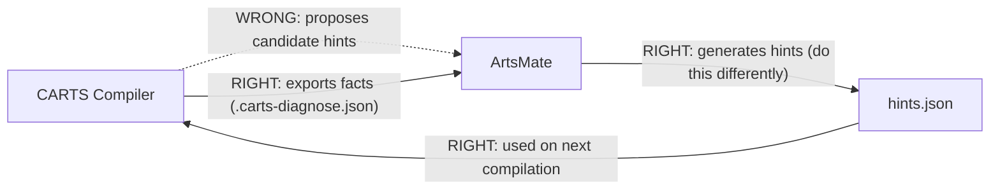
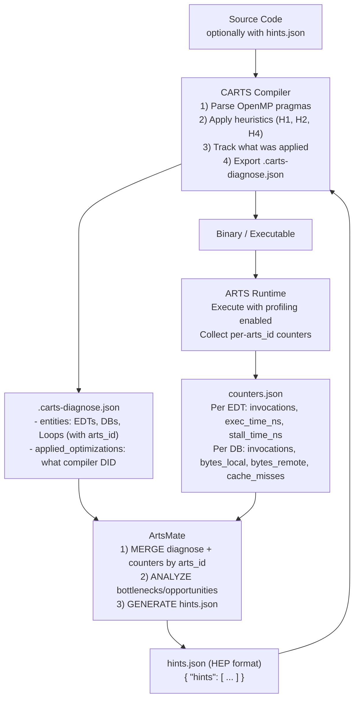

# Profile-Guided Optimization: CARTS Diagnose System

This document describes the dataflow between CARTS compiler, ARTS runtime, and ArtsMate for profile-guided optimization.

## Overview

The CARTS diagnose system enables iterative performance optimization by:
1. **CARTS** exports compile-time analysis to `.carts-diagnose.json`
2. **ARTS Runtime** collects per-entity performance counters
3. **ArtsMate** merges compile-time + runtime data to generate optimization hints
4. **CARTS** recompiles with hints from ArtsMate

## Key Design Principle

**Correct Hint Direction:**



The compiler exports **facts** (what it analyzed, what it applied). ArtsMate generates **hints** based on runtime evidence.

## Complete Dataflow Diagram



## Data Separation: Compile-Time vs Runtime

### Core Principle

**ArtsMate MERGES compile-time and runtime data - it should NOT recompute what the compiler already knows.**

### What CARTS Provides (Compile-Time Static Analysis)

| Data | Description | ArtsMate Use |
|------|-------------|--------------|
| `arts_id` | Unique entity identifier | **Merge key** with runtime |
| `potentially_parallel` | Can loop be parallelized? | Filter candidates |
| `dimension_deps[]` | Per-dimension dependency | Outer-loop parallelism |
| `reorder_nest_to[]` | Optimal loop order (if legal) | Loop interchange hint |
| `granularity` | fine/coarse DB allocation | Current state |
| `twin_diff` | Whether twin-diff is enabled | Current state |
| `applied_optimizations` | Why compiler decided X | Explain reasoning |

### What ARTS Runtime Provides (Execution Metrics)

| Metric | Description | Why Runtime-Only |
|--------|-------------|------------------|
| `invocations` | How often EDT/DB was accessed | Depends on input data |
| `total_exec_ns` | Actual execution time | Depends on hardware + input |
| `total_stall_ns` | Time waiting for memory | Depends on cache state |
| `bytes_local` | Local memory bytes accessed | Depends on data distribution |
| `bytes_remote` | Remote memory bytes accessed | Depends on data placement |
| `cache_misses` | Cache miss count | Actual locality behavior |

## .carts-diagnose.json Schema

### Top-Level Structure

```json
{
  "version": "1.0",
  "program": {
    "name": "jacobi_2d",
    "source_file": "jacobi.c"
  },
  "machine": {
    "node_count": 1,
    "threads": 8,
    "execution_mode": "IntraNode"
  },
  "entities": [...],
  "applied_optimizations": [...]
}
```

### Entity Types

#### Loop Entity
```json
{
  "arts_id": 100,
  "entity_type": "loop",
  "source_location": "jacobi.c:42",
  "potentially_parallel": true,
  "trip_count": 1000,
  "nesting_level": 0,
  "has_reductions": false,
  "parallel_classification": "Likely",
  "dimension_deps": [
    {"dim": 0, "has_carried_dep": false},
    {"dim": 1, "has_carried_dep": true, "distance": 1}
  ],
  "outermost_parallel_dim": 0,
  "reorder_nest_to": [101, 100],
  "containing_edt_id": 1000
}
```

#### EDT Entity
```json
{
  "arts_id": 1000,
  "entity_type": "edt",
  "source_location": "jacobi.c:42",
  "loop_ids": [100, 101],
  "concurrency": "intranode",
  "deps": [
    {"db_id": 300, "mode": "inout"}
  ]
}
```

#### DB (DataBlock) Entity
```json
{
  "arts_id": 300,
  "entity_type": "db",
  "source_location": "jacobi.c:10",
  "granularity": "fine",
  "outer_sizes": [64],
  "inner_sizes": [128],
  "access_mode": "inout",
  "twin_diff": false
}
```

### Applied Optimizations with PGO-Style Mapping

What CARTS already did - facts about the current compilation with compile-time → runtime correlation:

```json
{
  "applied_optimizations": [
    {
      "target_id": 50,
      "alloc_id": 43,
      "affected_db_ids": [43, 44, 45, 46],
      "source_location": "matrix.c:45",
      "type": "H4-TwinDiff",
      "heuristic": "H4-TwinDiff"
    }
  ]
}
```

**Key Fields:**
- `target_id`: The DbAcquireOp arts_id (compile-time operation)
- `alloc_id`: The parent DbAllocOp arts_id (allocation that creates the grid)
- `affected_db_ids`: Runtime DB IDs this decision affects (computed at compile-time)
- `source_location`: Source location for correlation

## Bridging Compile-Time and Runtime: PGO-Style Mapping

### The Problem

ArtsMate needs to correlate:
- **Compile-time**: "H4-TwinDiff applied to target_id=50"
- **Runtime**: "DB 45 had 1000 accesses, high latency"

Current disconnect:
- Compile-time records decisions on DbAcquireOp (arts_id=50)
- Runtime tracks DbAllocOp DBs (arts_id=43, 44, 45, 46)
- No entity with arts_id=50 exists at runtime!

### How PGO Systems Solve This

Based on LLVM Coverage Mapping Format, the pattern is:
1. **Compile-time**: Embed mapping (source_range → counter_id) in binary
2. **Runtime**: Collect counter values by counter_id
3. **Analysis**: Use mapping to correlate counters back to source

```
LLVM PGO:        source_range  ──mapping──►  counter_id  ◄──runtime──  count
CARTS/ArtsMate:  decision      ──mapping──►  db_ids      ◄──runtime──  metrics
```

### System Architecture

```
┌─────────────────────────────────────────────────────────────────────────────┐
│                           COMPILE TIME (CARTS)                              │
├─────────────────────────────────────────────────────────────────────────────┤
│                                                                             │
│  Source Code              MLIR/ARTS Ops                  ID Assignment      │
│  ───────────              ─────────────                  ─────────────      │
│                                                                             │
│  // line 30               DbAllocOp                                         │
│  double A[N];             ├─ sizes=[4]                   arts_id = 43       │
│                           └─ elementSizes=[100]          (runtime base)     │
│                                    │                                        │
│                                    │ creates 4 DBs at runtime:              │
│                                    │ [43, 44, 45, 46]                       │
│                                    │                                        │
│  // line 45               DbAcquireOp                                       │
│  #pragma omp task         ├─ parent_alloc ──────────────► 43                │
│  { A[i]++ }               ├─ offsets=[0]                                    │
│                           ├─ sizes=[4]  ───────────────► acquires ALL       │
│                           └─ arts_id = 50                                   │
│                                    │                                        │
│                                    ▼                                        │
│                    ┌───────────────────────────────────┐                    │
│                    │   H4-TwinDiff Decision Recorded   │                    │
│                    │   ────────────────────────────    │                    │
│                    │   target_id: 50 (acquire op)      │                    │
│                    │   alloc_id: 43 (parent alloc)     │                    │
│                    │   affected_db_ids: [43,44,45,46]  │◄── COMPUTED!       │
│                    │   source_location: "file.c:45"    │                    │
│                    └───────────────────────────────────┘                    │
│                                    │                                        │
└────────────────────────────────────┼────────────────────────────────────────┘
                                     │
                                     ▼
                    ┌────────────────────────────────────┐
                    │       diagnose.json (MAPPING)      │
                    │   ════════════════════════════     │
                    │   Similar to LLVM's coverage       │
                    │   mapping embedded in binary       │
                    └────────────────┬───────────────────┘
                                     │
┌────────────────────────────────────┼────────────────────────────────────────┐
│                            RUNTIME (ARTS)                                   │
├────────────────────────────────────┼────────────────────────────────────────┤
│                                    │                                        │
│   DB Creation (from DbAllocOp):    │                                        │
│   artsDbCreateWithGuidAndArtsId(guid, size, 43)  ──► DB[43] created        │
│   artsDbCreateWithGuidAndArtsId(guid, size, 44)  ──► DB[44] created        │
│   artsDbCreateWithGuidAndArtsId(guid, size, 45)  ──► DB[45] created        │
│   artsDbCreateWithGuidAndArtsId(guid, size, 46)  ──► DB[46] created        │
│                                    │                                        │
│   Execution & Metrics:             │                                        │
│   artsIdDbMetrics[43] = {accesses: 1000, bytes: 8000}                      │
│   artsIdDbMetrics[45] = {accesses: 1500, bytes: 12000}  ◄── HOT!           │
│                                    │                                        │
│                                    ▼                                        │
│                    ┌───────────────────────────────────┐                    │
│                    │     runtime_counters.json         │                    │
│                    │   { "db_metrics": [               │                    │
│                    │       {"arts_id": 43, ...},       │                    │
│                    │       {"arts_id": 45, ...}  ◄──── COUNTER DATA        │
│                    │     ]                             │                    │
│                    │   }                               │                    │
│                    └───────────────┬───────────────────┘                    │
│                                    │                                        │
└────────────────────────────────────┼────────────────────────────────────────┘
                                     │
                                     ▼
┌─────────────────────────────────────────────────────────────────────────────┐
│                         ARTSMATE (CORRELATION)                              │
├─────────────────────────────────────────────────────────────────────────────┤
│                                                                             │
│   CORRELATION ALGORITHM:                                                    │
│   1. User asks: "Why is DB 45 slow?"                                       │
│                                                                             │
│   2. Lookup: 45 ∈ affected_db_ids?                                         │
│      for decision in applied_optimizations:                                │
│        if 45 in decision.affected_db_ids:                                  │
│          return decision  ──────────────────► FOUND!                       │
│                                                                             │
│   3. Result:                                                                │
│      "DB 45 (1500 accesses) is part of array at file.c:30                  │
│                                                                             │
│       Optimization Applied:                                                 │
│       ├─ H4-TwinDiff at file.c:45                                          │
│       ├─ Rationale: single-node disables twin-diff                         │
│       └─ Affects all DBs: [43, 44, 45, 46]                                 │
│                                                                             │
│       Consider: If performance is poor, check if twin-diff                 │
│       should be re-enabled for multi-node execution."                      │
│                                                                             │
└─────────────────────────────────────────────────────────────────────────────┘
```

### Implementation Details

The mapping is computed in `HeuristicsConfig::recordDecision()`:

```cpp
/// For DbAcquireOp: compute affected runtime DB IDs
if (auto acquireOp = dyn_cast<DbAcquireOp>(op)) {
  /// Trace back to parent DbAllocOp
  if (Operation *allocOp = DatablockUtils::getUnderlyingDbAlloc(acquireOp.getSourcePtr())) {
    allocId = idRegistry_.get(allocOp);

    /// Compute affected DB IDs based on offsets and sizes
    ValueRange offsets = acquireOp.getOffsets();
    ValueRange sizes = acquireOp.getSizes();

    if (offsetKnown && sizeKnown && allocId != 0) {
      /// Exact affected DB IDs: [allocId + offset, allocId + offset + count)
      for (int64_t i = 0; i < count; i++)
        affectedDbIds.push_back(allocId + offset + i);
    }
  }
}
```

### Why This Works

1. **No runtime changes needed** - compile-time computes the mapping
2. **Direct correlation** - affected_db_ids matches runtime DB arts_ids exactly
3. **Handles "acquire all"** - if sizes=[N], affected_db_ids = [base, base+N)
4. **Graceful degradation** - dynamic offsets show partial correlation

## ARTS Runtime Counter JSON Format

The ARTS runtime exports per-`arts_id` metrics that can be merged with CARTS diagnose data:

```json
{
  "artsIdMetrics": {
    "edts": [
      {
        "arts_id": 1000,
        "invocations": 100,
        "total_exec_ns": 5000000,
        "total_stall_ns": 1000000
      }
    ],
    "dbs": [
      {
        "arts_id": 300,
        "invocations": 50,
        "bytes_local": 1024000,
        "bytes_remote": 0,
        "cache_misses": 10
      }
    ]
  }
}
```

### Enabling ARTS Counters

Use the arts_id-only profiling config for minimal overhead:

```bash
export ARTS_CONFIG=counter.profile-artsid-only.cfg
./my_arts_program
```

This produces `counters.json` with per-entity metrics keyed by `arts_id`.

## Hints ArtsMate Can Generate

ArtsMate analyzes merged compile-time + runtime data and generates hints:

| Hint Type | What it tells compiler | When to use |
|-----------|------------------------|-------------|
| `loop_reorder` | Apply specific loop interchange | High memory stalls, reorder is legal |
| `coarse_alloc` | Keep DB coarse-grained | Fine-grained overhead > benefit |
| `fine_alloc` | Chunkify DB with specific sizes | Large DBs, good locality |
| `enable_twin_diff` | Force twin-diff for a DB | High remote access ratio |
| `disable_twin_diff` | Disable twin-diff for a DB | No concurrent writes |
| `schedule` | Change loop schedule (static/dynamic) | Load imbalance detected |
| `replicate_db` | Replicate read-only DB | Read-only with high remote access |

## Iterative Optimization Example

### Iteration 1: Initial Compilation

```
CARTS: Applies H2 (fine-grained), exports diagnose
ARTS:  Runs, shows memory_stall_pct=75%

ArtsMate merges:
  compile-time: granularity=fine, reorder_nest_to=[1,0] (legal)
  runtime: memory_stall_pct=75% (HIGH!)

ArtsMate decides: "Fine-grained applied but memory-bound. Try loop reorder."
Generates: {"target": 100, "type": "loop_reorder", "order": [1, 0]}
```

### Iteration 2: With Hint Applied

```
CARTS: Recompiles with loop_reorder hint
ARTS:  Runs, shows memory_stall_pct=20%

ArtsMate: "Speedup achieved! LOOP_REORDER was effective."
```

## Merge Decision Table

When ArtsMate merges compile-time + runtime, it can answer:

| Question | Compile-Time | Runtime | Decision |
|----------|--------------|---------|----------|
| Parallelize loop X? | `potentially_parallel=true` | `exec_time=50%` | YES - hot AND parallelizable |
| Replicate DB Y? | `access_mode=read` | `bytes_remote/total=0.8` | YES - read-only AND remote |
| Reorder loop Z? | `reorder_nest_to=[1,0]` | `stall_pct=5%` | NO - not memory-bound |
| Which is bottleneck? | All EDTs listed | `exec_time` ranking | Focus on top 3 |
| Twin-diff needed? | `twin_diff=false` | `concurrent_writes=true` | YES - enable it |

## CLI Usage

```bash
# Generate diagnose output
carts run input.mlir --diagnose

# Custom output path
carts run input.mlir --diagnose --diagnose-output my-diagnose.json

# Also available in carts execute
carts execute input.mlir --diagnose
```

## File Locations

| File | Location | Description |
|------|----------|-------------|
| `.carts-diagnose.json` | Working directory | Compile-time analysis output |
| `counters.json` | ARTS output dir | Runtime performance counters |
| `hints.json` | ArtsMate output | Optimization hints for recompilation |

## Related Documentation

- [CARTS Heuristics](heuristics/single_rank/db_granularity_and_twin_diff.md) - H1, H2, H4 heuristic details
- [CARTS Analysis](analysis.md) - Analysis infrastructure overview
- [Developer Guide](developer-guide.md) - CARTS development guide
