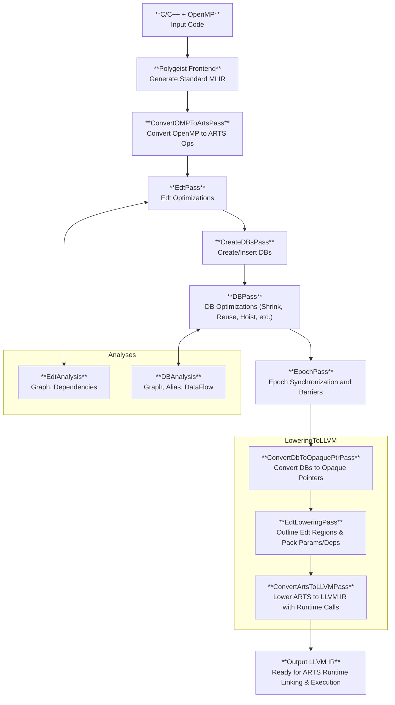

# Project Overview

CARTS is a compiler framework built on LLVM/MLIR that implements the ARTS (Asynchronous Runtime System) dialect. It is designed for high-performance computing on memory-disaggregated architectures.

## Key Features

*   **ARTS Dialect**: A custom MLIR dialect for expressing task-based parallelism.
*   **OpenMP Integration**: Translates OpenMP parallel constructs into the ARTS dialect.
*   **Memory-Centric Model**: Optimized for systems with physically separate memory and compute resources.
*   **Extensible Pass Pipeline**: Allows for custom optimizations and transformations.

## Core Architecture

The project's core is a transformation pipeline that takes C++ code with OpenMP directives, converts it to the MLIR representation using Polygeist, applies a series of transformations and optimizations in the ARTS dialect, and finally generates LLVM IR for compilation.

## Compiler Pass Pipeline

### Pass Explanations

*   **Polygeist Frontend**: The compilation process begins with Polygeist, which takes C/C++ source code and converts it into standard MLIR dialects.
*   **ConvertOMPToArtsPass**: This pass is responsible for converting OpenMP parallel constructs (`omp.parallel`, `omp.for`, etc.) into their ARTS equivalents, such as `arts.parallel`.
*   **EdtPass**: This pass performs optimizations on Event-Driven Tasks (EDTs). It uses `EdtAnalysis` to analyze dependencies between EDTs and enables optimizations like task fusion.
*   **CreateDbPass**: This pass identifies memory allocations (`memref.alloc`) and converts them into ARTS Data Blocks (`arts.db_alloc`).
*   **DbPass**: This pass performs optimizations on Data Blocks (DBs). It uses `DbAnalysis` to analyze data dependencies and enables optimizations like canonicalization, shrinking, reusing, and hoisting of DBs.
*   **EpochPass**: This pass handles the synchronization of tasks by inserting `arts.epoch` operations, which act as barriers.
*   **PreprocessDbsPass**: This pass prepares the DBs for the ARTS runtime by converting them into opaque pointers.
*   **EdtLoweringPass**: This pass outlines the EDT regions and packs their parameters and dependencies for the runtime.
*   **ConvertArtsToLLVMPass**: This is the final pass in the pipeline, which lowers the ARTS dialect to the LLVM IR dialect, including calls to the ARTS runtime library.

## Development Principles

*   **Conciseness**: Changes should be focused and essential.
*   **Simplicity**: Prefer simple and maintainable solutions.
*   **Performance**: Prioritize optimal and efficient implementations.

[Go back to README.md](../README.md)