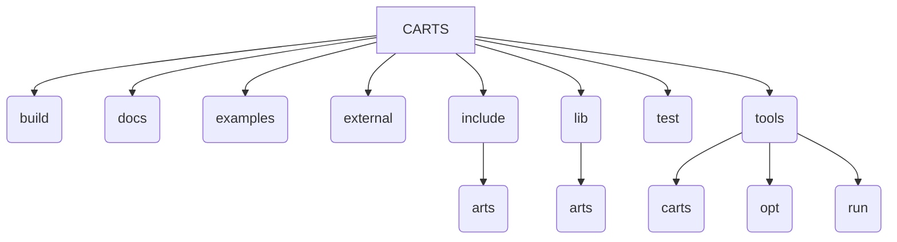

# Project Structure

This document outlines the directory structure of the CARTS project.

*   `_cmake/`: Contains custom CMake modules.
*   `.cursor/`: Contains rules and configurations for the Cursor IDE.
*   `build/`: The main build directory for the project.
*   `docs/`: Contains project documentation.
*   `examples/`: Contains example code demonstrating how to use CARTS.
*   `external/`: Contains external dependencies, such as the ARTS runtime and Polygeist.
*   `include/`: Contains the header files for the CARTS project.
    *   `arts/`: Header files for the ARTS dialect, passes, and other components.
*   `lib/`: Contains the source code for the CARTS project.
    *   `arts/`: Source code for the ARTS dialect, passes, and other components.
*   `test/`: Contains tests for the CARTS project.
*   `tools/`: Contains command-line tools for interacting with CARTS.
    *   `carts`: The main wrapper script for all CARTS operations.
    *   `opt/`: The `carts-opt` tool for running MLIR optimizations.
    *   `run/`: The `carts-run` tool for running the main ARTS transformation pipeline.

[Go back to README.md](../README.md)
