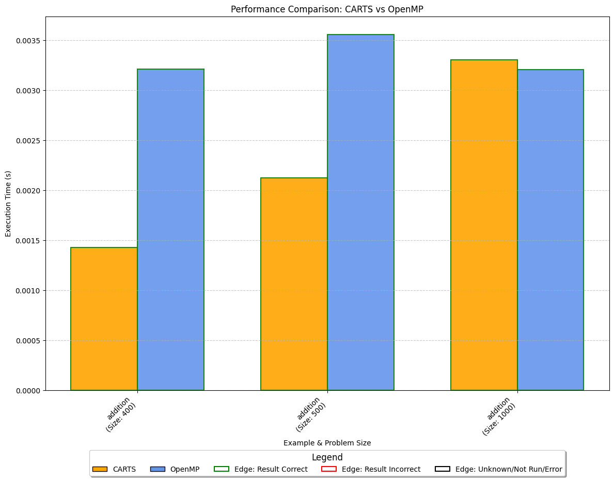
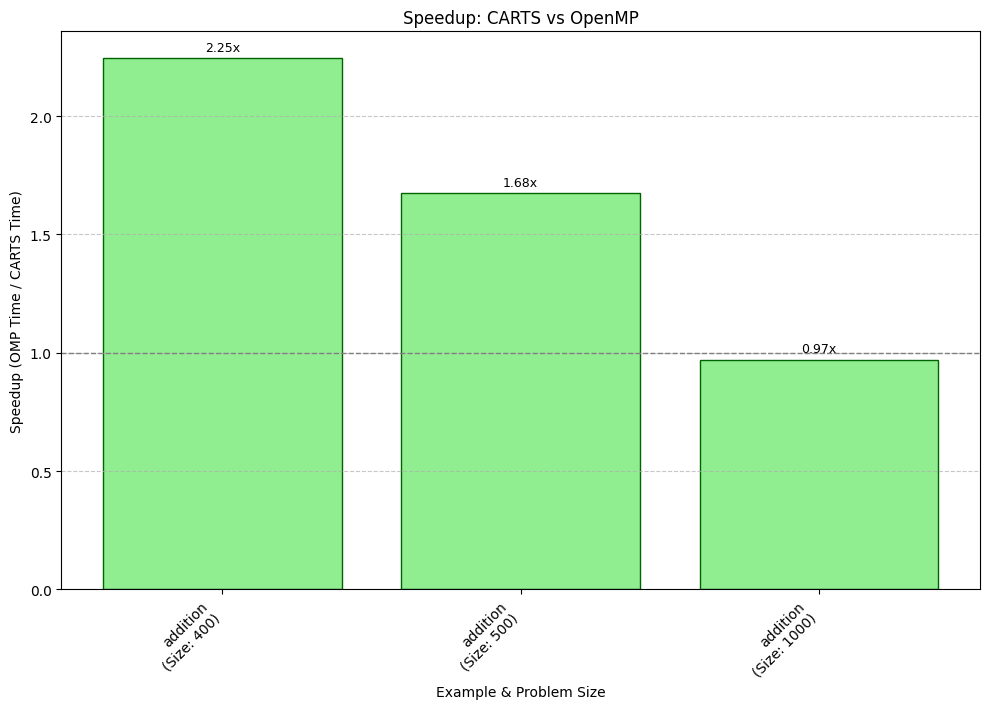

# Performance Comparison Report

**Run Timestamp**: 2025-05-09T16:52:50.109697

## System Information
- **OS Platform**: Linux-5.15.167.4-microsoft-standard-WSL2-x86_64-with-glibc2.35
- **OS Uname**: Linux randreshg 5.15.167.4-microsoft-standard-WSL2 #1 SMP Tue Nov 5 00:21:55 UTC 2024 x86_64 x86_64
- **CPU Model**: 11th Gen Intel(R) Core(TM) i7-11800H @ 2.30GHz
- **CPU Cores**: 16
- **Total Memory**: 31960 MB
- **Clang Version**: `clang version 18.0.0 (https://github.com/llvm/llvm-project.git 26eb4285b56edd8c897642078d91f16ff0fd3472)`

## Summary Table
| Example | Problem Size | CARTS Avg Time (s) | OMP Avg Time (s) | CARTS Correctness | OMP Correctness | Speedup | CARTS Threads | CARTS Nodes | Build Status |
|---|---|---|---|---|---|---|---|---|---|
| addition | 400 | 0.00143 | 0.00321 | CORRECT | CORRECT | 2.25x | 16 | 1 | run completed |
| addition | 500 | 0.00212 | 0.00356 | CORRECT | CORRECT | 1.68x | 16 | 1 | run completed |
| addition | 1000 | 0.00330 | 0.00321 | CORRECT | CORRECT | 0.97x | 16 | 1 | run completed |

## Performance Graph

## Speedup Graph (CARTS vs OpenMP)

## Detailed Data
See CSV: [report_report.csv](report_report.csv)
